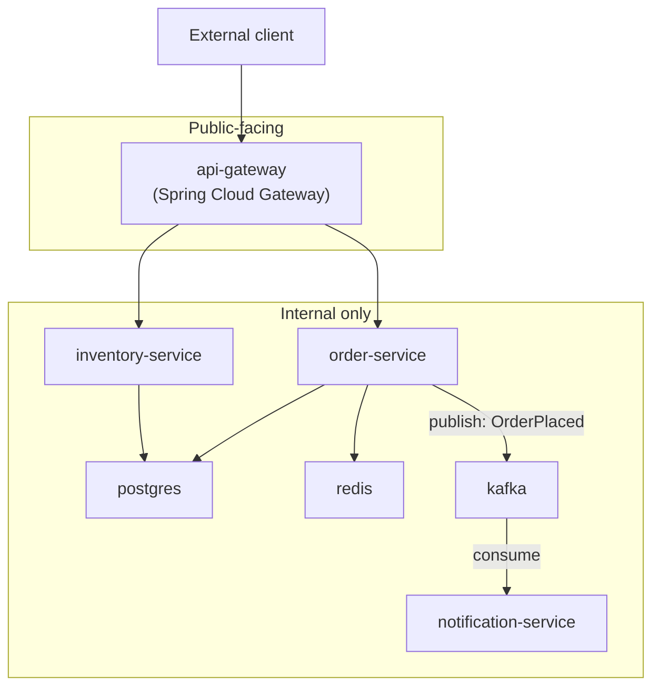

# Capstone: Architecture and Objective

This is the final synthesis of every phase in this repository: a production-grade e-commerce backend, containerized, networked, secured, built through a real CI pipeline, and deployed to Kubernetes. This chapter sets the objective and architecture; the next two chapters carry out the full implementation and the build/run/debug/productionize workflow.

---

## Objective

By the end of the capstone, you will have built and operated a system that demonstrates:

- **Phase 1–2**: multi-stage, cache-efficient, minimal-size Dockerfiles for every service
- **Phase 3**: correct PID 1/signal handling and measured JVM memory sizing under real cgroup limits
- **Phase 4**: a segmented network topology with only the gateway exposed
- **Phase 5**: durable, volume-backed storage for the one genuinely stateful service (Postgres)
- **Phase 6**: the entire local development and integration-testing environment defined in Compose
- **Phase 7**: a system you can debug systematically — inspect, diagnose startup failures, distinguish readiness from liveness
- **Phase 8**: non-root, capability-dropped, read-only, scanned images throughout
- **Phase 9**: a real CI pipeline building, scanning, and promoting images by digest
- **Phase 10**: the same system, running on Kubernetes, with the Compose-to-K8s translation applied service by service

---

## System Overview: An E-Commerce Order Backend

## Services and Their Responsibilities

| Service | Responsibility | Key phase concepts exercised |
|---|---|---|
| `api-gateway` | Single public entry point, routes to internal services | Phase 4 (segmented topology), Phase 8 (only this service published) |
| `order-service` | Order creation, stock check via `inventory-service`, publishes `OrderPlaced` events | Phase 3 (JVM tuning), Phase 4 (sync + async patterns), Phase 5 (Postgres + Redis) |
| `inventory-service` | Stock levels, queried synchronously by `order-service` | Phase 4 (sync communication pattern) |
| `notification-service` | Consumes `OrderPlaced` events, simulates customer notification | Phase 4 (async/broker pattern), Phase 6 (Kafka in Compose) |
| `postgres` | Durable order and inventory data | Phase 5 (volumes, backup/restore) |
| `redis` | Caching layer for `inventory-service` stock lookups | Phase 4 (internal-only service) |
| `kafka` | Event backbone between `order-service` and `notification-service` | Phase 6 (Compose profiles for optional tooling) |

---

## Architecture Decisions, Explained

- **Why a gateway rather than exposing each service directly?** Mirrors the Phase 4 networking lab's trust boundary principle exactly — one deliberate ingress point, everything else unreachable from outside by network topology, not just convention.
- **Why Kafka rather than direct synchronous calls for the notification path?** `order-service` should not fail, or even slow down, because `notification-service` is temporarily down — the Phase 4 Chapter 5 async pattern rationale, applied for real here.
- **Why Redis specifically for `inventory-service`?** Stock-level lookups are read-heavy and tolerate brief staleness — a textbook caching case that also exercises an additional internal-only service beyond what earlier phase projects covered.

---

## What the Next Two Chapters Cover

**Chapter 1 (`01-capstone-full-implementation.md`)**: complete source code for all five services, all Dockerfiles (multi-stage, hardened, per Phase 2/8), the full Compose file for local development, and the full Kubernetes manifest set for deployment.

**Chapter 2 (`02-capstone-build-run-debug-and-productionize.md`)**: build and run commands for both Compose and Kubernetes targets, a debugging walkthrough exercising Phase 7's techniques against this real system, and a final production-readiness review against Phase 9's checklist.

---

## What's Next

**Next:** [`01-capstone-full-implementation.md`](./01-capstone-full-implementation.md)