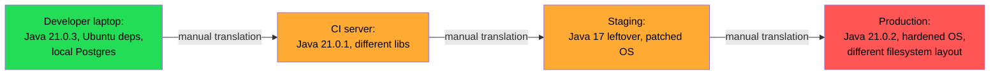
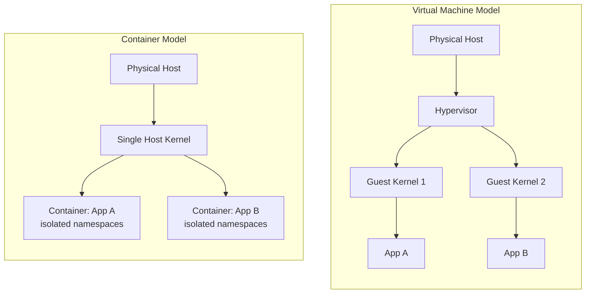

# What Problem Does Docker Solve

You already know how to run a Spring Boot application. You've typed `java -jar app.jar` a thousand times, you've fought classpath issues, you've been burned by "works on my machine," and you've probably deployed to at least one environment where the JVM version, the OS libraries, or some invisible system dependency didn't match what you tested against locally.

Docker didn't appear because someone wanted a new way to run `java -jar`. It appeared because the industry had a specific, expensive, recurring problem: **the thing you tested is not the thing that runs in production**, and closing that gap by hand doesn't scale.

This chapter is about understanding that problem precisely — not "containers are like lightweight VMs" (an analogy that will actively mislead you later), but the actual engineering situation Docker was built to solve, and why the solution takes the shape it does.

---

## The Problem, Stated Precisely

A running application is not just its code. It's:

- A language runtime (a specific JVM build — Temurin 21.0.3, not "some Java 21")
- OS-level shared libraries (glibc version, `libssl`, DNS resolver behavior)
- Environment variables and config files
- Filesystem layout assumptions (where does the app expect to find things?)
- Installed packages the app shells out to, or links against
- Network assumptions (what ports, what's reachable)
- The process supervision model (who restarts it if it dies? who sends it SIGTERM?)

When you say "deploy the app," you actually mean "recreate this entire bundle of assumptions on a different machine, or on a hundred different machines, correctly, every time." Before Docker, teams did this with:

- **Configuration management tools** (Ansible, Puppet, Chef) — describe the desired machine state as code, apply it to servers.
- **Golden AMIs / VM images** — bake a full VM image with everything installed, boot instances from it.
- **"Just document it and hope"** — a `README.md` full of `apt-get install` commands that rot within a month.

Each of these works, but each has a cost that gets worse as you have more services, more environments, and more engineers touching the system. That cost is the real problem Docker addresses.



Every arrow in that diagram is a place where drift creeps in, and drift is where "works on my machine" bugs come from. Docker's job is to collapse every one of those arrows into a single artifact that doesn't change as it moves.

---

## Why "Just Use a VM" Doesn't Fully Solve It

You already know VMs. A VM solves the drift problem too — a VM image is a full, frozen environment. So why wasn't that the end of the story?

Two reasons: **cost** and **granularity**.

A VM virtualizes hardware. Every VM boots its own kernel, has its own device drivers, its own init system, its own everything below the application. That's real weight — hundreds of megabytes to gigabytes of RAM overhead per VM, tens of seconds to minutes to boot, and a full OS's worth of things that can need patching and drift on their own.

If you're running one big monolith, that overhead is a rounding error. But you're a backend engineer working with microservices — you might run 10, 50, 200 service instances on a cluster. Paying full-VM overhead per service instance means:

- You can't densely pack instances onto a host — you're wasting CPU/RAM on redundant kernels
- Startup time (VM boot) becomes a real constraint on autoscaling and rolling deploys
- Every VM image needs its own OS-level patching lifecycle, multiplied by however many service types you have

What you actually want is: the **isolation and reproducibility of a VM**, without paying for **a whole separate kernel** per instance. That requires isolating processes *within a single running kernel*, not virtualizing hardware to run multiple kernels.

That's the shift. Docker (and containers generally) isolate at the **operating system process level**, not the **hardware level**. This is the single most important mental model correction to make right now, because it explains almost everything else in this repository — why containers start in milliseconds, why they share the host kernel, why a kernel exploit can escape a container in a way it can never escape a VM, and why "container vs VM" is a category difference, not a size difference.



We'll go deep into *how* that isolation is actually implemented — namespaces, cgroups — in the next chapter. Right now, just hold onto this: **a container is a normal Linux process, made to believe it's alone on the machine, running on the same kernel as everything else on the host.** There is no second kernel. There is no hypervisor. That's why it's fast, and that's also its main security caveat, which we'll cover properly in Phase 8.

---

## The Three Problems Docker Actually Solves

Strip away the marketing, and Docker solves three concrete engineering problems:

### 1. Environment Reproducibility ("Build once, run anywhere on this kernel")

A Docker image is a complete, immutable filesystem snapshot: your app's JAR, the exact JRE build, the exact OS packages, the exact config — bundled together and hashed. You build it once. Every environment runs the *identical* bytes. There is no "translation" step between CI, staging, and production — they all run the same image by digest.

```bash
# The image built in CI is the exact same image deployed everywhere.
# No "rebuild for staging", no "reinstall deps on the prod server".
docker build -t myorg/order-service:1.4.2 .
docker push myorg/order-service:1.4.2

# Staging and production both do exactly this — same digest, same bytes:
docker run myorg/order-service:1.4.2
```

Compare that to the pre-container world, where "deploy" meant SSHing into a server (or running a config management playbook) that tried to *converge* the target machine toward a desired state — a process that can partially fail, drift over time, or behave differently depending on what was already on that machine.

### 2. Process Isolation Without VM Overhead

Each container gets its own filesystem view, its own process tree, its own network stack (by default) — enforced by the kernel, not by convention. Two containers can both think they're PID 1, can both bind to port 8080 internally, and never collide, because they're isolated at the OS level. You get VM-like isolation guarantees for a fraction of the resource cost, with startup times measured in milliseconds, not minutes.

### 3. A Standard Packaging & Distribution Format

Before Docker, "how do I package and distribute a runnable service" had no cross-team, cross-language standard. Every team had its own tarball format, its own deploy script conventions. Docker made the image format and registry protocol (push/pull, layers, manifests) an industry standard. This is why you can `docker pull postgres:16` and get a working Postgres in seconds, regardless of what language Postgres is written in or what OS you're running — the packaging format is uniform.

---

## What Docker Is Not

Being precise here will save you from wrong mental models that cause real production mistakes later:

- **Docker is not a virtualization technology.** It doesn't virtualize hardware or run a guest kernel. (Docker Desktop on Mac/Windows *does* run a Linux VM under the hood to have a Linux kernel available at all — but that's a platform compatibility shim, not what a container itself is.)
- **A container is not a lightweight server.** It's usually built to run **one main process** well (though it can spawn children). Treating a container like a pet VM you SSH into and hand-configure defeats the reproducibility guarantee — if you change it live, it no longer matches the image, and a restart wipes your change.
- **An image is not a running thing.** An image is a static, immutable filesystem snapshot plus metadata. A container is a running instance of that image, with a writable layer on top. This distinction matters enough that the next chapter is entirely about it.
- **Docker does not make your app "portable" in the sense of cross-OS binary portability.** A Linux container image runs on a Linux kernel. What's portable is the *environment* — libraries, runtime, config — not the fundamental CPU architecture or kernel. (Multi-arch images address CPU architecture; we'll cover that in Phase 9.)

---

## Why This Matters for You Specifically

As a Spring Boot engineer, here's where this problem shows up concretely in your daily work, and where each later phase answers it:

| Pain point you've likely felt | Root cause | Where we solve it |
|---|---|---|
| "Works on my machine" but fails in CI/staging | Environment drift between dev machine and CI/prod | This chapter + Phase 2 (images) |
| Slow, flaky integration tests against a shared dev DB | No cheap way to get an isolated, disposable database per test run | Phase 5 (storage), Phase 6 (Compose) |
| Deploys that behave differently across environments | No single artifact carried through the pipeline | Phase 2, Phase 9 (CI/CD) |
| Onboarding a new engineer takes half a day of "install these 12 things" | No standard packaging/runtime for local dev | Phase 6 (Compose for local dev) |
| Container gets OOM-killed in Kubernetes for no obvious reason | Misunderstanding of cgroup memory limits vs JVM heap | Phase 3 (runtime & JVM) |
| "It passed health checks but wasn't actually ready" | Misunderstanding readiness vs liveness semantics | Phase 7 (debugging) |

None of these are "Docker trivia." They're the direct, practical payoff of understanding the problem Docker solves at the level we just covered.

---

## A Note on Framing for the Rest of This Repository

From here on, resist the urge to think of Docker commands as things to memorize. Every command, every flag, every Dockerfile instruction exists because of a specific engineering constraint — usually related to one of these three problems (reproducibility, isolation, packaging) or to how Linux itself works underneath. When a command's behavior seems arbitrary, it almost never is; it's downstream of a kernel mechanism we haven't covered yet. Chapter 2 goes straight into that mechanism.

**Next:** [`02-linux-primitives-namespaces-cgroups.md`](./02-linux-primitives-namespaces-cgroups.md) — the actual kernel features (namespaces and cgroups) that make everything in this chapter possible.