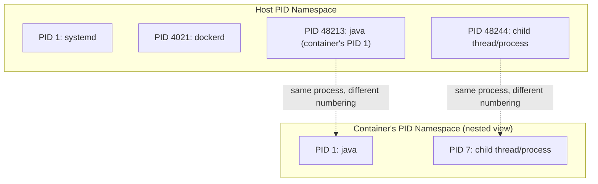
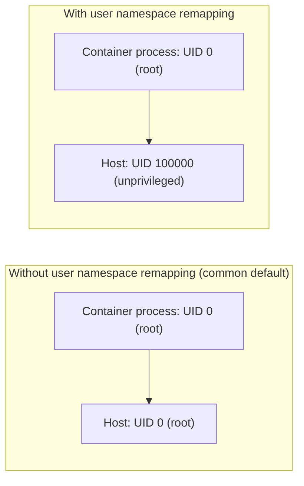
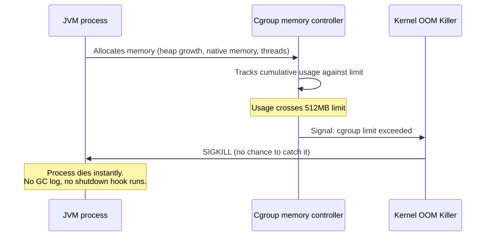
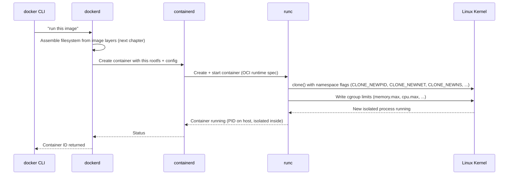

# Linux Primitives: Namespaces and Cgroups

In Chapter 1 we established that a container is a normal Linux process made to believe it's alone on the machine. This chapter is about the two kernel features that make that belief possible: **namespaces** (what a process can *see*) and **cgroups** (what a process is *allowed to consume*). Docker itself contains almost no isolation logic of its own — it's an orchestration layer over these two kernel features (plus a union filesystem, covered next chapter). If you understand namespaces and cgroups, you understand what a container *actually is*, mechanically, and a huge amount of "confusing" Docker behavior stops being confusing.

---

## Namespaces: Controlling What a Process Can See

A namespace wraps a global system resource and makes it appear, to processes inside the namespace, as though they have their own isolated instance of it. Nothing is actually duplicated at the hardware level — the kernel just filters what each process is allowed to observe and address.

Linux has (among others) these namespace types, and each one answers a specific question:

| Namespace | Isolates | Question it answers |
|---|---|---|
| `PID` | Process IDs | "What processes exist?" |
| `NET` | Network interfaces, routing tables, ports | "What network do I see?" |
| `MNT` | Filesystem mount points | "What filesystem do I see?" |
| `UTS` | Hostname, domain name | "What's my hostname?" |
| `IPC` | Inter-process communication (shared memory, semaphores) | "What can talk to what?" |
| `USER` | User and group IDs | "Who am I (root inside vs. outside)?" |
| `CGROUP` | Cgroup root directory view | "What resource limits do I see?" |

A container is simply a process launched into a *fresh set* of these namespaces. Let's go through the ones that matter most day-to-day.

### PID Namespace: Why `docker run` Shows PID 1

Inside a container, the main process is PID 1 — even though on the host, that same process might be PID 48213.

```bash
# On the host:
ps aux | grep java
# root  48213  ...  java -jar app.jar

# Inside the container:
docker exec -it my-container ps aux
# PID   USER   COMMAND
# 1     root   java -jar app.jar
```

This isn't a display trick — the PID namespace genuinely gives the container its own PID numbering, starting from 1. This matters enormously and we'll dedicate all of Phase 3 Chapter 1 to the consequences (PID 1 has special signal-handling responsibilities in Linux that most applications, including a default JVM, don't know they've inherited).



The process is the *same* process — the kernel just presents different PID numbers depending on which namespace you're viewing it from. This is why `docker run --pid=host` (rarely used, but worth knowing) lets a container see the host's real PID tree — useful for system-level debugging tools, dangerous for isolation.

### NET Namespace: Why Containers Have Their Own IP and Ports

Each container gets its own network namespace by default: its own loopback interface, its own routing table, its own iptables rules, its own view of "what's listening on port 8080." This is *why* two containers can both bind to port 8080 internally without conflict — from the kernel's perspective, they're not sharing a port number at all, because they're not sharing a network stack.

```bash
# Two containers, same internal port, no conflict:
docker run -d --name svc-a -p 8081:8080 myorg/api:latest
docker run -d --name svc-b -p 8082:8080 myorg/api:latest
```

Both `svc-a` and `svc-b` believe they own port 8080 exclusively — because within their own network namespace, they do. Docker's networking layer (Phase 4) is essentially: create a network namespace per container, then wire up virtual ethernet pairs and a bridge to let namespaces talk to each other and the outside world.

### MNT Namespace: Why a Container Has "Its Own Filesystem"

The mount namespace is what lets a container see a completely different root filesystem (`/`) than the host, even though it's ultimately reading from the same physical disk. When you do `docker run myapp`, the container's `/` is not your host's `/` — it's the assembled image filesystem, made visible via mount namespace tricks (specifically, a `pivot_root` or `chroot`-like operation combined with the layered filesystem from the next chapter).

This is why `rm -rf /` inside a well-formed container doesn't destroy your host — the container's `/` isn't the host's `/`, it's a different mount namespace pointing at the image's assembled layers.

### USER Namespace: Root Inside, Not-Root Outside

This one is subtle and security-relevant (we return to it in Phase 8). A user namespace can map "root" (UID 0) *inside* the container to an unprivileged, ordinary UID *outside* the container on the host. Without user namespace remapping enabled, "root in the container" and "root on the host" are the same UID 0 — which is why running as root in a container is a real security concern, not just a style preference: a container escape as UID 0 is a host root compromise. We'll fully unpack this trade-off in Phase 8 Chapter 2.



---

## Cgroups: Controlling What a Process Can Consume

Namespaces control *visibility*. Cgroups (control groups) control *consumption* — CPU time, memory, block I/O, PIDs count, and more. This is the mechanism behind `docker run --memory=512m` and `--cpus=1.5`, and it's the mechanism behind the single most common confusing production incident you'll hit: **a container getting killed with exit code 137 that looks nothing like a normal application crash.**

### How Cgroup Memory Limits Actually Work

When you set `--memory=512m`, Docker writes that limit into a cgroup memory controller file. The kernel then tracks the memory used by every process in that cgroup, and if the total exceeds the limit, the **kernel's OOM killer** — not your application, not the JVM — sends `SIGKILL` to a process in the cgroup to bring usage back under the limit.

```bash
docker run -d --name limited-app --memory=512m myorg/order-service:latest

# If it exceeds 512MB total RSS, the kernel OOM-killer fires:
docker inspect limited-app --format='{{.State.OOMKilled}}'
# true

docker inspect limited-app --format='{{.State.ExitCode}}'
# 137   (128 + signal 9 = SIGKILL)
```

This is a hard kernel-level cutoff, not a soft warning. Your JVM doesn't get a chance to log a graceful "out of memory" message and exit cleanly — it's killed mid-instruction by the kernel. This is precisely why "why did my container die with no stack trace, no log line, nothing" is one of the most common Docker + JVM production questions, and precisely why Phase 3 spends an entire chapter on how JVM heap sizing must be aware of the cgroup memory limit, not just the host's total RAM.



### CPU Cgroups: Shares vs. Quotas

Docker exposes two different CPU control mechanisms, and conflating them causes real confusion:

- `--cpus=1.5` — a **hard quota**: the container can use at most 1.5 CPU cores' worth of time, even if the host is otherwise idle.
- `--cpu-shares=512` — a **relative weight** used only when there's *contention*: if the host isn't busy, shares don't restrict anything; if multiple containers compete for CPU, shares determine the ratio each gets.

```bash
# Hard ceiling: this container can never exceed 1.5 cores of CPU time,
# even if the other 30 cores on the host are sitting idle.
docker run -d --cpus=1.5 myorg/order-service:latest

# Relative weight: only matters when CPU is contended.
# A container with --cpu-shares=1024 gets roughly 2x the CPU time
# of one with --cpu-shares=512, but ONLY during contention.
docker run -d --cpu-shares=512 myorg/low-priority-worker:latest
```

A subtle production trap: setting a `--cpus` quota too low on a JVM service causes the JVM's own ergonomics (which detect "available processors" partly from the cgroup quota on modern JVMs, partly from `nproc` on older ones) to size thread pools incorrectly — too few Garbage Collector threads, too small a common ForkJoinPool, etc. We revisit this concretely with real numbers in Phase 3.

---

## Putting Namespaces and Cgroups Together: What `docker run` Actually Does

When you run `docker run myimage`, here's the sequence, mechanically:



We'll unpack the daemon/containerd/runc chain itself — why it's split into these layers, and why that split matters for Kubernetes — in Chapter 5. For now, the key mechanical fact: **`runc` calls the same `clone()` syscall (with namespace flags) and cgroup filesystem writes that you could call yourself with plain C or even from a shell script.** There is no Docker-specific kernel magic. Docker's contribution is the image format, the layer assembly, the daemon/API, and the developer experience around a set of kernel primitives that already existed.

---

## Seeing It Yourself, Without Docker

To cement that containers are "just" namespaces + cgroups, here's what a minimal hand-rolled container looks like using tools already on most Linux systems (`unshare`, which directly exposes the `clone()` namespace flags):

```bash
# Run a new bash process in a new PID, mount, and UTS namespace.
# This is, mechanically, a big chunk of what "docker run" does under the hood.
sudo unshare --pid --mount --uts --fork /bin/bash

# Inside this shell:
hostname new-container-name   # Only visible inside this UTS namespace
echo $$                       # Will print 1 — you're PID 1 in this new PID namespace
ps aux                        # Will show almost nothing — you can't see the host's processes
```

This won't have a separate filesystem (that requires the union filesystem mechanics from the next chapter) or resource limits (that requires manually writing cgroup files), but it demonstrates, concretely, that namespace isolation is a kernel feature you can invoke directly — Docker is a very well-engineered, very convenient wrapper around it, not a fundamentally different technology.

---

## Common Misconceptions This Chapter Should Correct

- **"Containers are chroot on steroids."** Partially true historically, but chroot only isolates the filesystem view (and imperfectly, with known escape vectors). Namespaces isolate PID, network, IPC, hostname, and more — chroot is one ingredient, not the whole recipe.
- **"A container has its own kernel."** No. Every container on a host shares that host's single kernel. This is *the* reason container startup is fast and *the* reason a kernel-level vulnerability is a cross-container risk in a way it isn't for VMs — we return to this trade-off explicitly in Phase 8.
- **"Memory limits make the JVM aware of the limit automatically."** Only true for reasonably modern JVMs with cgroup-aware ergonomics enabled by default (Java 10+, and even then with caveats around cgroup v1 vs v2 detection). Never assume this without verifying — Phase 3 shows you exactly how to verify it.
- **"`--cpus` and `--cpu-shares` do the same kind of thing."** They don't — one is a hard ceiling, one is a relative weight under contention. Mixing them up leads to either throttled containers that should be fast, or noisy-neighbor problems you can't explain.

---

## What's Next

We now know *how a process is isolated* (namespaces) and *how its resource consumption is bounded* (cgroups). What we haven't covered is *what filesystem it actually sees* — where does that rootfs mounted into the MNT namespace actually come from, and why can ten containers built from the same base image share disk space instead of each needing their own full copy? That's the union filesystem and image layers, next.

**Next:** [`03-images-vs-containers.md`](./03-images-vs-containers.md)