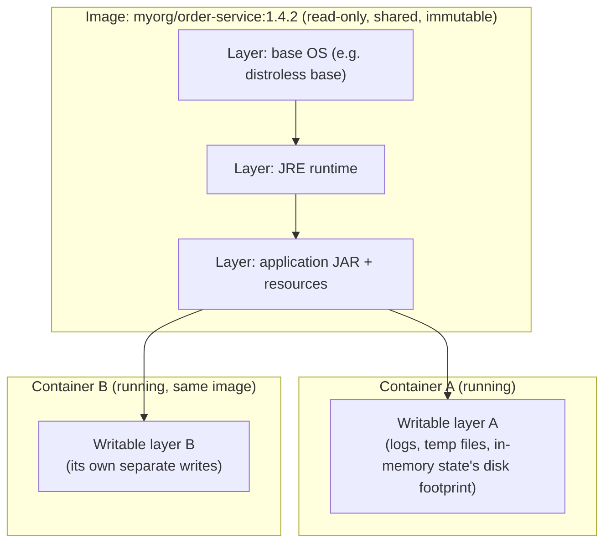

# Images vs. Containers

This distinction sounds obvious until you hit a bug that only makes sense once you internalize it properly: **an image is a static, immutable artifact; a container is a running process with a writable layer stacked on top of that artifact.** Confusing the two leads directly to two extremely common mistakes: expecting data written inside a container to persist after it's removed, and expecting a change to a running container to show up if you rebuild the image.

---

## An Image Is a Filesystem Snapshot Plus Metadata

A Docker image is:

1. A stack of **read-only filesystem layers** (covered mechanically next chapter)
2. A **manifest** describing those layers, their order, and their content hashes
3. **Configuration metadata** — the default command, environment variables, exposed ports, working directory, entrypoint, labels

None of this is running. An image sitting in your local image cache or in a registry is inert data — comparable to a `.jar` file sitting on disk. `docker images` shows you this inert catalog:

```bash
docker images
# REPOSITORY              TAG       IMAGE ID       SIZE
# myorg/order-service     1.4.2     a1b2c3d4e5f6   187MB
```

That `187MB` is real disk space, but it represents *no running process, no memory usage, no CPU usage*. It's a recipe, fully assembled but not yet cooked.

## A Container Is a Running Instance, Plus a Writable Layer

When you run `docker run myorg/order-service:1.4.2`, Docker:

1. Takes the image's read-only layers, unchanged
2. Adds a new, empty **writable layer** on top (specific to this container)
3. Starts the image's configured process inside a fresh set of namespaces (previous chapter), with cgroup limits applied
4. Assigns it a container ID, distinct from the image ID



Notice that Container A and Container B both sit on top of the *exact same* read-only image layers. Docker doesn't copy the 187MB of image data per container — it mounts the same read-only layers into both, via the union filesystem, and gives each container its own thin writable layer. This is why you can run 50 containers from the same image and use barely more disk space than one image's worth, plus whatever each container actually writes.

This also directly explains a behavior that surprises people the first time they hit it:

```bash
docker run -it --rm ubuntu:24.04 bash
# Inside the container:
echo "important data" > /tmp/notes.txt
exit
# Container is removed (--rm flag). /tmp/notes.txt is gone.
# It only ever existed in that container's writable layer, which no longer exists.
```

Data written into a container's writable layer dies with the container, unless it was written to a volume or bind mount (Phase 5). This is not a bug — it's the direct, mechanical consequence of what a container *is*: a temporary writable layer on top of a permanent, shared, read-only image.

---

## The Relationship, Precisely

| | Image | Container |
|---|---|---|
| State | Static, immutable | Running, mutable (writable layer) |
| Identity | Content-addressed (SHA256 digest of layers + config) | Runtime-assigned ID, tied to one execution |
| Lifetime | Persists until explicitly removed from local cache/registry | Exists from `docker create`/`run` until `docker rm` |
| Sharing | One image can back many containers simultaneously | A container belongs to exactly one image (at creation time) |
| Analogy | A class definition, or a compiled `.jar` | An object instantiated from that class, or a running JVM process from that jar |

That last analogy is worth sitting with if you're coming from Java: an image is like a compiled class — a `Runnable` blueprint that fully describes behavior but does nothing by itself. A container is like calling `.run()` on an instance of it — now it has a stack, a heap, live state — except that "live state" here includes an actual writable filesystem layer, not just JVM memory.

---

## Commands That Make This Distinction Concrete

```bash
# Build produces an IMAGE. Nothing runs yet.
docker build -t myorg/order-service:1.4.2 .

# `docker create` makes a CONTAINER from that image, but doesn't start it.
docker create --name order-svc myorg/order-service:1.4.2
docker ps -a
# CONTAINER ID   IMAGE                        STATUS
# 9f2a1b3c4d5e   myorg/order-service:1.4.2    Created (not running)

# `docker start` actually starts the process inside that container.
docker start order-svc
docker ps
# CONTAINER ID   IMAGE                        STATUS
# 9f2a1b3c4d5e   myorg/order-service:1.4.2    Up 2 seconds

# `docker run` = create + start in one step (what you use 95% of the time).
docker run -d --name order-svc-2 myorg/order-service:1.4.2

# Stopping a container does NOT delete it — the writable layer persists
# until you `docker rm` it.
docker stop order-svc
docker ps -a
# order-svc is still listed, status "Exited (0)"

# The writable layer is genuinely still there — you can inspect it:
docker diff order-svc
# Shows files added/changed/deleted in that container's writable layer
# relative to the image it was created from.

# Only `docker rm` actually discards the writable layer:
docker rm order-svc
```

`docker diff` is worth pausing on — it's a direct, visible demonstration of the writable layer's existence. It shows you *exactly* what a running (or stopped-but-not-removed) container has changed relative to its image, which is invaluable when debugging "why does this container behave differently than a fresh one from the same image" (a classic symptom of someone having manually patched a running container instead of rebuilding the image — an anti-pattern we'll call out explicitly and repeatedly).

---

## One Image, Many Tags — And What "Latest" Actually Means

A single image (identified by its content digest) can have multiple human-readable tags pointing at it:

```bash
docker build -t myorg/order-service:1.4.2 -t myorg/order-service:latest .
```

`latest` is not a special, automatically-updating pointer — it's just a tag string like any other, that happens to be Docker's default tag when you omit one. If you don't explicitly re-tag `latest` on every build, it silently stops pointing at your newest image. This is precisely why **production deployments should reference an explicit version tag (or, better, an image digest), never `latest`** — `latest` gives you no reproducibility guarantee at all, which directly undermines the entire "environment reproducibility" problem Docker exists to solve (Chapter 1). We'll make this a hard rule again in Phase 9 when we cover tagging strategy for CI/CD.

```bash
# This is NOT reproducible — "latest" could point to a different image
# tomorrow, or already point to something different in another environment:
docker run myorg/order-service:latest        # avoid in production

# This IS reproducible — this exact digest will never change:
docker run myorg/order-service@sha256:a1b2c3d4e5f6...
```

---

## Common Misconceptions This Chapter Should Correct

- **"Stopping a container frees its disk space."** No — `docker stop` halts the process but keeps the container (and its writable layer) around. Only `docker rm` (or `docker run --rm`, which auto-removes on exit) discards it.
- **"Editing a running container and committing it (`docker commit`) is a normal way to build images."** It works mechanically, but it's an anti-pattern: it produces an image with no reproducible build history, no Dockerfile to review or version, and no way to know what changed or why. Always build from a Dockerfile (Phase 2); reserve `docker commit` for interactive debugging archaeology, never for shipping.
- **"`latest` means the newest version."** It means whatever was last tagged `latest` — which, if your build pipeline isn't careful, might not be your newest image at all.
- **"An image and a container take roughly the same disk space."** An image's layers are shared read-only across every container built from it. A container typically only adds a small writable layer on top — unless the application inside is writing a lot of data without a volume, in which case that data is silently accumulating in a layer that vanishes on `docker rm`.

---

## What's Next

We've established that containers share read-only image layers via a writable layer trick — but we haven't explained the actual filesystem technology that makes "shared read-only layers with per-container writable overlay" possible without full copies. That's OverlayFS and union filesystems, and it's the mechanical foundation for both image layer caching (which determines your build speed, Phase 2) and copy-on-write semantics (which determine container filesystem performance, Phase 5).

**Next:** [`04-union-filesystems-and-layers.md`](./04-union-filesystems-and-layers.md)