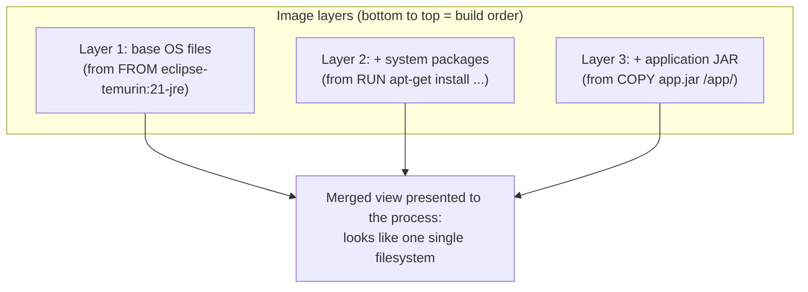
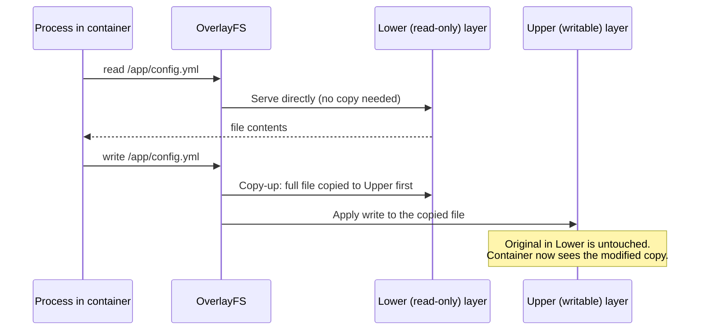

# Union Filesystems and Layers

Every Dockerfile instruction you'll write in Phase 2 — `FROM`, `RUN`, `COPY` — produces a **layer**. Every layer is a diff. Understanding *how* those diffs get stacked into what looks like a single coherent filesystem, and *why* that stacking mechanism is exactly what makes build caching, image sharing, and copy-on-write container writes all work, is the subject of this chapter. The technology is called a **union filesystem**, and on modern Linux, the implementation Docker uses by default is **OverlayFS**.

---

## The Core Idea: Stacking Read-Only Diffs

A union filesystem lets you take multiple directory trees ("layers") and present them to a process as if they were merged into one single directory tree — with a defined precedence order for which layer "wins" when the same file path exists in more than one.



Each layer only contains the *files it added, changed, or marked as deleted* relative to the layer below it. Layer 1 might be ~150MB (a full base OS). Layer 2 might be ~20MB (a few installed packages). Layer 3 might be ~40MB (your JAR and resources). The union filesystem driver presents these three as a single, seamless `/` to anything running inside — the process never "sees" the layering; it just sees files.

## OverlayFS: The Concrete Mechanism

OverlayFS (the default union filesystem driver on modern Docker/Linux) works with a small, precise vocabulary:

- **`lowerdir`** — one or more read-only layers (can be stacked, lowest to highest priority)
- **`upperdir`** — a single writable layer
- **`workdir`** — internal scratch space OverlayFS needs for atomic operations (you never touch this directly)
- **`merged`** — the resulting combined view — this is what actually gets mounted as the container's `/`

```bash
# This is conceptually what the kernel does when a container starts
# (Docker does this for you, but the underlying mount looks like this):
mount -t overlay overlay \
  -o lowerdir=/var/lib/docker/overlay2/layer1:/var/lib/docker/overlay2/layer2:/var/lib/docker/overlay2/layer3,\
upperdir=/var/lib/docker/overlay2/container-writable/diff,\
workdir=/var/lib/docker/overlay2/container-writable/work \
  /var/lib/docker/overlay2/merged
```

You can see this directly on a Docker host:

```bash
docker inspect --format '{{json .GraphDriver}}' order-svc | python3 -m json.tool
# {
#   "Data": {
#     "LowerDir": "/var/lib/docker/overlay2/abc123/diff:/var/lib/docker/overlay2/def456/diff",
#     "MergedDir": "/var/lib/docker/overlay2/xyz789/merged",
#     "UpperDir": "/var/lib/docker/overlay2/xyz789/diff",
#     "WorkDir": "/var/lib/docker/overlay2/xyz789/work"
#   },
#   "Name": "overlay2"
# }
```

`LowerDir` is exactly the image's read-only layers (Chapter 3's "image"). `UpperDir` is exactly that container's writable layer (Chapter 3's "container-specific state"). `MergedDir` is what actually gets presented as `/` inside the container via the mount namespace (Chapter 2). Three chapters of concepts, all converging on one `mount` command.

---

## Copy-on-Write: Why Reading Is Free, but the First Write Copies

The behavior that makes this efficient is **copy-on-write (COW)**:

- **Reading** a file that only exists in a lower (read-only) layer: OverlayFS serves it directly from that lower layer. No copying, no overhead beyond a normal read.
- **Writing** to a file that exists in a lower layer: OverlayFS first copies the *entire file* up into the writable `upperdir`, then applies the write there. This is called **"copy-up."** The original in the lower layer is untouched; the container's view now points at the modified copy in the writable layer.
- **Deleting** a file that exists in a lower layer: since the lower layer is read-only and can't actually be modified, OverlayFS creates a special marker file (a "whiteout") in the upper layer that tells the merged view "pretend this file doesn't exist," even though it's still physically present in the lower layer.



### The Practical Consequence: Copy-Up Cost on Large Files

Copy-on-write copies the **entire file**, not just the changed bytes, on first write. If your application does something like appending log lines to a large file that happens to live in a lower layer (unusual, but happens with misconfigured logging paths baked into an image), the *first* write triggers copying that entire file into the writable layer — which can be a real, measurable latency spike for large files, and a real, measurable disk usage increase.

This is one of several concrete reasons application data and logs belong in a **volume** (Phase 5), not in the container's writable layer: volumes bypass the union filesystem entirely and are mounted directly, avoiding copy-up overhead altogether and, more importantly, surviving container removal.

---

## Why This Makes Build Caching Possible

Every Dockerfile instruction produces a layer with its own content hash. Docker's build cache checks, instruction by instruction: *"have I built this exact layer, on top of this exact parent layer, before?"* If yes, it reuses the cached layer instead of re-executing the instruction.

```dockerfile
FROM eclipse-temurin:21-jre
COPY pom.xml .
RUN mvn dependency:go-offline    # Layer A: depends only on pom.xml's content
COPY src ./src                   # Layer B: depends on src/ content
RUN mvn package                  # Layer C: depends on Layer B's output
```

If you change a file in `src/` but not `pom.xml`, Docker's cache correctly reuses Layer A untouched (the dependency download layer) and only re-executes from `COPY src ./src` onward. This is precisely *why* Dockerfile instruction *ordering* is a real, load-bearing optimization technique, not a style preference — we'll build a full mental model and a real before/after benchmark for this in Phase 2 Chapter 2. Right now, the important takeaway is: **the cache operates at the layer level, and a layer is a union-filesystem diff, which is why reordering instructions changes what gets invalidated.**

---

## Why This Makes Image Sharing (and Disk Efficiency) Possible

Because a lower layer is content-addressed (identified by the hash of its contents) and strictly read-only, **any number of images and containers can reference the exact same physical layer on disk simultaneously**, with zero duplication.

```bash
# These three images all likely share the exact same base-OS and JRE layers
# on disk, because they're built FROM the same eclipse-temurin:21-jre tag:
docker build -t myorg/order-service:1.4.2 .
docker build -t myorg/inventory-service:2.1.0 .
docker build -t myorg/notification-service:1.0.3 .

# Check actual disk usage — you'll see it's far less than
# (size of one image) x 3, because shared layers aren't duplicated:
docker system df -v
```

This is the direct payoff of the layering model at scale: on a busy CI/CD system building dozens of services from a shared base image, or on a Kubernetes node running dozens of pods from a handful of base images, the marginal disk (and often network pull) cost of "one more container from an already-present base" is close to zero.

---

## Common Misconceptions This Chapter Should Correct

- **"Each layer is a full filesystem snapshot."** No — each layer (except the very first) is a *diff* relative to the layer below it. This is exactly why layer sizes in `docker history` roughly correspond to what that specific instruction changed, not the cumulative image size.
- **"Deleting a file in a later layer actually removes it from the image."** It creates a whiteout marker hiding it from the merged view — the bytes from the earlier layer are still physically present in the image, still contribute to image size, and still travel over the network on `docker pull`. This is precisely why "install build tools, use them, then `RUN rm -rf` them in the same layer" doesn't shrink your final image the way people expect, unless it's done within a single `RUN` instruction (so the deletion is part of the same layer as the installation) — a subtlety we exploit deliberately in the multi-stage builds chapter (Phase 2 Chapter 3).
- **"Container writes are as fast as normal filesystem writes, always."** True for genuinely new files created directly in the writable layer. Not true for the *first* write to a large pre-existing file from a lower layer, due to copy-up cost.
- **"OverlayFS is Docker-specific technology."** It's a general-purpose Linux kernel filesystem feature, usable outside Docker entirely (as the earlier `mount -t overlay` example shows). Docker is a well-integrated consumer of it, not its inventor.

---

## What's Next

We now understand the two kernel mechanisms (namespaces, cgroups) and the filesystem mechanism (union filesystem/OverlayFS) that together constitute "what a container is." What we haven't covered is the *software architecture* around these mechanisms — what `dockerd`, `containerd`, and `runc` each actually do, why Docker is split into these separate components at all, and why that split becomes directly relevant once Kubernetes enters the picture (Phase 10).

**Next:** [`05-docker-architecture-daemon-client-containerd.md`](./05-docker-architecture-daemon-client-containerd.md)