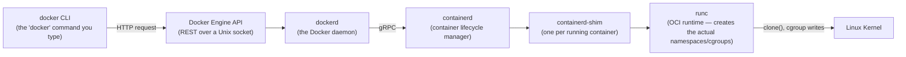
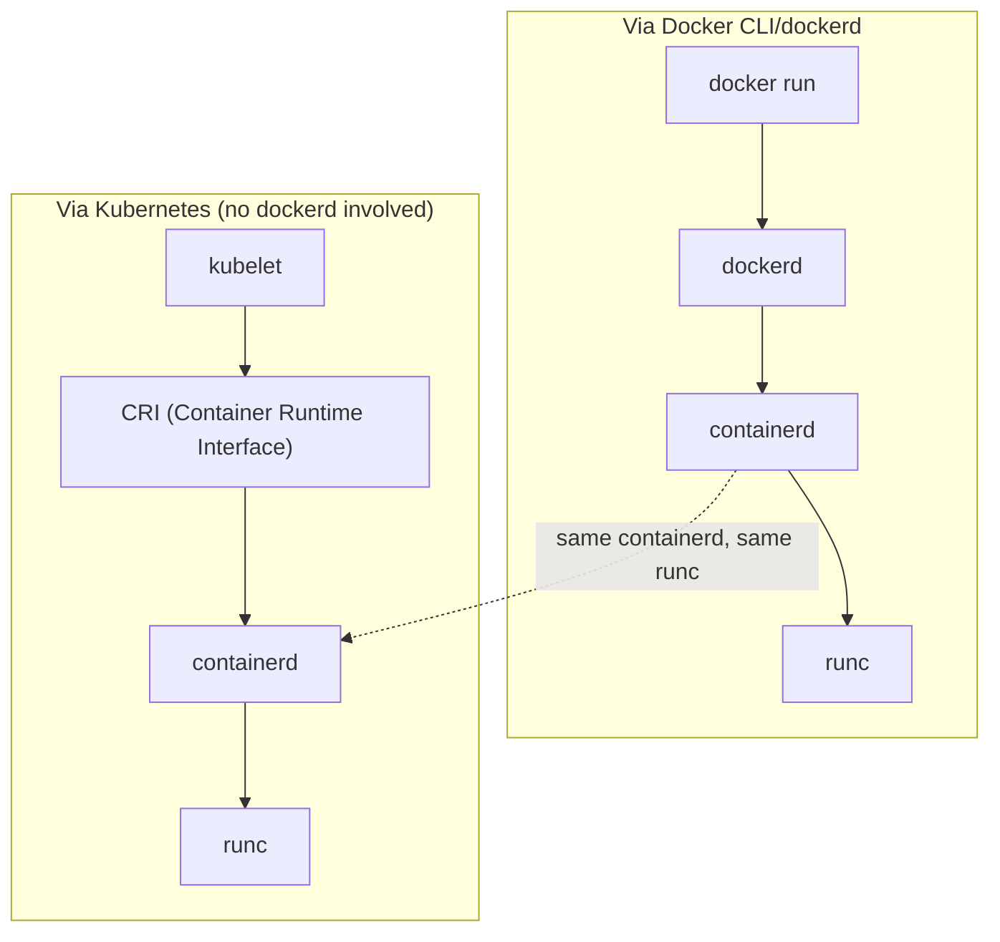

# Docker Architecture: Client, Daemon, containerd, and runc

You've been typing `docker run`, `docker build`, `docker ps` since long before this repository. This chapter explains what actually receives those commands, and why "Docker" is not one program but a chain of cooperating components — a chain whose shape directly explains why Kubernetes can use "the same containers" without using "Docker" at all (a point of confusion we resolve concretely here, and revisit in depth in Phase 10).

---

## The Chain, End to End



Each layer exists because it has a distinct, separable responsibility:

| Component | Responsibility |
|---|---|
| **docker CLI** | Parses commands you type, sends HTTP requests to the Docker API |
| **dockerd** | Owns image builds, networking config, volumes, the Docker API surface, and higher-level orchestration (Compose-adjacent concerns) |
| **containerd** | An industry-standard container *runtime manager* — handles pulling images, managing container lifecycle, storage — independent of Docker specifically |
| **containerd-shim** | A small long-lived process per running container that keeps the container's process alive even if `containerd` itself restarts, and reports exit status back |
| **runc** | The actual OCI-spec-compliant program that calls `clone()` with namespace flags and writes cgroup limits — the piece that does the Chapter 2 work |

---

## Why the Split Exists: containerd Predates and Outlives Docker-the-Product

Early Docker (pre-2016) was a single large monolithic daemon that did everything — image building, networking, container execution, the API — in one process. This had real problems: a bug or hang anywhere in that one process could affect every running container, and there was no clean way for *other* systems (like Kubernetes) to reuse "just the container-running part" without pulling in the whole Docker daemon and its opinions.

Docker Inc. extracted the container execution logic into **containerd**, then donated it to the Cloud Native Computing Foundation (the same foundation that governs Kubernetes) as an independent, standardized project. Later, the even-lower-level piece — the part that actually calls kernel syscalls to create namespaces and apply cgroups — was further extracted and standardized as **runc**, an implementation of the **OCI (Open Container Initiative) Runtime Specification**.

This matters concretely: **`containerd` and `runc` are not Docker-only technology.** Kubernetes doesn't need "Docker" installed at all — it can talk to `containerd` (or other OCI-compliant runtimes like CRI-O) directly, via the **Container Runtime Interface (CRI)**, entirely bypassing `dockerd`. This is why "Docker support was removed from Kubernetes" (a real, often-misunderstood event from 2020–2022) didn't mean "Kubernetes stopped running containers" — it meant Kubernetes stopped talking to the `dockerd` layer specifically, because it never needed dockerd's extra layer of API and opinions; it only ever needed the OCI-compliant runtime underneath. We'll make this fully concrete with the CRI in Phase 10 Chapter 2.



Both paths converge on the exact same `containerd` and `runc` — the *same* underlying container technology. "Docker" (the CLI + daemon) is one convenient, developer-friendly front-end to that technology; Kubernetes is a different front-end, built for cluster orchestration rather than developer ergonomics.

---

## What This Means for `docker build` Specifically

`docker build` historically lived entirely inside `dockerd`. Modern Docker builds (the default since Docker 23+) go through **BuildKit**, a separate, more sophisticated build engine that supports better caching, parallel build stages, and build secrets. BuildKit is itself another example of the same architectural pattern: a specialized component with a narrow, well-defined job (building images efficiently), pluggable underneath the same `docker build` command you already know. We dedicate a full chapter to BuildKit's internals in Phase 2 Chapter 5, once you have the Dockerfile mechanics to appreciate what it's optimizing.

---

## Making the Chain Visible on Your Own Machine

```bash
# The docker CLI is just a client — see the daemon it's talking to:
docker info | grep -i "server version"

# dockerd delegates to containerd — you can see containerd running
# as a genuinely separate OS process on a Linux Docker host:
ps aux | grep containerd
# root  1842  /usr/bin/containerd
# root  1843  /usr/bin/dockerd

# Each running container has its own shim process — this is why
# a container can survive `systemctl restart docker` without dying:
ps aux | grep containerd-shim
# root  5021  containerd-shim -namespace moby -id 9f2a1b3c... 

# You can even talk to containerd directly, bypassing dockerd entirely,
# using containerd's own CLI (ctr) if it's installed:
sudo ctr namespaces list
sudo ctr --namespace moby containers list
```

That last point — containers surviving a `dockerd` restart — is a direct, practical consequence of this architecture, and worth internalizing: because the shim (not `dockerd` itself) is the process actually supervising your running container, restarting or even briefly crashing the Docker daemon does **not** kill your running containers. This is a deliberate design goal (called "live restore" in Docker's own configuration), not an accident.

---

## Common Misconceptions This Chapter Should Correct

- **"Docker is one program."** It's a CLI, a daemon, a build engine (BuildKit), and it delegates actual container execution to `containerd` and `runc` — each independently useful, independently testable, and (for containerd/runc) independently standardized outside Docker Inc.
- **"Kubernetes used to run Docker containers, now it runs something else."** Kubernetes has always ultimately run OCI-compliant containers via `containerd` (or another CRI-compliant runtime) and `runc`. What changed was whether the *extra* `dockerd` layer sat in that path — removing it didn't change the container technology underneath, just cut out a layer Kubernetes didn't need.
- **"Restarting the Docker daemon kills all my containers."** With the shim architecture (and Docker's live-restore capability enabled), it generally doesn't — this is one of the concrete benefits of the split architecture.
- **"`runc` is a Docker product."** It's a CNCF-governed reference implementation of the OCI Runtime Specification — an open standard multiple runtimes (including alternatives like `crun`) implement.

---

## Closing Out Phase 1: What You Now Understand

At this point you have the complete mental model this entire repository builds on:

- **Chapter 1**: *Why* — containers solve environment reproducibility and process isolation without VM overhead
- **Chapter 2**: *Isolation mechanism* — namespaces control visibility, cgroups control consumption
- **Chapter 3**: *The image/container relationship* — static artifact vs. running instance with a writable layer
- **Chapter 4**: *The filesystem mechanism* — OverlayFS stacks read-only layers with copy-on-write, enabling caching and disk-efficient sharing
- **Chapter 5** (this one): *The software architecture* — CLI → dockerd → containerd → runc → kernel, and why that chain is shared with Kubernetes

Everything in Phases 2 through 10 is really just applying these five ideas to specific problems: building efficient images (Phase 2) is about layer diffs and caching; runtime behavior (Phase 3) is about namespaces and cgroups in practice; networking (Phase 4) is namespaces applied to network interfaces specifically; and so on. When something in a later phase seems to behave strangely, the answer is almost always traceable back to one of these five foundations.

---

## What's Next

Time to stop reading about the theory and build something real: containerizing an actual Spring Boot application from scratch, writing your first Dockerfile, running it, and verifying — end to end — every concept from this phase against a real running container.

**Next:** [`06-containerizing-your-first-spring-boot-app.md`](./06-containerizing-your-first-spring-boot-app.md)