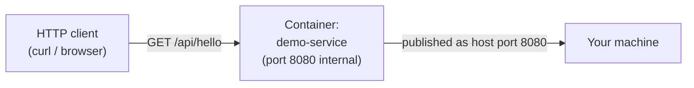

# Project: Containerizing Your First Spring Boot App

This project is the payoff for Phase 1. We'll build a minimal but realistic Spring Boot REST service, containerize it with a straightforward (deliberately not yet optimized — that's Phase 2) Dockerfile, run it, and then use the container to directly observe every concept from Chapters 1–5: the writable layer, the PID namespace, the cgroup memory boundary, and the daemon/containerd/runc chain.

By the end, you'll have a container running end-to-end, and you'll have personally verified — not just read about — how it actually works underneath.

---

## Objective

- Build a real Spring Boot REST API
- Package it as a runnable JAR with Maven
- Write a working (intentionally simple) Dockerfile
- Build the image, run the container, and hit the API
- Use `docker exec`, `docker inspect`, and `docker diff` to directly observe Phase 1 concepts in the running container

We are **not** optimizing image size or using multi-stage builds here — that's the entire subject of Phase 2. This project's goal is a correct, working container and a solid mental grounding in what's actually happening. Optimizing it comes next.

---

## Architecture



A single-service, no-dependency REST API — deliberately simple so that every step is attributable to a specific Docker concept, not obscured by application complexity.

---

## Folder Structure

```text
spring-boot-docker-demo/
├── pom.xml
├── src/
│   └── main/
│       ├── java/
│       │   └── com/example/demo/
│       │       ├── DemoApplication.java
│       │       └── HelloController.java
│       └── resources/
│           └── application.properties
└── Dockerfile
```

---

## Source Code

**`pom.xml`**

```xml
<?xml version="1.0" encoding="UTF-8"?>
<project xmlns="http://maven.apache.org/POM/4.0.0"
         xmlns:xsi="http://www.w3.org/2001/XMLSchema-instance"
         xsi:schemaLocation="http://maven.apache.org/POM/4.0.0
                              https://maven.apache.org/xsd/maven-4.0.0.xsd">
    <modelVersion>4.0.0</modelVersion>

    <parent>
        <groupId>org.springframework.boot</groupId>
        <artifactId>spring-boot-starter-parent</artifactId>
        <version>3.3.0</version>
    </parent>

    <groupId>com.example</groupId>
    <artifactId>demo</artifactId>
    <version>0.0.1-SNAPSHOT</version>
    <name>demo</name>

    <properties>
        <java.version>21</java.version>
    </properties>

    <dependencies>
        <dependency>
            <groupId>org.springframework.boot</groupId>
            <artifactId>spring-boot-starter-web</artifactId>
        </dependency>
        <dependency>
            <groupId>org.springframework.boot</groupId>
            <artifactId>spring-boot-starter-actuator</artifactId>
        </dependency>
    </dependencies>

    <build>
        <plugins>
            <plugin>
                <groupId>org.springframework.boot</groupId>
                <artifactId>spring-boot-maven-plugin</artifactId>
            </plugin>
        </plugins>
    </build>
</project>
```

Actuator is included deliberately — we'll use its `/actuator/health` endpoint to demonstrate health checks in later phases, but including it now avoids revisiting the POM later.

**`src/main/java/com/example/demo/DemoApplication.java`**

```java
package com.example.demo;

import org.springframework.boot.SpringApplication;
import org.springframework.boot.autoconfigure.SpringBootApplication;

@SpringBootApplication
public class DemoApplication {
    public static void main(String[] args) {
        SpringApplication.run(DemoApplication.class, args);
    }
}
```

**`src/main/java/com/example/demo/HelloController.java`**

```java
package com.example.demo;

import org.springframework.web.bind.annotation.GetMapping;
import org.springframework.web.bind.annotation.RestController;

import java.time.Instant;
import java.util.Map;

@RestController
public class HelloController {

    @GetMapping("/api/hello")
    public Map<String, Object> hello() {
        return Map.of(
            "message", "Hello from inside a container",
            "timestamp", Instant.now().toString(),
            "pid", ProcessHandle.current().pid()
        );
    }
}
```

Including `ProcessHandle.current().pid()` in the response is deliberate — it lets us verify the PID namespace concept from Chapter 2 directly through the API response, not just via `docker exec`.

**`src/main/resources/application.properties`**

```properties
server.port=8080
management.endpoints.web.exposure.include=health,info
```

---

## The Dockerfile

```dockerfile
# Phase 1: a correct, simple, single-stage Dockerfile.
# This is NOT yet optimized for size or build speed — see Phase 2 for that.

FROM eclipse-temurin:21-jdk

WORKDIR /app

# Copy the whole project and build inside the image.
# (Phase 2 will show why this is inefficient for caching and image size,
# and how multi-stage builds fix both problems.)
COPY . .

RUN ./mvnw clean package -DskipTests

EXPOSE 8080

ENTRYPOINT ["java", "-jar", "target/demo-0.0.1-SNAPSHOT.jar"]
```

A few deliberate choices worth explaining now, since they connect directly to Phase 1 concepts:

- **`FROM eclipse-temurin:21-jdk`** — this pulls a base image, i.e., the first (and largest) read-only layer (Chapter 4). Everything we add stacks on top of it.
- **`WORKDIR /app`** — sets the working directory *inside the container's mount namespace* (Chapter 2) — this has no effect on your host filesystem at all.
- **`COPY . .`** — creates a new layer containing your entire project directory, copied into the image's filesystem.
- **`RUN ./mvnw clean package`** — executes the Maven build *inside* the image build process, producing another layer containing the compiled JAR (and, unfortunately, the entire Maven local repo cache and your source tree too — exactly the inefficiency Phase 2 addresses).
- **`ENTRYPOINT`** — defines what process becomes **PID 1** (Chapter 2) when a container starts from this image.

---

## Build Commands

```bash
# From the project root (where the Dockerfile lives):
docker build -t demo-service:1.0 .
```

Expected output (abbreviated):

```text
[+] Building 42.3s (10/10) FINISHED
 => [1/4] FROM eclipse-temurin:21-jdk
 => [2/4] WORKDIR /app
 => [3/4] COPY . .
 => [4/4] RUN ./mvnw clean package -DskipTests
 => exporting to image
 => => naming to docker.io/library/demo-service:1.0
```

Verify the image exists:

```bash
docker images demo-service
# REPOSITORY      TAG   IMAGE ID       SIZE
# demo-service    1.0   7f8a9b0c1d2e   612MB
```

612MB is large for what is, functionally, a "hello world" — this is expected and intentional at this stage. The JDK base image alone is several hundred MB, and we've copied the entire Maven build context (including the local `.m2` cache generated during the build) into the final image. Phase 2 will bring this down dramatically using multi-stage builds and a JRE-only runtime base — keep this number in mind as your "before" baseline.

---

## Run Commands

```bash
docker run -d --name demo-service -p 8080:8080 demo-service:1.0
```

Verify it's running:

```bash
docker ps
# CONTAINER ID   IMAGE               STATUS         PORTS
# 3f4a5b6c7d8e   demo-service:1.0    Up 5 seconds   0.0.0.0:8080->8080/tcp
```

## Expected Output

```bash
curl http://localhost:8080/api/hello
```

```json
{
  "message": "Hello from inside a container",
  "timestamp": "2026-01-14T10:32:07.184Z",
  "pid": 1
}
```

**That `"pid": 1` is not a coincidence** — it's a direct, observable confirmation of the PID namespace concept from Chapter 2. Your Java process really is PID 1 inside its own PID namespace, even though it has a completely different PID on the host.

---

## Debugging Walkthrough: Verifying Phase 1 Concepts Directly

### 1. Confirm the PID namespace from both sides

```bash
# Inside the container's namespace, the java process is PID 1:
docker exec demo-service ps aux
# PID   USER     COMMAND
# 1     root     java -jar target/demo-0.0.1-SNAPSHOT.jar

# From the host, the SAME process has a completely different, larger PID:
ps aux | grep "demo-0.0.1-SNAPSHOT.jar"
# root  52847  ...  java -jar target/demo-0.0.1-SNAPSHOT.jar
```

Same process. Two different PID numbers, because two different PID namespaces are being viewed (Chapter 2).

### 2. Confirm the writable layer exists and captures runtime state

```bash
# Write something inside the running container:
docker exec demo-service sh -c "echo 'test data' > /tmp/scratch.txt"

# docker diff shows exactly this addition, in the container's writable layer:
docker diff demo-service
# A /tmp/scratch.txt
```

`A` means "added" — this file exists only in the writable layer on top of the read-only image (Chapter 3). If you `docker rm -f demo-service` and start a fresh container from the same image, `/tmp/scratch.txt` will not exist in the new container — it belongs to the writable layer of the specific container instance you wrote it in, not to the image.

### 3. Confirm the OverlayFS mount concretely

```bash
docker inspect --format '{{json .GraphDriver.Data}}' demo-service | python3 -m json.tool
```

```json
{
    "LowerDir": "/var/lib/docker/overlay2/abc.../diff:/var/lib/docker/overlay2/def.../diff",
    "MergedDir": "/var/lib/docker/overlay2/xyz.../merged",
    "UpperDir": "/var/lib/docker/overlay2/xyz.../diff",
    "WorkDir": "/var/lib/docker/overlay2/xyz.../work"
}
```

This is the literal OverlayFS mount structure from Chapter 4, populated with real paths from your own running container.

### 4. Confirm the cgroup memory boundary

```bash
# Run a second instance with an explicit, tight memory limit:
docker run -d --name demo-limited -p 8081:8080 --memory=100m demo-service:1.0

# Check whether it's still alive after startup — a default JVM heap
# on a 100MB cgroup limit is a genuinely tight fit and may OOM:
docker ps -a --filter name=demo-limited
docker inspect demo-limited --format '{{.State.OOMKilled}}'
```

If it printed `true`, you've just reproduced, on purpose, the exact cgroup OOM-kill mechanism from Chapter 2 — the kernel killed the JVM because cumulative memory crossed the cgroup limit, not because the JVM chose to exit. We'll return to correctly sizing JVM heaps against cgroup limits with real numbers in Phase 3.

### 5. Confirm the daemon/containerd/shim chain

```bash
# On the Docker host (not inside the container):
ps aux | grep containerd-shim | grep demo-service
# root  53012  containerd-shim -namespace moby -id 3f4a5b6c...
```

That shim process (Chapter 5) is what's actually supervising your container's process tree — independent of `dockerd` itself.

---

## Cleanup

```bash
docker stop demo-service demo-limited
docker rm demo-service demo-limited
docker rmi demo-service:1.0
```

---

## Common Mistakes

- **Forgetting `-p 8080:8080`** and then wondering why `curl localhost:8080` fails — the container's network namespace (Chapter 2) means its port 8080 is invisible from the host unless explicitly published.
- **Rebuilding the image without changing the tag**, then being confused that `docker run` still uses the old behavior — because an old container is still running from the previous image (Chapter 3: images are static, a running container doesn't "see" a rebuilt image until you stop it and start a new container from the new image).
- **Assuming a low `--memory` limit will produce a clean, catchable error inside the JVM.** It won't — it produces an ungraceful `SIGKILL` from the kernel OOM killer, as demonstrated above.

---

## Production Considerations (Preview)

This Dockerfile is intentionally not production-ready, and that's fine for a Phase 1 project — but keep this list in mind, because we address each one explicitly in an upcoming phase:

- **Image size (612MB)** → multi-stage builds, JRE-only base images (Phase 2)
- **Running as root by default** → non-root user (Phase 8)
- **No health check defined** → `HEALTHCHECK` and Kubernetes readiness/liveness semantics (Phase 3, Phase 7)
- **No graceful shutdown handling verified** → PID 1 signal handling (Phase 3)
- **Copying the entire build context, including `.git`, into the image** → `.dockerignore` and build context hygiene (Phase 2)

---

## What's Next

Phase 1 is complete. You now have a working mental model of what a container fundamentally is, and you've verified it against a real running Spring Boot service. Phase 2 takes this exact application and turns the Dockerfile above into something genuinely production-grade — cutting image size dramatically, understanding build caching precisely, and using multi-stage builds correctly.

**Next:** [`../phase-2-images-and-dockerfiles/01-dockerfile-instructions-deep-dive.md`](../phase-2-images-and-dockerfiles/01-dockerfile-instructions-deep-dive.md)