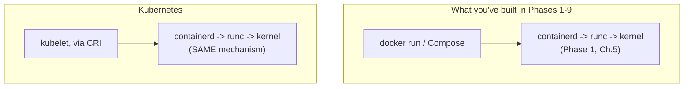
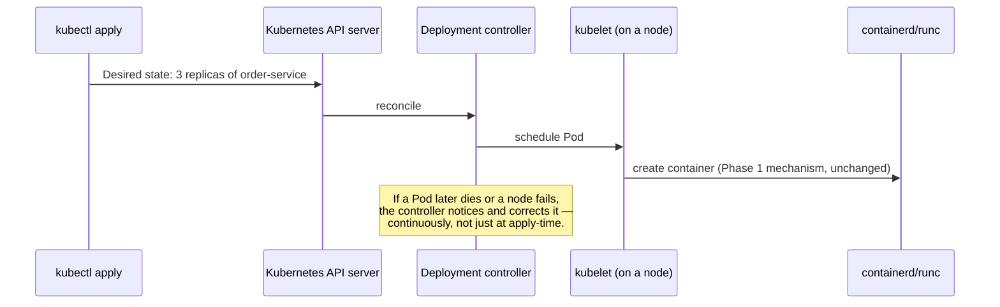

# What Kubernetes Takes From Docker

You already use Kubernetes at a basic level, per this repository's stated audience. This chapter and phase are not a Kubernetes tutorial — they're the bridge: mapping every concept built across nine phases onto its Kubernetes equivalent, so what you already know about Docker mechanics transfers directly rather than needing to be relearned as unrelated Kubernetes trivia.

---

## The Core Claim: Nothing Fundamental Changes, Only the Orchestration Layer

Every container Kubernetes runs is created via the exact same mechanism from Phase 1: `containerd` (or another CRI-compliant runtime) invoking `runc`, which calls `clone()` with namespace flags and writes cgroup limits. **A Kubernetes Pod's container is not a different kind of container** — it's an ordinary container, created the identical way, just scheduled and managed by a different, more sophisticated control plane than `dockerd` or Compose.

This is why everything from Phases 1, 3, 5, and 8 — namespaces, cgroups, the writable layer, volumes, non-root execution — applies **unchanged** once you're running under Kubernetes. What Kubernetes adds is the layer *above* that: scheduling across many machines, service discovery across a cluster instead of one host, and a richer, more explicit desired-state model than Compose's.

---

## A Direct Concept Map

| Docker/Compose concept | Kubernetes equivalent | What actually changes |
|---|---|---|
| A running container (Phase 1) | A container inside a Pod | Pods can hold multiple co-located containers; scheduling now spans a cluster, not one host |
| `docker run --memory`/`--cpus` (Phase 3) | Pod `resources.limits`/`requests` | Same cgroup mechanism underneath; Kubernetes adds a *request* (scheduling hint) distinct from the *limit* (hard ceiling) |
| User-defined bridge network + DNS (Phase 4) | Kubernetes Service + cluster DNS | Conceptually identical (name-based discovery); implementation spans multiple nodes via a cluster-wide overlay network |
| Named volume (Phase 5) | PersistentVolume + PersistentVolumeClaim | Same durability goal; decouples storage from any specific node, not just any specific container |
| Compose `depends_on` + healthcheck (Phase 6) | Init containers + readiness probes | Kubernetes formally separates startup-ordering (init containers) from ongoing traffic-routing (readiness probes) |
| Docker health check (Phase 7) | Separate livenessProbe / readinessProbe | Kubernetes has the two genuinely distinct mechanisms Phase 7 Chapter 4 argued Docker's single check conflates |
| `USER`, `--cap-drop`, `--read-only` (Phase 8) | Pod/container `securityContext` | Same underlying kernel mechanisms; now declared as structured Kubernetes API fields |
| CI-pushed, digest-referenced image (Phase 9) | `image:` field in a Pod spec, ideally by digest | Identical principle — Kubernetes just consumes the same registry-hosted artifact |

---

## What Genuinely Is New: Reconciliation at Cluster Scale

Compose (Phase 6) converges a single host toward a desired state described in one file. Kubernetes does the same *conceptually*, but across an entire cluster of machines, continuously, via **controllers** — background processes constantly comparing desired state (your manifests) against actual cluster state, and correcting drift automatically (restarting a crashed Pod, rescheduling one from a failed node onto a healthy one).

This continuous reconciliation loop — rather than a one-time `docker compose up` — is the single biggest genuinely new concept Kubernetes introduces relative to everything in this repository so far.

---

## Common Misconceptions

- **"Kubernetes uses a fundamentally different container technology than Docker."** It uses the identical OCI-compliant runtime chain (Phase 1, Chapter 5) — the difference is entirely in the orchestration layer above container creation.
- **"Everything I learned about Docker networking/storage/security is Docker-specific and doesn't transfer."** The underlying kernel mechanisms (namespaces, cgroups, OverlayFS) are exactly what Kubernetes relies on too — what changes is the API surface for expressing configuration, not the mechanism itself.
- **"Learning Kubernetes from scratch, ignoring Docker fundamentals, would have been faster."** The opposite is generally true for genuinely understanding *why* Kubernetes behaves the way it does (rather than memorizing YAML fields) — every mapping in this chapter's table only makes sense once you understand what's on the Docker side of it.

---

## What's Next

**Next:** [`02-container-runtime-interface-and-containerd.md`](./02-container-runtime-interface-and-containerd.md)