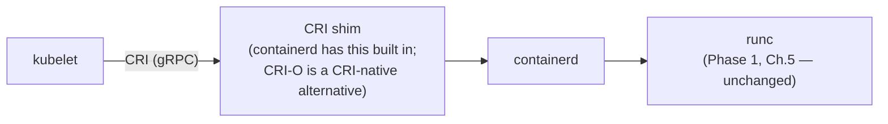
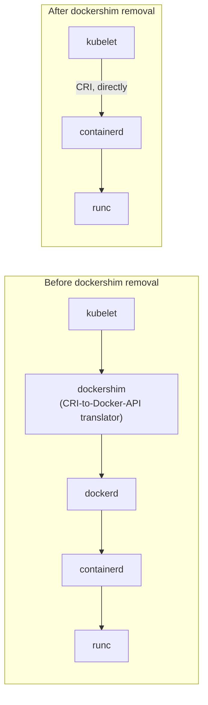

# The Container Runtime Interface and containerd

Phase 1 Chapter 5 previewed this: Kubernetes doesn't need `dockerd` at all, because it talks to a container runtime via a standardized interface. This chapter makes that mechanism fully concrete — what the CRI actually is, and why the widely-misunderstood "Docker support removed from Kubernetes" event (2020–2022) didn't change what container technology actually runs your workloads.

---

## The CRI: A gRPC API Between kubelet and the Runtime

Each Kubernetes node runs a **kubelet** — the agent responsible for actually running Pods on that node. Rather than kubelet knowing how to talk to any specific container engine's proprietary API, Kubernetes defines the **Container Runtime Interface (CRI)**: a standardized gRPC API that any compliant container runtime implements. kubelet talks *only* to this interface — it has no runtime-specific logic baked in at all.



`containerd` — the exact same component from Phase 1 Chapter 5 that sits underneath plain Docker — implements the CRI directly. This is precisely why Kubernetes can use `containerd` as its runtime with **zero dependency on `dockerd`** at all: `dockerd` was never part of this chain to begin with, from Kubernetes' perspective — it only ever needed the CRI-compliant layer underneath, which `containerd` already was.

---

## What Actually Happened With "Dockershim Removal"

Early Kubernetes versions supported Docker specifically via a compatibility shim called **dockershim** — a translation layer that let kubelet talk to `dockerd` (which didn't natively speak CRI) by pretending to be a CRI client on one side and a Docker API client on the other.



Removing dockershim (Kubernetes 1.24+) removed an unnecessary **extra translation hop** — kubelet now talks to `containerd` directly via native CRI, skipping the `dockerd` layer entirely. **The actual containers produced were running via `containerd` and `runc` both before and after this change** — nothing about the fundamental container technology changed; a middleman that added complexity without adding capability was removed.

This is exactly why the widely-repeated framing "Kubernetes doesn't support Docker anymore" is misleading if taken to mean "Kubernetes stopped running Docker-style containers" — it never ran anything conceptually different in the first place; it simply stopped routing through `dockerd`'s API for no remaining benefit.

---

## Practical Consequence: Images Built With `docker build` Still Work Perfectly

Because the **image format** (OCI Image Specification) is entirely separate from the **runtime chain** discussed above, every image you've built in this repository using `docker build` works completely unchanged under Kubernetes/containerd — an OCI-compliant image is an OCI-compliant image, regardless of which tool produced it or which CRI-compliant runtime eventually runs it.

```bash
# This exact image, built with plain docker build throughout this
# repository, runs identically under Kubernetes with zero changes:
docker build -t myorg/order-service:1.4.2 .
docker push myorg/order-service:1.4.2

# Kubernetes Pod spec references it exactly the same way it always would:
# image: myorg/order-service:1.4.2
```

Nothing from Phase 2's multi-stage builds, Phase 8's non-root/hardening work, or Phase 9's CI pipeline needs to change at all for a Kubernetes target — the entire image-building discipline built across this repository transfers completely unchanged.

---

## Alternative CRI-Compliant Runtimes

`containerd` is the most common choice, but **CRI-O** (a runtime built specifically and only to implement the CRI, with no independent Docker-compatible API layer at all) is a legitimate alternative used by some Kubernetes distributions (notably OpenShift). Both ultimately delegate to `runc` (or an alternative OCI-compliant low-level runtime like `crun`) for actual container creation — the CRI standardization is precisely what makes this runtime choice largely invisible to anything above it, including your Pod specs and your images.

---

## Common Misconceptions

- **"Removing dockershim meant Kubernetes stopped running Docker images."** Image format (OCI) and runtime mechanism (containerd/runc) are separate concerns — dockershim removal only affected an unnecessary translation hop in the runtime chain, never the image format your Dockerfiles produce.
- **"You need Docker installed on a Kubernetes node for anything to work."** A Kubernetes node needs a CRI-compliant runtime (containerd, CRI-O) — `dockerd` itself is not required and, on modern clusters, typically isn't even present.
- **"CRI is Kubernetes-specific technology that Docker itself doesn't use."** `containerd` — the same component underneath plain `docker build`/`run` since Phase 1 — is the same component implementing CRI for Kubernetes; it's genuinely shared, not a Kubernetes-only fork.

---

## What's Next

**Next:** [`03-translating-compose-concepts-to-kubernetes.md`](./03-translating-compose-concepts-to-kubernetes.md)