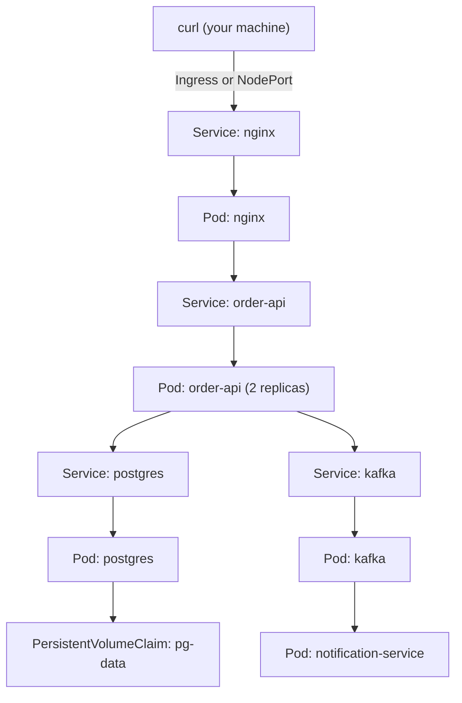

# Project: Migrating the Compose Stack to Kubernetes Manifests

This project takes the Phase 6 Compose stack (nginx, order-api, postgres, redis, kafka, notification-service) and produces a complete, working set of Kubernetes manifests — applying every mapping from Chapter 3 and every requirement from Chapter 4, using the exact hardened image from Phase 8's project.

---

## Objective

- Translate every Compose service into Deployment + Service pairs
- Replace bare `depends_on` with init containers, and Compose healthchecks with proper readiness/liveness probes
- Replace the named `pg-data` volume with a PersistentVolumeClaim
- Apply the Phase 8 `securityContext` hardening, with `runAsNonRoot: true` enforced
- Verify the full stack runs correctly on a local cluster (minikube or kind)

---

## Architecture



---

## Folder Structure

```text
k8s-migration-project/
├── namespace.yaml
├── postgres/
│   ├── pvc.yaml
│   ├── deployment.yaml
│   └── service.yaml
├── redis/
│   ├── deployment.yaml
│   └── service.yaml
├── kafka/
│   ├── deployment.yaml
│   └── service.yaml
├── order-api/
│   ├── configmap.yaml
│   ├── secret.yaml
│   ├── deployment.yaml
│   └── service.yaml
├── notification-service/
│   └── deployment.yaml
└── nginx/
    ├── configmap.yaml
    ├── deployment.yaml
    └── service.yaml
```

---

## Key Manifests

**`postgres/pvc.yaml`**

```yaml
apiVersion: v1
kind: PersistentVolumeClaim
metadata:
  name: pg-data
spec:
  accessModes: ["ReadWriteOnce"]
  resources:
    requests:
      storage: 5Gi
```

**`postgres/deployment.yaml`**

```yaml
apiVersion: apps/v1
kind: Deployment
metadata:
  name: postgres
spec:
  replicas: 1
  selector:
    matchLabels: { app: postgres }
  template:
    metadata:
      labels: { app: postgres }
    spec:
      containers:
        - name: postgres
          image: postgres:16
          env:
            - name: POSTGRES_DB
              value: orders
            - name: POSTGRES_PASSWORD
              valueFrom:
                secretKeyRef: { name: pg-credentials, key: password }
          readinessProbe:
            exec:
              command: ["pg_isready", "-U", "postgres"]
            periodSeconds: 5
          volumeMounts:
            - name: pg-storage
              mountPath: /var/lib/postgresql/data
      volumes:
        - name: pg-storage
          persistentVolumeClaim: { claimName: pg-data }
```

**`order-api/deployment.yaml`** (the Phase 8 hardened image, with the Chapter 3/4 requirements applied)

```yaml
apiVersion: apps/v1
kind: Deployment
metadata:
  name: order-api
spec:
  replicas: 2
  selector:
    matchLabels: { app: order-api }
  template:
    metadata:
      labels: { app: order-api }
    spec:
      securityContext:
        runAsNonRoot: true
        fsGroup: 1001
      initContainers:
        - name: wait-for-postgres
          image: busybox
          command: ['sh', '-c', 'until nc -z postgres 5432; do sleep 2; done']
      containers:
        - name: order-api
          image: myorg/order-service:1.4.2-hardened   # Phase 8's hardened image
          envFrom:
            - configMapRef: { name: order-api-config }
          env:
            - name: SPRING_DATASOURCE_PASSWORD
              valueFrom:
                secretKeyRef: { name: pg-credentials, key: password }
          ports:
            - containerPort: 8080
          resources:
            requests: { memory: "400Mi", cpu: "250m" }
            limits: { memory: "512Mi", cpu: "500m" }
          readinessProbe:
            httpGet: { path: /actuator/health/readiness, port: 8080 }
            initialDelaySeconds: 15
            periodSeconds: 10
          livenessProbe:
            httpGet: { path: /actuator/health/liveness, port: 8080 }
            initialDelaySeconds: 30
            periodSeconds: 15
          securityContext:
            allowPrivilegeEscalation: false
            readOnlyRootFilesystem: true
            capabilities: { drop: ["ALL"] }
          volumeMounts:
            - name: tmp
              mountPath: /tmp
      volumes:
        - name: tmp
          emptyDir: {}   # Kubernetes' equivalent of Phase 8's --tmpfs /tmp
```

`emptyDir: {}` here is the direct Kubernetes equivalent of Phase 8's `--tmpfs /tmp` runtime flag — providing exactly the narrow writable exception a read-only-root-filesystem container needs, without compromising the read-only guarantee everywhere else.

**`order-api/service.yaml`**

```yaml
apiVersion: v1
kind: Service
metadata:
  name: order-api
spec:
  selector: { app: order-api }
  ports:
    - port: 8080
      targetPort: 8080
```

---

## Apply and Verify Commands

```bash
kubectl create namespace order-system
kubectl apply -n order-system -f postgres/ -f redis/ -f kafka/ \
  -f order-api/ -f notification-service/ -f nginx/

kubectl get pods -n order-system
# NAME                          READY   STATUS    RESTARTS
# postgres-7d8f9c-x2k9p         1/1     Running   0
# order-api-6b7d8f-a1b2c        1/1     Running   0
# order-api-6b7d8f-d3e4f        1/1     Running   0
```

## Expected Output

```bash
kubectl port-forward svc/nginx -n order-system 8080:80
curl -X POST http://localhost:8080/api/orders \
  -H "Content-Type: application/json" -d '{"sku":"WIDGET-001","quantity":5}'
# {"id":1,"sku":"WIDGET-001","quantity":5,"createdAt":"..."}
```

---

## Debugging Walkthrough

### Confirm `runAsNonRoot` is genuinely enforced

```bash
# Deliberately point at an image with no non-root USER set,
# to confirm Kubernetes actually refuses to start it:
kubectl run test-root --image=eclipse-temurin:21-jre \
  --overrides='{"spec":{"securityContext":{"runAsNonRoot":true}}}' \
  -n order-system
kubectl get pods test-root -n order-system
# STATUS: CreateContainerConfigError
kubectl describe pod test-root -n order-system | grep -A2 "Events"
# ... container has runAsNonRoot and image will run as root
```

This directly confirms Chapter 4's claim: `runAsNonRoot: true` is a hard admission-time enforcement, not merely advisory.

### Confirm readiness/liveness are genuinely separate

```bash
# Kill postgres briefly and observe order-api's Pods:
kubectl scale deployment postgres --replicas=0 -n order-system
kubectl get pods -n order-system -w
# order-api Pods should show READY 0/1 (readiness failing correctly)
# but NOT show RESTARTS incrementing (liveness unaffected) —
# exactly the Phase 7, Chapter 4 distinction, now enforced by Kubernetes.
kubectl scale deployment postgres --replicas=1 -n order-system
```

---

## Production Considerations

- This project uses `emptyDir` for local Postgres storage class simplicity; a genuine production cluster needs a proper `StorageClass` backing the PVC (cloud block storage, or an equivalent), not the cluster's default.
- A real production setup would add a `NetworkPolicy` explicitly restricting which Pods can reach `postgres` — the Kubernetes-native enforcement of the exact trust-boundary principle from Phase 4's networking lab, now expressed as policy rather than relying solely on Docker's simpler network-membership model.

---

## Cleanup

```bash
kubectl delete namespace order-system
```

---

## What's Next

Phase 10, and every concept phase in this repository, is now complete. What remains is the capstone: a full production-grade e-commerce backend bringing together every phase — from kernel-level container mechanics through to a Kubernetes-ready, CI-piped, hardened multi-service system — built and documented end to end.

**Next:** [`../capstone/00-capstone-architecture-and-objective.md`](../capstone/00-capstone-architecture-and-objective.md)