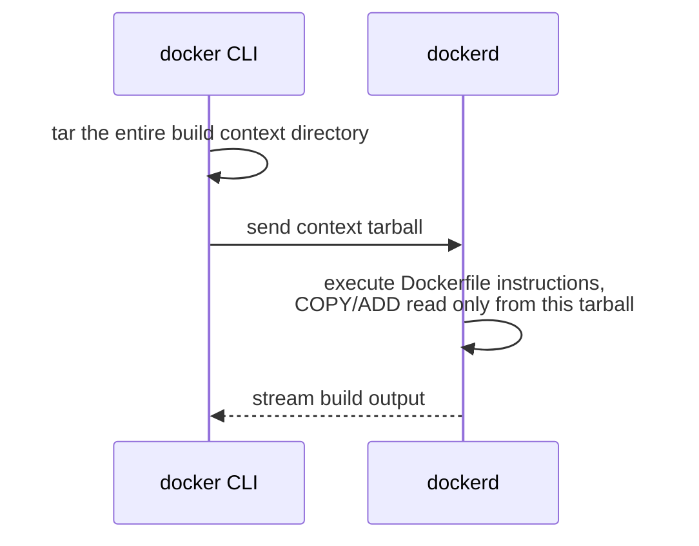
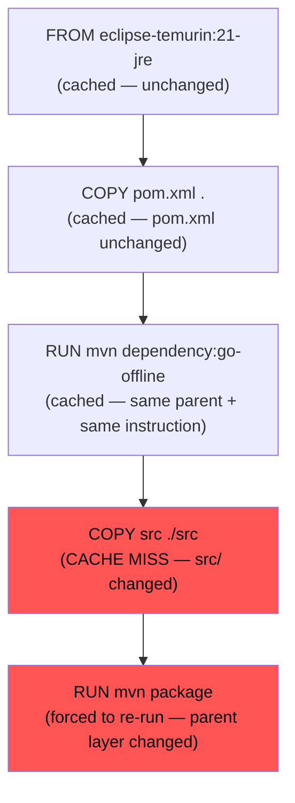

# Build Context and Caching

Two related but distinct concepts sit at the heart of build performance: the **build context** (what files Docker even has access to during a build) and the **layer cache** (which previously-built layers get reused vs. rebuilt). Get the build context wrong and every build sends megabytes of irrelevant data to the daemon. Get instruction ordering wrong and every build re-downloads your entire Maven dependency tree even when you only changed one line of application code. This chapter fixes both.

---

## What "Build Context" Actually Means

When you run:

```bash
docker build -t myimage .
```

That trailing `.` is not "the directory the Dockerfile is in" in some abstract sense — it is **the exact set of files the Docker daemon is allowed to see during this build.** Before executing a single instruction, the Docker CLI **tars up the entire contents of that directory** and sends it to the daemon (which may be a remote process, even on the same machine, communicating over a socket — recall the CLI/daemon split from Phase 1, Chapter 5).



This has a direct, measurable consequence: **if your project directory contains a 2GB `node_modules`, a `.git` history, log files, or IDE metadata, every single build sends all of it to the daemon — even if your Dockerfile never references most of it.** You'll see this as a slow "Sending build context to Docker daemon" step before any instruction even starts executing.

### `.dockerignore`: Trimming the Context Before It's Sent

```text
# .dockerignore — same syntax family as .gitignore
.git
target/
*.log
.idea/
.vscode/
node_modules/
*.md
Dockerfile
.dockerignore
```

This file is read *before* the tar step — excluded paths never leave your machine as part of the build context at all. For our Phase 1 Spring Boot project, excluding `.git` and any local `target/` from a previous local build is not just a speed optimization — it also prevents a genuinely security-relevant mistake: **accidentally `COPY`ing your entire `.git` directory (with full history, including anything ever committed and later "removed") into a production image**, where anyone with image access can extract it.

```bash
# Without .dockerignore: context might be 400MB (includes .git, target/, logs)
docker build -t myimage .
# => Sending build context to Docker daemon 412.3MB

# With .dockerignore excluding the above:
docker build -t myimage .
# => Sending build context to Docker daemon 3.2MB
```

---

## The Build Cache: What Actually Gets Reused

Recall from Phase 1, Chapter 4: each `RUN`/`COPY`/`ADD` produces a content-addressed layer. Docker's build cache, for each instruction, checks: **"does a cached layer already exist that resulted from this exact instruction, applied to this exact parent layer?"** If yes, that layer is reused verbatim, and the instruction is *not* re-executed at all.

Two things invalidate this check:

1. **The instruction text itself changes** (e.g., you edit the `RUN` command)
2. **For `COPY`/`ADD`: the content of the copied files changes** (checked via content hash, not just filename or timestamp)
3. **Any earlier layer in the chain was invalidated** — cache invalidation is contagious *downward* through the rest of the Dockerfile. Once one layer misses the cache, every subsequent instruction re-executes too, even if those later instructions themselves didn't change.



This is exactly why **instruction ordering is a real performance lever, not a style preference.** The rule falls directly out of the mechanism: **put things that change rarely earlier in the Dockerfile, and things that change frequently as late as possible.**

---

## The Concrete Pattern: Dependency Caching

Your Phase 1 Dockerfile did this:

```dockerfile
COPY . .
RUN ./mvnw clean package -DskipTests
```

Every single time *any* file in the project changes — including a one-line change to `HelloController.java` — this invalidates the `COPY . .` layer, which invalidates the `RUN` layer, which means **Maven re-downloads your entire dependency tree from scratch, every build.** For a typical Spring Boot project, that's often 30 seconds to several minutes of pure waste on every single code change.

The fix separates "things that change when dependencies change" from "things that change on every code edit":

```dockerfile
FROM eclipse-temurin:21-jdk AS build
WORKDIR /app

# Copy ONLY the dependency descriptor first.
COPY pom.xml .
COPY .mvn .mvn
COPY mvnw .

# This layer is cached as long as pom.xml doesn't change —
# meaning dependency downloads are skipped on almost every rebuild.
RUN ./mvnw dependency:go-offline -B

# NOW copy the source — this is the layer that changes on every edit,
# but it's cheap: just a file copy, no network activity.
COPY src ./src

# Only this final build step re-runs on every code change,
# and it uses the already-cached, already-downloaded dependencies.
RUN ./mvnw clean package -DskipTests -o
```

```bash
# First build: downloads everything, slow (expected, one-time cost)
docker build -t demo-service:2.0 .
# => RUN ./mvnw dependency:go-offline  ... 47.2s

# Change ONLY HelloController.java, rebuild:
docker build -t demo-service:2.0 .
# => COPY pom.xml .                    CACHED
# => RUN ./mvnw dependency:go-offline  CACHED   <- skipped entirely!
# => COPY src ./src                    (fast — just a file copy)
# => RUN ./mvnw clean package -o       ... 8.1s  <- only the actual compile
```

The dependency download step goes from "every build" to "only when `pom.xml` actually changes" — often a 5–10x build time reduction for iterative development, purely from instruction reordering. No new tools, no configuration flags — just applying the cache invalidation rule deliberately.

---

## `--no-cache`: When You Deliberately Want to Bypass This

```bash
docker build --no-cache -t myimage .
```

Forces every instruction to re-execute regardless of cache state. Legitimate uses: verifying a build is reproducible from scratch, debugging a suspicion that a stale cached layer is masking a real problem (e.g., an `apt-get install` silently using outdated cached package lists — see Chapter 1's discussion of why `apt-get update && apt-get install` must be one instruction), or a scheduled "clean rebuild" in CI to catch upstream base-image security patches that a cached layer would otherwise hide indefinitely.

---

## Cache Scope: It's Local (or Registry-Backed) — Not Automatically Shared

By default, the build cache lives on the machine that ran the build. A fresh CI runner, with no prior build history, gets zero cache benefit on its first build — every layer executes from scratch. For teams running CI on ephemeral runners, this matters enough that BuildKit supports **exporting and importing cache from a remote registry**, letting a fresh runner "warm start" from a previous build's cache even though it's never run this build before:

```bash
# Export this build's cache layers to a registry-hosted cache image:
docker build \
  --cache-to type=registry,ref=myorg/order-service:buildcache \
  --cache-from type=registry,ref=myorg/order-service:buildcache \
  -t myorg/order-service:1.4.2 .
```

We'll return to this specific pattern with full CI context in Phase 9 — for now, understand the underlying reason it's necessary: **the cache is tied to the machine/storage where layers physically exist, and ephemeral CI runners don't automatically inherit yesterday's cache** unless you explicitly ship it somewhere durable and pull it back down.

---

## Common Misconceptions This Chapter Should Correct

- **"The build context is just `.` — it doesn't cost anything to reference it."** It's tarred and transmitted in full (minus `.dockerignore` exclusions) before the build even starts; a bloated context directly slows every build.
- **"Docker's cache checks file timestamps."** It checks content, via hashing — renaming a file with identical content and touching its timestamp won't invalidate the cache; changing even one byte of content will.
- **"Reordering Dockerfile instructions is just cleanliness/style."** It's a direct, mechanical lever on build cache invalidation and therefore on build speed — the earlier an instruction sits, the less frequently its cache gets busted.
- **"A cache hit means the underlying content is guaranteed identical to what would be freshly built."** It means the *inputs* (parent layer + instruction text + copied file content) are identical to a previous build — which is exactly what you want, but it does mean a base image's own upstream security patches won't reach you until you either bump the base image tag or force `--no-cache`.

---

## What's Next

We've optimized *rebuild speed* through cache-aware ordering. We haven't yet addressed the other half of Phase 1's 612MB problem: the final image still contains the entire JDK, the whole Maven dependency cache, and your raw source tree — none of which the *running* application actually needs. That's what multi-stage builds solve, and it's the single highest-leverage optimization in this entire phase.

**Next:** [`03-multi-stage-builds.md`](./03-multi-stage-builds.md)