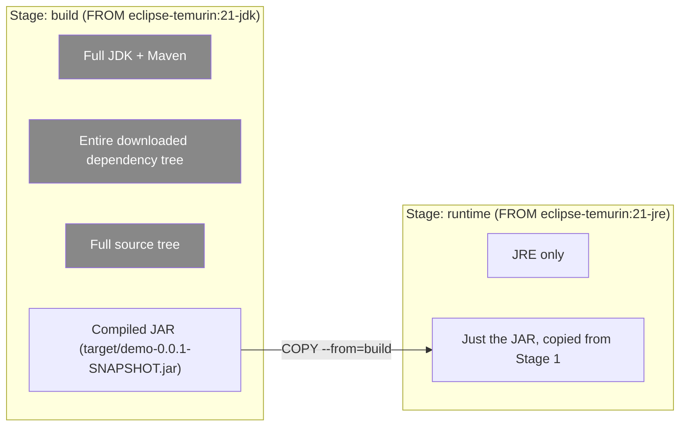

# Multi-Stage Builds

Our Phase 1 image was 612MB, and the previous chapter's caching fix made it *build faster* — but it's still 612MB, because the final image still contains the full JDK, the entire downloaded Maven dependency tree, your raw source code, and every intermediate build artifact. None of that is needed to *run* the application — only to *build* it. Multi-stage builds are the mechanism that lets you use a heavy, tool-rich environment to build your artifact, then discard everything except the artifact itself in the final image. This is the single highest-leverage optimization available to you, and it directly follows from the layer/union-filesystem mechanics in Phase 1, Chapter 4.

---

## The Core Idea: Multiple `FROM` Instructions, Selective Copying

A multi-stage Dockerfile has more than one `FROM` instruction, each starting a new, independent build stage. Later stages can selectively `COPY --from=<stage>` specific files out of earlier stages — pulling in only the finished artifact, not the tools that produced it.

```dockerfile
# ---- Stage 1: "build" — has the full JDK, Maven, source tree ----
FROM eclipse-temurin:21-jdk AS build
WORKDIR /app
COPY pom.xml .mvn mvnw ./
RUN ./mvnw dependency:go-offline -B
COPY src ./src
RUN ./mvnw clean package -DskipTests -o

# ---- Stage 2: "runtime" — only the JRE, only the final JAR ----
FROM eclipse-temurin:21-jre AS runtime
WORKDIR /app
COPY --from=build /app/target/demo-0.0.1-SNAPSHOT.jar app.jar
EXPOSE 8080
ENTRYPOINT ["java", "-jar", "app.jar"]
```



**The final image is built entirely from Stage 2's layers.** Stage 1's JDK, Maven cache, and source tree never become part of the shipped image at all — they exist only transiently during the build, in an intermediate image that gets discarded (or kept in the local build cache for reuse, but never pushed to a registry or deployed).

```bash
docker build -t demo-service:2.0 .
docker images demo-service
# REPOSITORY      TAG   SIZE
# demo-service    1.0   612MB    <- Phase 1's single-stage build
# demo-service    2.0   241MB    <- multi-stage, JRE-only runtime
```

Already a significant reduction, purely from separating "build tools" from "runtime." We'll push this further in Chapter 4 (choosing base images) and the Chapter 6 project — 241MB is a good milestone, not the final destination.

---

## Named Stages Are Just Labels — Use Them for Clarity, Not Just the Last Stage

`AS build` and `AS runtime` are arbitrary names — they exist purely so later stages (or the CLI) can reference an earlier stage explicitly. You can have as many stages as you want, and any stage can copy from any *earlier* stage:

```dockerfile
FROM eclipse-temurin:21-jdk AS deps
WORKDIR /app
COPY pom.xml .mvn mvnw ./
RUN ./mvnw dependency:go-offline -B

FROM deps AS build
COPY src ./src
RUN ./mvnw clean package -DskipTests -o

FROM eclipse-temurin:21-jre AS runtime
WORKDIR /app
COPY --from=build /app/target/demo-0.0.1-SNAPSHOT.jar app.jar
ENTRYPOINT ["java", "-jar", "app.jar"]
```

Splitting "download dependencies" (`deps`) from "compile source" (`build`) as separate stages is a deliberate caching refinement building on Chapter 2's lesson: `deps` only rebuilds when `pom.xml` changes, `build` only rebuilds when source changes, and `runtime` only rebuilds when the copied artifact actually changes — three independent cache boundaries instead of one monolithic build stage.

### Targeting a Specific Stage

```bash
# Build only up through the "deps" stage — useful for debugging
# or for warming a cache layer independently:
docker build --target deps -t demo-deps-cache .

# Build the full multi-stage pipeline through to the final stage (default):
docker build -t demo-service:2.0 .
```

`--target` is genuinely useful in CI: you can build and cache a `test` stage (running unit tests inside the build) separately from the final `runtime` stage, without shipping test dependencies or test-only tooling into the deployed image at all.

---

## A Realistic Pattern: Adding a Test Stage

```dockerfile
FROM eclipse-temurin:21-jdk AS deps
WORKDIR /app
COPY pom.xml .mvn mvnw ./
RUN ./mvnw dependency:go-offline -B

FROM deps AS test
COPY src ./src
RUN ./mvnw test

FROM deps AS build
COPY src ./src
RUN ./mvnw clean package -DskipTests -o

FROM eclipse-temurin:21-jre AS runtime
WORKDIR /app
COPY --from=build /app/target/demo-0.0.1-SNAPSHOT.jar app.jar
ENTRYPOINT ["java", "-jar", "app.jar"]
```

```bash
# In CI: run the test stage as a gate. If tests fail, the build fails here —
# the runtime stage is never even attempted:
docker build --target test -t demo-service:test .

# Only if that succeeds, build the actual deployable image:
docker build --target runtime -t demo-service:2.0 .
```

This gives you **tests that run inside the exact same environment your image is built in** (same JDK version, same OS libraries) — closing a real gap where "tests pass on the CI runner's own Java install" doesn't guarantee "tests pass in the environment the built artifact actually runs in."

---

## Why This Also Improves Build Parallelism

Independent stages (ones that don't depend on each other via `COPY --from`) can be built **in parallel** by BuildKit — we cover BuildKit's execution model precisely in Chapter 5, but it's worth flagging here: multi-stage builds aren't just a size optimization, they're also a structural hint that lets the build engine do less serial work when stages are genuinely independent (e.g., a stage compiling a frontend asset bundle and a stage compiling the backend JAR, combined only in a final assembly stage).

---

## Common Misconceptions This Chapter Should Correct

- **"Multi-stage builds require multiple Dockerfiles."** No — it's multiple `FROM` instructions within a single Dockerfile.
- **"Earlier stages' layers still bloat the final image, just hidden."** No — the final image's layer graph is determined entirely by the final stage (or whatever `--target` you built), traced back only through its own `COPY --from` dependencies. Earlier stages that nothing copies from are irrelevant to the shipped image's size, though they do still consume local build cache disk space until pruned (`docker builder prune`).
- **"You need `--target` to get the size benefit."** No — by default, `docker build` builds through to the *last* stage in the file, and that's what determines the final image. `--target` is for selectively stopping earlier (e.g., building just a test stage), not a requirement for multi-stage benefits.
- **"Multi-stage builds are only useful for compiled languages like Java."** They're broadly useful anywhere a build process needs tools the runtime doesn't (a Node.js `npm run build` producing static assets served by nginx is an equally common multi-stage pattern) — the Java/Maven case is simply the one most directly relevant to you.

---

## What's Next

Multi-stage builds cut our image from 612MB to 241MB by removing build tooling from the shipped image. The next lever is the *runtime* base image itself — is `eclipse-temurin:21-jre` even the right choice, or is there something smaller and more secure? That's the subject of the next chapter: JRE vs. JDK vs. distroless vs. Alpine-based images, and the real trade-offs between them.

**Next:** [`04-choosing-base-images-jre-vs-jdk-vs-distroless.md`](./04-choosing-base-images-jre-vs-jdk-vs-distroless.md)