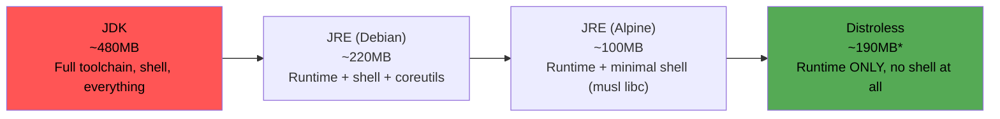

# Choosing Base Images: JRE vs. JDK vs. Distroless

We cut our image from 612MB to 241MB by separating build tools from runtime (previous chapter). The base image we run on top of is the next lever, and it's not a simple "smaller is always better" decision — each option trades off image size against debuggability, security surface, and operational familiarity. This chapter gives you the actual trade-offs so you can make this choice deliberately, per service, rather than defaulting to whatever the first tutorial you read used.

---

## The Options, Concretely

| Base image family | Approx. size (Java 21) | Contains |
|---|---|---|
| `eclipse-temurin:21-jdk` | ~450–500MB | Full JDK: compiler, debugger tools, full dev toolchain |
| `eclipse-temurin:21-jre` | ~200–230MB | Java runtime only, no compiler/dev tools |
| `eclipse-temurin:21-jre-alpine` | ~90–120MB | JRE on Alpine Linux (musl libc, minimal package set) |
| `gcr.io/distroless/java21-debian12` | ~180–200MB (mostly the JRE itself) | JRE plus an absolute minimal Debian base — **no shell, no package manager, no coreutils** |

None of these numbers include your application layer — they're the base you build on top of.

---

## JDK in Production: Almost Always Wrong

The JDK includes the compiler (`javac`), diagnostic tools, and a full development toolchain — none of which a running production service needs. Shipping the JDK to production means shipping tools that provide zero runtime value but *do* provide extra attack surface (more binaries, more libraries, more CVEs to track and patch) and unnecessary size. The only legitimate reason to ship JDK-in-production is if your application itself invokes JDK tooling at runtime (rare — e.g., dynamically compiling classes, which is unusual outside specific frameworks). Use JDK for your **build stage** (Chapter 3), JRE for your **runtime stage**, and treat any exception to this as something to justify explicitly, not default to.

---

## JRE (Debian-based, e.g., Temurin's default): The Sensible Default

```dockerfile
FROM eclipse-temurin:21-jre AS runtime
```

This is a solid, boring, well-supported default: full glibc compatibility (matters if any native library or JNI dependency assumes glibc, which many do), a real shell and coreutils present for debugging (`docker exec -it container sh`, `cat`, `ps` all just work), and broad familiarity across your team. The trade-off: it's the largest of the JRE-based options, and it includes a general-purpose OS userland (shell, package manager remnants, various utilities) that's larger attack surface than strictly necessary.

---

## Alpine-Based Images: Smaller, But With a Real Compatibility Caveat

```dockerfile
FROM eclipse-temurin:21-jre-alpine AS runtime
```

Alpine Linux uses **musl libc** instead of glibc, and BusyBox instead of full GNU coreutils. This is where Alpine's size savings come from — but it's also where a specific, recurring production issue comes from: **some Java native libraries, JNI bindings, and DNS resolution behavior assume glibc and behave subtly differently (or fail) under musl.** This has historically bitten teams using certain native crypto libraries, some JDBC drivers with native components, and DNS resolution edge cases in containerized Kubernetes environments.

This isn't a reason to avoid Alpine — it's a reason to **actually test your specific application's dependency tree against it before committing to it**, rather than assuming "smaller Linux distro" is a risk-free swap. If your dependencies are pure-JVM (common for a fairly standard Spring Boot REST service with no native library requirements), Alpine is usually a safe, meaningful size win. If you depend on native libraries (some observability agents, some crypto libraries, some legacy JDBC drivers), verify explicitly first.

---

## Distroless: Maximum Attack-Surface Reduction, at the Cost of Debuggability

```dockerfile
FROM gcr.io/distroless/java21-debian12 AS runtime
COPY --from=build /app/target/demo-0.0.1-SNAPSHOT.jar /app/app.jar
ENTRYPOINT ["java", "-jar", "/app/app.jar"]
```

"Distroless" images strip out everything not strictly required to run the specified language runtime: **no shell, no package manager, no coreutils, often not even a `cat` or `ls`.** The entire idea is that if an attacker achieves code execution inside the container, there's no shell to pivot from, no package manager to pull in additional tools, dramatically shrinking what a compromise can accomplish from inside the container. This is a genuinely strong security posture, and it's what several security-conscious organizations default to for production services.

The direct cost: **you cannot `docker exec -it container sh` into a distroless container**, because there is no shell to exec into. Debugging a running distroless container requires different techniques entirely — attaching a debugger over the network (Phase 7 covers remote JVM debugging specifically), reading logs and metrics rather than shelling in, or using `docker cp` combined with ephemeral debug containers (Kubernetes' `kubectl debug` with an ephemeral container is the cleanest version of this pattern, covered when we bridge to Kubernetes in Phase 10).


*Distroless Java images aren't always the smallest in raw MB (the JVM itself dominates the size), but they have the smallest **attack surface** and **package count**, which is a different and often more important axis than raw size.

---

## Choosing: A Practical Decision Framework

| Situation | Recommendation |
|---|---|
| Build stage (any scenario) | JDK — you need the compiler and full toolchain |
| Standard service, team values easy `docker exec` debugging | JRE (Debian-based) |
| Standard service, pure-JVM dependencies, size matters | JRE (Alpine) — verify native dependencies first |
| Security-sensitive service (handles PII, payment data, internet-facing with high scrutiny) | Distroless — pair with strong observability since shell debugging is unavailable |
| Any service depending on native libraries with known musl issues | JRE (Debian-based) — avoid Alpine until verified |

There's no single universally-correct answer — this is a genuine engineering trade-off between size/attack-surface and operational debuggability, and it's reasonable for different services in the same organization to make different choices based on their specific risk profile and dependency tree.

---

## Verifying Your Choice Actually Works

Before committing a base image change to production, verify the basics still function:

```bash
# Build with the candidate base image:
docker build -t demo-service:alpine-test .

# Does it start and respond correctly?
docker run -d --name alpine-test -p 8080:8080 demo-service:alpine-test
curl http://localhost:8080/api/hello

# If using a native-dependency-sensitive library, specifically exercise
# that code path — don't just check that the app boots:
curl http://localhost:8080/api/endpoint-that-uses-native-lib

# Check actual resulting image size:
docker images demo-service:alpine-test --format "{{.Size}}"
```

A base image swap that boots successfully but silently breaks one native-dependent code path is a worse outcome than not optimizing at all — verify functionally, not just "did it start."

---

## Common Misconceptions This Chapter Should Correct

- **"Smaller is always better."** Smaller reduces size and often attack surface, but can cost real debuggability and occasionally introduce genuine compatibility issues (Alpine/musl). The right choice depends on your specific application and operational needs.
- **"Distroless means you can't debug it at all."** You can't `exec` a shell into it, but you absolutely can (and should) debug it via logs, metrics, remote JVM debugging, and ephemeral debug containers — different techniques, not zero techniques.
- **"Alpine's smaller size has no functional trade-off."** musl vs. glibc is a real, sometimes silent compatibility difference — verify your specific dependency tree, don't assume.
- **"JDK in production is fine as long as the image builds and runs."** It runs, but it's carrying compiler tooling and extra attack surface with zero runtime benefit for the overwhelming majority of services — treat it as something to actively avoid, not a neutral default.

---

## What's Next

We've covered *what* to put in the image. Next, we go under the hood of *how* the build itself executes — BuildKit's actual execution model, why it can parallelize independent stages, how its cache export/import mechanism works precisely, and how to safely handle build-time secrets (the gap we flagged back in Chapter 1).

**Next:** [`05-buildkit-internals.md`](./05-buildkit-internals.md)