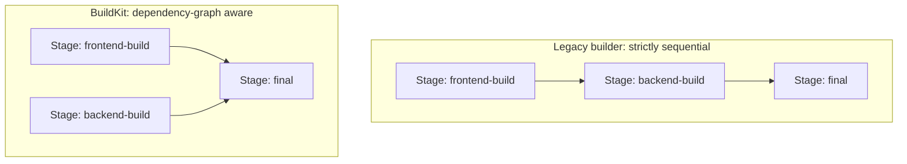

# BuildKit Internals

Every `docker build` you've run in this repository so far has actually been executed by **BuildKit**, not the legacy builder — it's been the default build engine since Docker 23. This chapter explains what BuildKit actually does differently from the legacy builder, why it can parallelize independent stages (the thing we flagged but didn't explain in Chapter 3), and — critically — how to correctly handle build-time secrets without leaking them into image layers, closing the gap left open in Chapter 1.

---

## Why BuildKit Exists: The Legacy Builder's Limitations

The original Docker builder executed a Dockerfile as a strictly linear sequence: each instruction ran, in order, one at a time, each producing exactly one layer, with no ability to skip unnecessary work or run independent steps concurrently. For a multi-stage Dockerfile with genuinely independent stages (say, a frontend asset build and a backend JAR build that only combine in a final stage), the legacy builder still executed them serially — Stage 1 fully finishes, then Stage 2 starts, even if Stage 2 doesn't depend on Stage 1 at all.

BuildKit re-architected this around a **dependency graph**, not a linear script:



BuildKit analyzes which stages actually depend on which (via `COPY --from=`), and executes independent stages **concurrently**, only serializing where a genuine data dependency exists. This is a direct, mechanical explanation for something you may have already noticed: multi-stage builds with genuinely parallel stages build faster under BuildKit than the equivalent linear execution would take.

---

## Content-Addressable, Not Just Layer-Order-Addressable Caching

The legacy builder's cache matching (Chapter 2) was strictly based on layer *position* in the instruction sequence — reorder two independent, swappable instructions and you'd bust the cache for both, even though neither instruction's actual inputs changed. BuildKit's cache is more precisely content-addressed: it can, in more cases, recognize that a given operation's inputs are unchanged even if its position in the file shifted slightly, giving more robust cache hits across minor Dockerfile refactors.

---

## Build Secrets: The Correct Way to Handle Credentials Mid-Build

Chapter 1 flagged a real problem: sometimes a build genuinely needs a credential — a private Maven repository token, a private npm registry auth token, an SSH key to clone a private git dependency — but baking that credential into any layer (via `ARG`, `ENV`, or a `COPY`'d credentials file) leaves it recoverable from the image's layer history indefinitely, even if a later layer "removes" it (recall Phase 1 Chapter 4: deletions are whiteouts, not erasures — the data is still physically present in an earlier layer).

BuildKit solves this properly with `--mount=type=secret`: the secret is mounted into the container **only for the duration of that specific `RUN` instruction**, and is never written into any layer at all.

```dockerfile
# syntax=docker/dockerfile:1
FROM eclipse-temurin:21-jdk AS build
WORKDIR /app
COPY pom.xml .mvn mvnw ./

# The secret is available at /run/secrets/maven_token ONLY during this RUN,
# and is never committed to any image layer:
RUN --mount=type=secret,id=maven_token \
    MAVEN_TOKEN=$(cat /run/secrets/maven_token) && \
    ./mvnw dependency:go-offline -B -Dmaven.repo.token=$MAVEN_TOKEN
```

```bash
docker build \
  --secret id=maven_token,src=$HOME/.secrets/maven_token.txt \
  -t demo-service:2.0 .
```

Verify the secret genuinely isn't in the image:

```bash
docker history --no-trunc demo-service:2.0 | grep -i token
# (nothing — the secret was never part of any layer)
```

This is the *only* correct way to handle build-time credentials. Anything that writes the secret into a `COPY`'d file, an `ENV`, or an `ARG` that gets baked into an `ENV`, leaves it recoverable — `--mount=type=secret` is specifically engineered to avoid that, and it's the direct payoff of understanding BuildKit's execution model rather than the legacy builder's simpler (but less capable) one.

---

## Cache Mounts: Speeding Up Package Manager Downloads Without Bloating Layers

A related BuildKit feature, `--mount=type=cache`, lets a `RUN` instruction use a **persistent cache directory across builds**, without that cache directory ever becoming part of the image layer itself:

```dockerfile
RUN --mount=type=cache,target=/root/.m2 \
    ./mvnw dependency:go-offline -B
```

This is subtly different from (and complementary to) the Chapter 2 caching strategy: even when the *layer cache* misses (say, because `pom.xml` changed, adding one new dependency), the Maven local repository cache mounted here still persists across builds, so only the *new* dependency needs downloading — not the entire tree. And critically, `/root/.m2`'s contents never get committed into the image layer at all (unlike a plain `COPY` or unmounted `RUN` would), so the final image doesn't carry around gigabytes of accumulated package cache.

---

## Multi-Platform Builds: A Preview

BuildKit's execution model is also what enables building images for multiple CPU architectures (`linux/amd64`, `linux/arm64`) from a single build invocation, using QEMU emulation or native multi-arch builders:

```bash
docker buildx build --platform linux/amd64,linux/arm64 -t myorg/demo-service:2.0 --push .
```

We cover this properly, with real production context (Apple Silicon dev machines vs. amd64 cloud deployment, and multi-arch registry manifests), in Phase 9 — it's flagged here only because it's another capability that specifically depends on BuildKit's architecture, not the legacy builder's.

---

## Inspecting What BuildKit Actually Did

```bash
# BuildKit's default output already shows a dependency-graph-style build log,
# rather than the old flat sequential log — notice stages building concurrently:
docker build -t demo-service:2.0 . --progress=plain

# See detailed cache hit/miss reporting per step:
docker build -t demo-service:2.0 . --progress=plain 2>&1 | grep -E "CACHED|DONE"
```

---

## Common Misconceptions This Chapter Should Correct

- **"BuildKit is an optional, advanced feature you have to opt into."** It's been the default builder since Docker 23 — you've been using it the entire time, even in Phase 1's simple single-stage build.
- **"You can pass secrets safely via `ARG` if you're careful to not also set an `ENV`."** Even `ARG`-only usage can leave traces depending on how the value is used within `RUN` commands and shell history captured in layer metadata; `--mount=type=secret` is the only mechanism specifically designed to avoid this, and should be the default for any real credential.
- **"Cache mounts (`--mount=type=cache`) are the same thing as the layer cache from Chapter 2."** They're complementary but distinct: the layer cache reuses whole layers when inputs are unchanged; a cache mount persists a specific directory's contents across builds regardless of layer cache hits/misses, without that directory becoming part of any image layer.
- **"Parallelizing stages is something you configure."** It's automatic — BuildKit determines it from the dependency graph implied by your `COPY --from=` relationships; you get it for free by structuring stages to be genuinely independent where possible.

---

## What's Next

We now understand every lever available: instruction semantics (Chapter 1), cache-aware ordering (Chapter 2), multi-stage separation (Chapter 3), base image selection (Chapter 4), and the build engine itself (this chapter). Time to apply all of it at once: take a genuinely bloated, poorly-structured Dockerfile and rebuild it from scratch, measuring the improvement at every step.

**Next:** [`06-optimizing-a-bloated-production-image.md`](./06-optimizing-a-bloated-production-image.md)