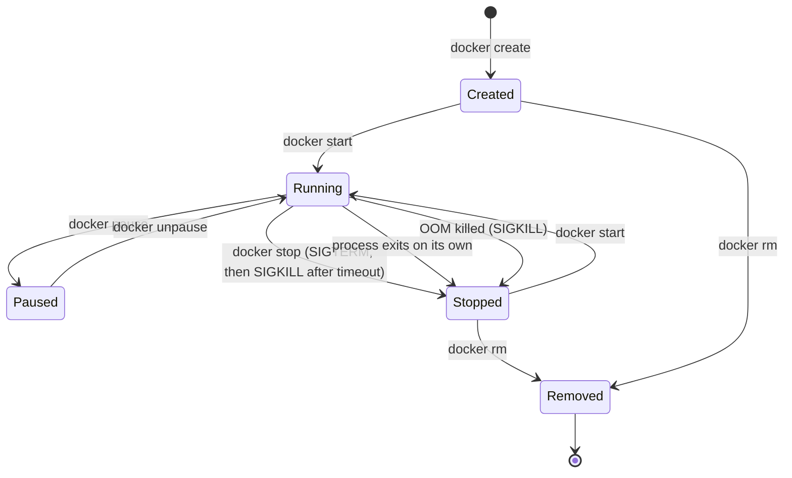
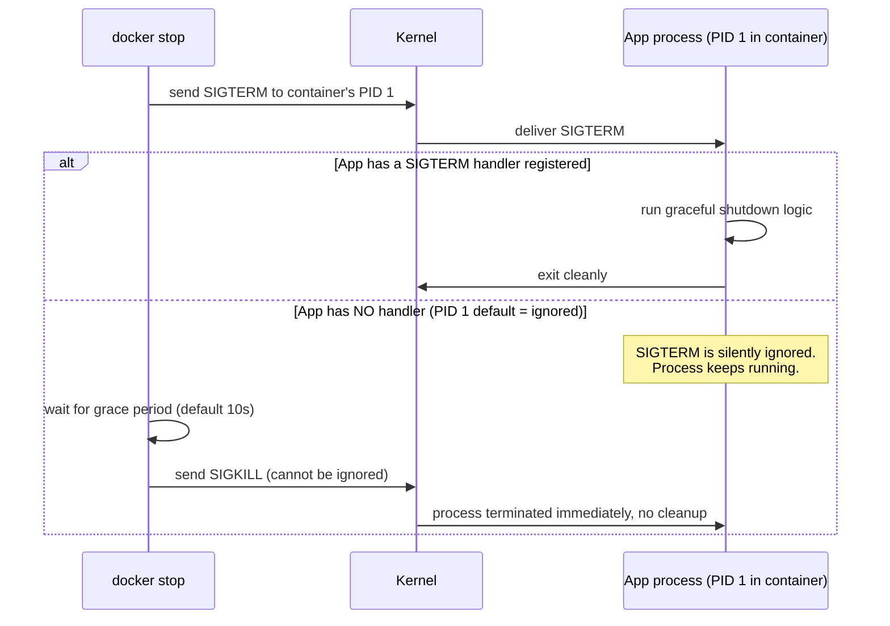

# Container Lifecycle and PID 1

In Phase 1 you saw that your Spring Boot process becomes PID 1 inside its own PID namespace. This chapter is about why that specific fact — being PID 1 — is not a cosmetic detail, but a set of real Linux kernel responsibilities that most processes, including a default `java -jar`, were never written to handle. Getting this wrong is the single most common source of containers that "don't shut down cleanly," "take 10 seconds to stop for no reason," or "leave zombie processes."

---

## The Container Lifecycle, States and Transitions

Before PID 1 specifically, it's worth having the full lifecycle state machine clearly in view — you'll refer back to this constantly across debugging (Phase 7) and orchestration (Phase 6, Phase 10).



A few states worth flagging explicitly because they're easy to misunderstand:

- **Created** is a real, distinct state — the container exists (has an ID, a writable layer allocated) but its main process has never run. `docker create` alone leaves you here.
- **Paused** uses the cgroup **freezer** controller — it literally suspends all processes in the container's cgroup at the kernel scheduler level, without killing anything. This is different from stopping, and rarely what you want in production (it's mostly a debugging/testing tool), because a paused container still holds all its memory and file descriptors while contributing zero CPU progress — including to any health check or load balancer that might be expecting a timely response.
- **Stopped is not Removed.** As established in Phase 1, a stopped container retains its writable layer and can be restarted with `docker start`. Only `docker rm` (or `--rm` at creation) discards it.

---

## What "PID 1" Actually Means, and Why Linux Treats It Specially

Every Linux process tree has exactly one PID 1 (`init`, in the classic sense — `systemd` on most modern hosts). The kernel gives PID 1 two special properties that don't apply to any other process:

1. **Orphaned processes are reparented to PID 1.** If a process's parent dies before it does, the kernel doesn't leave it parentless — it reassigns it to PID 1, whose job (in a normal init system) is to periodically `wait()` on it and reap it, preventing **zombie processes** from accumulating.
2. **Default signal handlers are not installed for PID 1 unless the process explicitly sets them up.** For any *other* process, sending `SIGTERM` with no custom handler results in the kernel's built-in default action (usually: terminate the process). For **PID 1 specifically**, the kernel does not apply default signal actions — if PID 1 hasn't registered its own handler for a signal, that signal is simply **ignored**.

A container's PID namespace (Phase 1, Chapter 2) means your application process is PID 1 *within that namespace* — and the kernel applies both of these special rules to it, exactly as if it were a normal machine's real `init`. Most applications, including a bare `java -jar`, were never written with the expectation that they'd need to act as an init system.



This is precisely why you'll sometimes observe `docker stop` on a container taking exactly 10 seconds (Docker's default grace period) before it actually disappears — the application ignored `SIGTERM` entirely (because, as PID 1, no default handler applied), and Docker fell back to the forceful `SIGKILL` after timing out. We cover exactly how to fix this — both at the application level and at the Dockerfile level — in the next chapter, which is entirely devoted to signal handling.

---

## Reparenting and Zombie Processes, Concretely

If your containerized application spawns a child process (a shell script calling another binary, a JVM invoking a subprocess for some tooling integration, etc.) and that child outlives or gets orphaned before your main process reaps it, the orphan gets reparented to your container's PID 1. If your application isn't built to `wait()` on child processes the way a real init system is, that orphan becomes a **zombie** — a process entry that has exited but whose exit status was never collected.

```bash
# Demonstrate this directly: run a container whose PID 1 is a shell
# that spawns and abandons a child, and never reaps it.
docker run -d --name zombie-demo busybox sh -c \
  "sh -c 'sleep 1 &' ; sleep 300"

# After a couple of seconds, inspect the process tree inside the container:
docker exec zombie-demo ps aux
# PID   USER     COMMAND
# 1     root     sh -c sleep 1 & ; sleep 300
# 7     root     sleep 300
# 6     root     [sh] <defunct>      <-- zombie: exited, never reaped
```

A single zombie is harmless in isolation, but a long-running service that repeatedly spawns and abandons children will slowly accumulate zombies, each consuming a process table entry, until it exhausts the container's PID limit (a cgroup-enforced resource, covered in Chapter 3 of this phase) — a genuinely observed production failure mode, not a hypothetical one.

---

## The Practical Fix: A Real Init System Inside the Container

The standard, well-established fix is running a minimal init process as PID 1 instead of your application directly — one whose entire job is correct signal forwarding and zombie reaping — and letting your application run as its child instead.

**Tini** is the de facto standard for this (small enough to add negligible image size, and Docker even has a built-in flag for it):

```bash
# Docker can inject tini as PID 1 automatically, transparently:
docker run -d --init --name demo-service myorg/order-service:1.4.2
```

`--init` tells Docker to insert a minimal init process as the container's actual PID 1, which then correctly forwards signals to your application (now PID 2 or later) and reaps any orphaned children on your application's behalf.

Baking it directly into the image (so it works even without `--init` being remembered at every `docker run`, and so it works the same way under Kubernetes, which does not pass `--init` for you) is the more robust production approach:

```dockerfile
FROM eclipse-temurin:21-jre

# Install tini as a proper init system:
RUN apt-get update && apt-get install -y --no-install-recommends tini \
    && rm -rf /var/lib/apt/lists/*

COPY target/demo-0.0.1-SNAPSHOT.jar /app/app.jar

ENTRYPOINT ["tini", "--", "java", "-jar", "/app/app.jar"]
```

With this, the process tree inside the container looks like:

```bash
docker exec demo-service ps aux
# PID   USER     COMMAND
# 1     root     tini -- java -jar /app/app.jar
# 7     root     java -jar /app/app.jar
```

Tini is PID 1 (handles signal forwarding and zombie reaping correctly, since it's specifically designed to fulfill init's kernel-mandated responsibilities). Your JVM is PID 7 (or similar) — an ordinary process, subject to ordinary default signal handling, which then gets a real chance to run its own JVM shutdown hooks when `SIGTERM` arrives via tini's forwarding.

---

## Common Misconceptions This Chapter Should Correct

- **"My app didn't register a SIGTERM handler, so `docker stop` will just kill it, which is fine."** It's not "just killed" cleanly — it's ignored for the grace period, then force-killed via `SIGKILL`, meaning zero graceful shutdown logic runs (in-flight requests dropped, connections not drained, nothing flushed). We build out exactly what graceful JVM shutdown should look like in the next chapter.
- **"Every process in Linux gets default signal handling."** Only true for non-PID-1 processes. This chapter's central point is that PID 1 is a genuinely special case in the kernel, not just a numbering convention.
- **"Zombies mean something is broken with Docker."** Zombies are a normal Linux phenomenon whenever a parent fails to reap a child — Docker containers are simply more exposed to this because the application is often unexpectedly acting as its own init system.
- **"`--init` and a JVM shutdown hook are the same fix for the same problem."** They solve *different* problems: `--init`/tini fixes signal *forwarding and zombie reaping at the kernel/process level*; a JVM shutdown hook fixes what your *application* does once it actually receives the signal. You typically need both, together — covered fully next chapter.

---

## What's Next

Now that PID 1's special responsibilities are clear, the next chapter goes deep on the other half of this problem: what actually happens, signal by signal, from `docker stop` through to your Spring Boot application's shutdown hooks — and how to make that sequence genuinely graceful, not just fast.

**Next:** [`02-signals-shutdown-and-graceful-termination.md`](./02-signals-shutdown-and-graceful-termination.md)