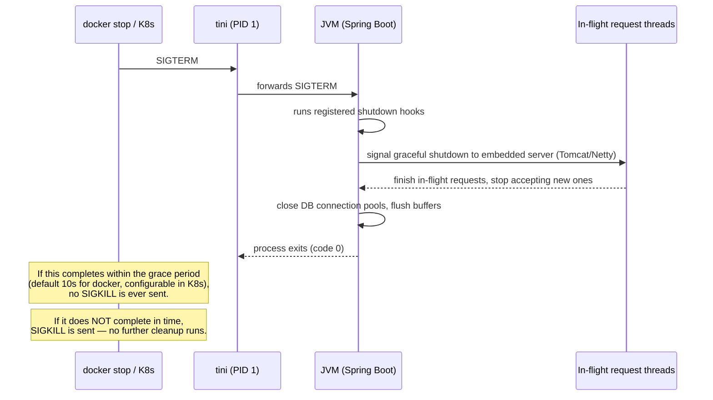

# Signals, Shutdown, and Graceful Termination

Chapter 1 established *why* PID 1 handles signals differently and *how* to fix the kernel-level part of the problem (tini). This chapter goes one level up: what actually needs to happen, in your Spring Boot application, between "SIGTERM arrives" and "process exits," for a shutdown to genuinely be graceful — no dropped in-flight requests, no half-committed work, no abrupt connection resets for clients.

This matters more in containers than it did in traditional deployments because container orchestration (Compose restart policies, Kubernetes rolling deploys, autoscaling scale-downs) sends `SIGTERM` to your containers constantly, as a completely normal, frequent event — not an exceptional one.

---

## The Full Signal Sequence, End to End



Every one of those steps is something you need to have deliberately configured — none of it happens for free with a default `spring-boot-starter-web` setup.

---

## Step 1: Spring Boot's Graceful Shutdown Setting

Since Spring Boot 2.3+, graceful shutdown is a built-in feature, but it's **opt-in**, not default:

```properties
# application.properties
server.shutdown=graceful
spring.lifecycle.timeout-per-shutdown-phase=20s
```

With `server.shutdown=graceful` set, when the embedded web server (Tomcat, Jetty, or Netty/Reactor) receives the shutdown signal from Spring's lifecycle management, it:

1. Stops accepting new HTTP connections
2. Allows in-flight requests up to `timeout-per-shutdown-phase` to complete normally
3. Only then proceeds to close down the application context

Without this setting, the default behavior is closer to **immediate shutdown** — the server can drop in-flight connections the instant the JVM begins its shutdown sequence, which for anything serving real user traffic is a correctness problem, not just a UX rough edge.

```bash
# Verify graceful shutdown behavior directly: start the app, fire a slow
# request, and stop the container mid-request.

# Terminal 1: hit an endpoint that takes a few seconds
curl http://localhost:8080/api/slow-operation &

# Terminal 2: stop the container immediately after
docker stop demo-service

# With server.shutdown=graceful configured correctly, the curl request
# in Terminal 1 should complete successfully before the container exits.
# Without it, you may see a connection reset instead.
```

---

## Step 2: The Grace Period Itself Must Be Long Enough

Docker's default `docker stop` grace period is **10 seconds** before it escalates to `SIGKILL`. This is a hard external deadline your entire graceful shutdown sequence must fit inside, regardless of what `spring.lifecycle.timeout-per-shutdown-phase` says — if Docker's own timeout fires first, your Spring-level timeout never gets the chance to matter.

```bash
# Override Docker's grace period explicitly if your workload
# genuinely needs longer to drain in-flight work:
docker stop --time=30 demo-service
```

In Kubernetes, this same concept is `terminationGracePeriodSeconds` on the Pod spec — and it governs the same trade-off: how long the orchestrator waits after sending `SIGTERM` before it escalates to `SIGKILL`. We revisit this specifically in the Kubernetes bridge phase (Phase 10), but the underlying mechanism you're tuning is identical to what's shown here.

**A common, costly mistake:** setting `spring.lifecycle.timeout-per-shutdown-phase=30s` while leaving Docker's/Kubernetes' grace period at its 10-second (or 30-second) default with no coordination between the two — the shorter of the two timeouts always wins, silently, and the longer one is dead configuration that never gets to run to completion.

---

## Step 3: A JVM Shutdown Hook for Anything Spring Doesn't Cover Automatically

For resources Spring's lifecycle doesn't manage automatically — a custom thread pool, an external client connection, a metrics flush — register an explicit JVM shutdown hook:

```java
package com.example.demo;

import org.springframework.stereotype.Component;
import jakarta.annotation.PostConstruct;

@Component
public class GracefulShutdownHandler {

    @PostConstruct
    public void registerShutdownHook() {
        Runtime.getRuntime().addShutdownHook(new Thread(() -> {
            System.out.println("Shutdown signal received — flushing pending work...");
            // Flush custom caches, close non-Spring-managed clients, etc.
            System.out.println("Cleanup complete. Exiting.");
        }));
    }
}
```

This hook fires when the JVM begins its shutdown sequence — which, per the sequence diagram above, only happens if `SIGTERM` actually reaches the JVM process with a handler ready to run. This is exactly why Chapter 1's tini fix and this chapter's Spring configuration are not alternatives to each other — they're two different, necessary links in the same chain: **tini ensures the signal reaches your JVM at all (kernel-level PID 1 concern); Spring's graceful shutdown setting and your own shutdown hooks ensure your JVM does the right thing once it receives that signal (application-level concern).**

---

## Verifying the Whole Chain Together

```bash
docker run -d --init --name demo-service -p 8080:8080 \
  -e SERVER_SHUTDOWN=graceful \
  -e SPRING_LIFECYCLE_TIMEOUT_PER_SHUTDOWN_PHASE=20s \
  demo-service:1.0

# Fire a slow request and stop the container with enough grace period
# to actually observe graceful completion rather than a forced kill:
curl http://localhost:8080/api/slow-operation &
docker stop --time=25 demo-service

# Check the logs — you should see Spring's graceful shutdown messages,
# your custom shutdown hook's output, and a clean exit — NOT a bare
# "Killed" with no application-level log lines at all.
docker logs demo-service
```

If `docker logs` shows nothing at all around shutdown — no "Commencing graceful shutdown," no your own hook's print statement — that's a direct signal something upstream in the chain (tini missing, `server.shutdown` not actually set, grace period too short) is broken, and worth checking in that order.

---

## Common Misconceptions This Chapter Should Correct

- **"Setting `server.shutdown=graceful` alone is sufficient."** It's necessary but not sufficient — it only matters if the signal actually reaches the JVM (needs tini/`--init` from Chapter 1) and if the orchestrator's own grace period is long enough for it to complete.
- **"A longer `spring.lifecycle.timeout-per-shutdown-phase` always makes shutdown safer."** Only if the surrounding grace period (Docker's `--time`, or Kubernetes' `terminationGracePeriodSeconds`) is at least as long — otherwise you're configuring a timeout that never gets to run to completion.
- **"SIGKILL triggers cleanup code, just more abruptly."** No — `SIGKILL` cannot be caught, handled, or ignored by any process, by kernel design. Nothing in your application runs once `SIGKILL` is delivered; there is no hook, no `finally` block, no chance to flush anything.
- **"This only matters for stateful services."** Even a stateless REST API benefits — abrupt termination mid-request is a dropped or corrupted client response either way, regardless of whether your service holds durable state.

---

## What's Next

We've covered *when* a container's process dies gracefully or forcefully. The next chapter covers a different but related resource question: how CPU and memory limits are actually enforced by cgroups v2 in practice, with concrete numbers — completing the cgroups foundation from Phase 1 with the operational detail you need to size limits correctly rather than guessing.

**Next:** [`03-resource-limits-cpu-memory-cgroups-v2.md`](./03-resource-limits-cpu-memory-cgroups-v2.md)