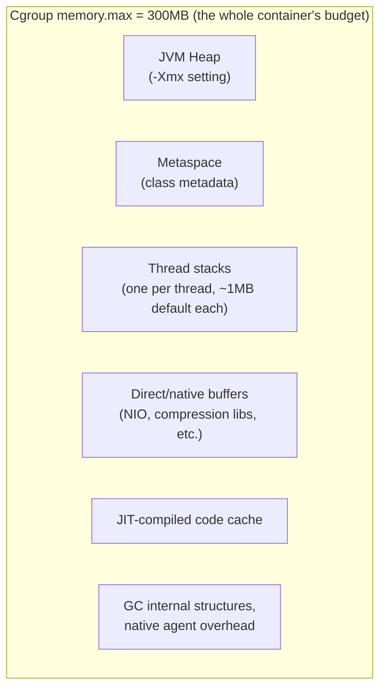

# Resource Limits: CPU, Memory, and Cgroups v2 in Practice

Phase 1 introduced cgroups conceptually — the kernel mechanism that enforces resource ceilings and triggers OOM kills. This chapter is the operational follow-up: the actual cgroups v2 files Docker writes to, how to read them directly (bypassing Docker's abstractions when you need ground truth while debugging), and precisely how CPU quotas translate into throttling behavior you can observe and measure.

---

## Cgroups v2: One Unified Hierarchy

Older Docker hosts used cgroups v1, which had a separate hierarchy per resource controller (memory, CPU, etc.) — a genuine source of historical confusion. Modern Linux distributions (and modern Docker) default to **cgroups v2**, which unifies everything under a single hierarchy per container, exposed as plain files you can read directly:

```bash
# Find your container's cgroup path (requires knowing the container ID):
docker inspect demo-service --format '{{.Id}}'
# 3f4a5b6c7d8e...

# On the host, the cgroup v2 files typically live under:
cat /sys/fs/cgroup/system.slice/docker-3f4a5b6c7d8e....scope/memory.max
# 104857600        <- this is your --memory=100m limit, in bytes

cat /sys/fs/cgroup/system.slice/docker-3f4a5b6c7d8e....scope/memory.current
# 87234560         <- current actual usage, right now, in bytes

cat /sys/fs/cgroup/system.slice/docker-3f4a5b6c7d8e....scope/cpu.max
# 150000 100000    <- "150000 100000" = 150ms of CPU time per 100ms period = 1.5 cores
```

Everything Docker's `--memory` and `--cpus` flags do is, mechanically, writing numbers into these exact files. When `docker stats` shows you memory or CPU usage, it's reading from these same files. There is no additional hidden accounting layer — this is the ground truth, and being able to read it directly is a genuinely useful debugging skill when Docker's own tooling is behaving unexpectedly or is unavailable.

---

## Memory: `memory.max` and the OOM Killer, Revisited With Real Numbers

```bash
docker run -d --name demo-limited -p 8081:8080 --memory=300m demo-service:1.0

docker stats demo-limited --no-stream
# CONTAINER ID   NAME            CPU %   MEM USAGE / LIMIT     MEM %
# 9a8b7c6d5e4f   demo-limited    0.8%    245.3MiB / 300MiB     81.7%
```

That 300MiB limit is a **hard ceiling on the cgroup's total memory usage**, which for a JVM includes far more than just heap:



**This is the single most consequential fact in this entire chapter for a JVM engineer**: if you set `-Xmx280m` inside a container with `--memory=300m`, you have left only ~20MB for metaspace, thread stacks, direct buffers, and JIT code combined — routinely not enough, and a very common cause of OOM-kills that look, from the outside, like "the heap limit was respected but the container still died." The container doesn't care about your `-Xmx` setting specifically — it enforces the *total* cgroup memory usage, heap and everything else combined.

We dedicate the next-but-one chapter (JVM behavior inside containers) and the phase's capstone project entirely to getting this sizing right with concrete, measured numbers. For now, the operational takeaway: **`--memory` (or Kubernetes' memory limit) is a budget for the whole process, not a heap size setting** — treat `-Xmx` as a carved-out portion of that budget, always leaving meaningful headroom.

---

## CPU: Quotas, Periods, and Throttling You Can Actually Observe

`cpu.max` expresses a quota as two numbers: **quota** and **period**, both in microseconds. `150000 100000` means "150,000µs of CPU time allowed per 100,000µs (100ms) wall-clock period" — i.e., 1.5 CPU cores' worth of execution time, averaged over each 100ms window.

```bash
docker run -d --name cpu-limited --cpus=0.5 demo-service:1.0

docker exec cpu-limited cat /sys/fs/cgroup/cpu.max
# 50000 100000     <- 0.5 cores: 50ms of CPU time allowed per 100ms period
```

The critical, easy-to-miss behavior: **once a container exhausts its quota within a period, it is throttled — paused — for the remainder of that period, even if the rest of the host machine is completely idle.** This is fundamentally different from cgroup memory limits (which allow bursting up to the hard ceiling and only intervene at the ceiling) — CPU quota enforcement is a hard, repeating, per-period ceiling.

```bash
# Directly observe throttling via the cgroup's own accounting file:
docker exec cpu-limited cat /sys/fs/cgroup/cpu.stat
# usage_usec 48213891
# nr_periods 96421
# nr_throttled 8734
# throttled_usec 1829442
```

`nr_throttled` tells you exactly how many 100ms periods resulted in your container being paused because it hit its quota. A service showing high `nr_throttled` relative to `nr_periods`, combined with elevated request latency, is a container that's CPU-quota-starved — a very different diagnosis (and fix — raise `--cpus`, or investigate whether the workload is genuinely this CPU-hungry) than a memory problem or an application-level slow query.

---

## The JVM-Specific Trap: Ergonomics Reading the Wrong Number

Modern JVMs (Java 10+, with container-awareness improvements continuing through later releases) attempt to detect available CPU count from the cgroup quota, not from the host's total core count, and use that detected number to size things like the default garbage collector's thread count and the common `ForkJoinPool` parallelism.

```bash
# Verify what the JVM itself believes its available CPU count is,
# running inside a container with a fractional CPU quota:
docker run --rm --cpus=1.5 eclipse-temurin:21-jre \
  java -XX:+PrintFlagsFinal -version | grep -i activeprocessorcount
# uintx ActiveProcessorCount = 2   (rounds up from 1.5 in some JVM versions —
#                                    always verify the exact behavior for your
#                                    JVM version rather than assuming)
```

A `--cpus` value that doesn't match what you assumed when reasoning about GC threads or thread pool sizing is a real, non-obvious source of "why is this container's throughput lower than the same code running on my laptop" — the JVM sized its internals for a different number of cores than you expected. Always verify this explicitly for your JVM version and configured quota, rather than assuming — the exact rounding and detection behavior has changed across JVM releases.

---

## PIDs Limit: The Cgroup You're Least Likely to Know About

One more cgroup controller worth knowing, directly relevant to Chapter 1's zombie process discussion: `pids.max` caps the total number of processes/threads a container's cgroup can create.

```bash
docker run -d --name pid-limited --pids-limit=100 demo-service:1.0

docker exec pid-limited cat /sys/fs/cgroup/pids.max
# 100
docker exec pid-limited cat /sys/fs/cgroup/pids.current
# 34
```

A runaway thread leak (a genuinely common JVM application bug — an executor service never shut down, a connection pool misconfigured to keep spawning threads) will hit this ceiling and start failing to fork new threads/processes with an `EAGAIN`-style error — which, without knowing this cgroup exists, looks like an inexplicable resource exhaustion with no clear cause in `docker stats`' default memory/CPU view.

---

## Common Misconceptions This Chapter Should Correct

- **"`-Xmx` should equal the container's `--memory` limit for maximum utilization."** This leaves no room for metaspace, thread stacks, and native memory — a near-guaranteed OOM-kill under any real load. Leave deliberate headroom (quantified concretely in the next chapter).
- **"CPU throttling shows up as high CPU usage in monitoring."** It's the opposite — a throttled container often shows *unremarkable* CPU usage percentages while suffering from real, cgroup-induced latency, because the "used vs. available" ratio looks fine even though a hard per-period ceiling is being hit constantly. Check `cpu.stat`'s `nr_throttled`, not just usage percentage.
- **"Cgroup memory limits and JVM heap limits are enforced by the same mechanism."** They're not — the JVM's own heap limit (`-Xmx`) is enforced by the JVM's garbage collector and throws a catchable `OutOfMemoryError`; the cgroup's `memory.max` is enforced by the kernel and results in an uncatchable `SIGKILL`. These are two independent safety nets, and only the JVM's own is catchable at all.
- **"cgroups v1 and v2 work the same way, just with different file paths."** Close enough for most day-to-day purposes covered here, but v2's unified single-hierarchy model (vs. v1's per-controller hierarchies) is a genuinely different design — if you're on an older host still running v1, some file paths and a few specific behaviors (like the PID controller's availability) differ; verify which version your host uses with `mount | grep cgroup` before assuming the exact paths above.

---

## What's Next

We now have the operational cgroups picture with real numbers. The next chapter takes this directly into JVM-specific territory: concrete heap sizing formulas, `-XX` flags that matter specifically for containerized JVMs, and verifying container-awareness is actually working as expected on your JVM version — the knowledge this phase's capstone project will apply hands-on.

**Next:** [`04-jvm-behavior-inside-containers.md`](./04-jvm-behavior-inside-containers.md)