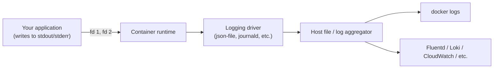

# Logging and Stdout/Stderr Conventions

Every container platform — Docker, Compose, Kubernetes — assumes your application writes its logs to **stdout and stderr**, not to a file. This chapter explains why that convention exists mechanically (not just as a style preference), what actually happens to those streams, and how to reconfigure a default Spring Boot / Logback setup, which writes to a file by default in many starter configurations, to work correctly with this model.

---

## Why Stdout/Stderr, Mechanically

When a container starts, the container runtime (`runc`, from Phase 1 Chapter 5) attaches the container's stdout and stderr file descriptors to a **logging driver** managed by the container engine — by default, Docker's `json-file` driver, which captures everything written to those two streams and appends it, as JSON-wrapped lines with timestamps, to a file on the host.

```bash
docker logs demo-service
# 2026-01-14T10:32:07.184Z  Starting DemoApplication...
# 2026-01-14T10:32:08.912Z  Tomcat started on port 8080
```

`docker logs` is not reading your application's own log file inside the container — it's reading the log driver's captured copy of whatever your process wrote to fd 1 (stdout) and fd 2 (stderr):

```bash
# The actual underlying file, on the host, that docker logs reads from:
docker inspect demo-service --format '{{.LogPath}}'
# /var/lib/docker/containers/3f4a5b6c.../3f4a5b6c...-json.log

sudo cat /var/lib/docker/containers/3f4a5b6c.../3f4a5b6c...-json.log
# {"log":"Starting DemoApplication...\n","stream":"stdout","time":"2026-01-14T10:32:07.184Z"}
```



This is precisely why "just write logs to a file inside the container" (a very natural instinct if you've configured Logback with a `FileAppender` before, which is Spring Boot's common non-container default in many quick-start guides) breaks the entire downstream tooling chain: `docker logs`, Kubernetes' `kubectl logs`, and virtually every centralized log aggregator (Fluentd, Loki, CloudWatch agent, Datadog agent) are built around reading the stdout/stderr capture, not scanning arbitrary files inside a container's writable layer (which, per Phase 1 Chapter 3, vanishes on `docker rm` anyway).

---

## Reconfiguring Spring Boot / Logback for Container-Correct Logging

Spring Boot's default `logback-spring.xml` (or the implicit default if you haven't customized it) already logs to the console by default in most setups — but it's worth verifying explicitly and removing any file appenders that may have been added for local-development convenience:

```xml
<!-- src/main/resources/logback-spring.xml -->
<configuration>
    <include resource="org/springframework/boot/logging/logback/defaults.xml"/>

    <appender name="CONSOLE" class="ch.qos.logback.core.ConsoleAppender">
        <encoder>
            <!-- Structured, single-line-per-event JSON is strongly preferable
                 in containers: log aggregators parse it directly, whereas
                 multi-line stack traces can otherwise get split across
                 multiple separately-timestamped log driver entries. -->
            <pattern>%d{yyyy-MM-dd'T'HH:mm:ss.SSSXXX} [%thread] %-5level %logger{36} - %msg%n</pattern>
        </encoder>
    </appender>

    <root level="INFO">
        <appender-ref ref="CONSOLE"/>
    </root>

    <!-- Explicitly absent: any <appender class="...FileAppender"> or
         <appender class="...RollingFileAppender"> — file-based logging
         inside a container writes into the ephemeral writable layer
         (Phase 1, Chapter 3) and is invisible to `docker logs`. -->
</configuration>
```

If your team wants structured JSON logs (strongly recommended for anything feeding a log aggregator that indexes fields, rather than grepping raw text), use a JSON encoder instead of the plain pattern above:

```xml
<appender name="CONSOLE" class="ch.qos.logback.core.ConsoleAppender">
    <encoder class="net.logstash.logback.encoder.LogstashEncoder"/>
</appender>
```

```bash
docker logs demo-service
# {"@timestamp":"2026-01-14T10:32:07.184Z","level":"INFO","logger_name":"com.example.demo.DemoApplication","message":"Starting DemoApplication..."}
```

---

## Multi-Line Stack Traces: A Real, Easy-to-Miss Gotcha

The `json-file` driver (and many log shippers) captures logs **line by line**. A Java stack trace is many lines of plain text output to stderr — without structured logging, each line of a stack trace can become a *separate* log entry in whatever's aggregating your logs downstream, destroying the ability to see (or search for) a complete stack trace as one coherent unit.

```bash
# Without structured logging: a single exception becomes N separate
# "log lines" as far as most aggregators are concerned:
docker logs demo-service
# 2026-01-14T10:33:01Z  java.lang.NullPointerException: Cannot invoke...
# 2026-01-14T10:33:01Z      at com.example.demo.OrderService.process(OrderService.java:42)
# 2026-01-14T10:33:01Z      at com.example.demo.OrderController.create(OrderController.java:18)
# ...
```

Structured JSON logging (via `LogstashEncoder` above, or an equivalent) typically escapes the entire stack trace into a single `stack_trace` field of one JSON event — the fix for this is at the logging configuration layer, not something `docker logs` or the log driver can retroactively repair for you.

---

## Log Driver Choice and Disk Growth: A Production Trap

The default `json-file` driver has **no size limit by default** on older Docker configurations — a chatty application (or a bug causing log spam) can fill the host's disk over time with accumulated log files, entirely independent of application memory or CPU behavior.

```bash
# Always bound log file size and rotation explicitly in production:
docker run -d --name demo-service \
  --log-opt max-size=10m \
  --log-opt max-file=3 \
  demo-service:1.0

# Or, more durably, as Docker daemon-wide defaults in
# /etc/docker/daemon.json:
# {
#   "log-driver": "json-file",
#   "log-opts": { "max-size": "10m", "max-file": "3" }
# }
```

Without an explicit bound, `max-size`/`max-file` default to unlimited on many Docker installations — a real, observed cause of hosts running out of disk from log accumulation alone, with no relationship at all to the application's own memory or CPU cgroup limits from the previous two chapters. This is a genuinely separate resource to bound explicitly, not something covered by any of the limits discussed so far.

---

## Common Misconceptions This Chapter Should Correct

- **"Logging to a file inside the container is just a style choice."** It's a functional break with the entire container logging pipeline — `docker logs`, `kubectl logs`, and most log aggregators are built specifically around stdout/stderr capture, not arbitrary in-container files.
- **"`docker logs` reads my application's actual log file."** It reads the logging driver's captured copy of stdout/stderr — there is no relationship to any file your application itself might separately be writing inside its writable layer.
- **"Container log storage is bounded by the same `--memory` limit as the application."** No — log file growth on the host is governed entirely separately, by the logging driver's own `max-size`/`max-file` options (or lack thereof), and is a distinct operational risk from anything covered by cgroup memory/CPU/PID limits.
- **"Multi-line stack traces just naturally stay together in aggregated logs."** Only with structured/JSON logging that explicitly encodes the full trace as a single field — plain-text multi-line output is genuinely at risk of being split line-by-line by downstream tooling.

---

## What's Next

This closes out the conceptual portion of Phase 3: process lifecycle and signals (Chapters 1–2), resource limits (Chapter 3), JVM-specific behavior (Chapter 4), and now logging conventions (this chapter). The phase's project puts every one of these together in one hands-on lab: deliberately constraining a JVM container's memory, observing the OOM-kill, measuring CPU throttling under load, and correctly tuning both — with real, measured numbers, not assumptions.

**Next:** [`06-tuning-a-jvm-container-under-memory-limits.md`](./06-tuning-a-jvm-container-under-memory-limits.md)