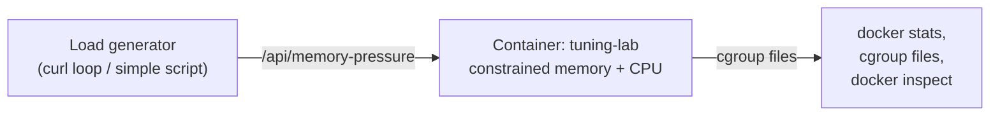

# Project: Tuning a JVM Container Under Memory Limits

This project puts every concept from Phase 3 to work at once, using measurement rather than assumption: we'll deliberately under-provision a container's memory, reproduce a real OOM-kill, diagnose it correctly using the cgroup files from Chapter 3, then fix it with properly tuned JVM flags and graceful shutdown — verifying every fix with real numbers, not guesses.

We reuse the Spring Boot service from the Phase 1 project, extended with an endpoint that lets us apply controlled memory pressure on demand, and a slow endpoint to exercise graceful shutdown from Phase 3 Chapter 2.

---

## Objective

- Reproduce a cgroup OOM-kill on purpose, and diagnose it using kernel-level evidence, not guesswork
- Measure actual JVM memory breakdown (heap vs. non-heap) under load
- Apply deliberately-sized JVM flags and verify the fix holds under the same load that previously caused the crash
- Verify CPU throttling behavior under a constrained `--cpus` quota
- Verify graceful shutdown completes correctly under realistic traffic

---

## Architecture



---

## Folder Structure

```text
jvm-tuning-lab/
├── pom.xml                          (same as Phase 1 project)
├── src/main/java/com/example/demo/
│   ├── DemoApplication.java          (same as Phase 1 project)
│   ├── HelloController.java          (same as Phase 1 project)
│   └── LoadController.java           (new: memory pressure + slow endpoint)
├── src/main/resources/
│   ├── application.properties        (extended with graceful shutdown config)
│   └── logback-spring.xml            (from Phase 3 Chapter 5)
└── Dockerfile
```

---

## Source Code

**`src/main/java/com/example/demo/LoadController.java`** (new)

```java
package com.example.demo;

import org.springframework.web.bind.annotation.GetMapping;
import org.springframework.web.bind.annotation.RequestParam;
import org.springframework.web.bind.annotation.RestController;

import java.util.ArrayList;
import java.util.List;
import java.util.Map;

@RestController
public class LoadController {

    // Deliberately holds allocated memory in a static field so it
    // survives across requests, letting us build up pressure on demand.
    private static final List<byte[]> heapPressure = new ArrayList<>();

    @GetMapping("/api/memory-pressure")
    public Map<String, Object> applyPressure(@RequestParam(defaultValue = "50") int megabytes) {
        byte[] chunk = new byte[megabytes * 1024 * 1024];
        // Touch every page so it's actually committed, not just reserved —
        // otherwise the OS may not back it with real resident memory yet.
        for (int i = 0; i < chunk.length; i += 4096) {
            chunk[i] = 1;
        }
        heapPressure.add(chunk);

        Runtime rt = Runtime.getRuntime();
        return Map.of(
            "addedMB", megabytes,
            "totalChunksHeld", heapPressure.size(),
            "jvmMaxHeapMB", rt.maxMemory() / 1024 / 1024,
            "jvmUsedHeapMB", (rt.totalMemory() - rt.freeMemory()) / 1024 / 1024
        );
    }

    @GetMapping("/api/release-pressure")
    public Map<String, Object> releasePressure() {
        int released = heapPressure.size();
        heapPressure.clear();
        System.gc();
        return Map.of("releasedChunks", released);
    }

    @GetMapping("/api/slow-operation")
    public Map<String, Object> slowOperation() throws InterruptedException {
        Thread.sleep(5000); // simulate real in-flight work for shutdown testing
        return Map.of("status", "completed after 5s");
    }
}
```

**`src/main/resources/application.properties`** (extended)

```properties
server.port=8080
management.endpoints.web.exposure.include=health,info
server.shutdown=graceful
spring.lifecycle.timeout-per-shutdown-phase=20s
```

---

## The Dockerfile

```dockerfile
FROM eclipse-temurin:21-jdk AS build
WORKDIR /app
COPY . .
RUN ./mvnw clean package -DskipTests

FROM eclipse-temurin:21-jre
RUN apt-get update && apt-get install -y --no-install-recommends tini \
    && rm -rf /var/lib/apt/lists/*
COPY --from=build /app/target/demo-0.0.1-SNAPSHOT.jar /app/app.jar
EXPOSE 8080

# Deliberately explicit JVM flags — see the "Fixing It" section below
# for why each of these specific values was chosen, not assumed.
ENTRYPOINT ["tini", "--", "java", \
  "-XX:MaxRAMPercentage=60.0", \
  "-XX:MaxMetaspaceSize=128m", \
  "-XX:+ExitOnOutOfMemoryError", \
  "-Xlog:gc:stdout:time,level,tags", \
  "-jar", "/app/app.jar"]
```

(This Dockerfile uses a multi-stage build and tini from concepts introduced in Phase 2 and this phase's Chapter 1 — if you haven't built those chapters yet, the key line for this project is the `ENTRYPOINT`'s explicit JVM flags.)

---

## Build Commands

```bash
docker build -t tuning-lab:1.0 .
```

---

## Step 1: Reproduce the OOM-Kill on Purpose

```bash
# Deliberately under-provisioned: 200MB total budget for a JVM whose
# default MaxRAMPercentage (25%, unset here on purpose) plus request
# handling overhead will not comfortably fit.
docker run -d --name tuning-lab -p 8080:8080 --memory=200m tuning-lab:1.0

# Apply memory pressure in 50MB increments and watch it climb:
curl "http://localhost:8080/api/memory-pressure?megabytes=50"
curl "http://localhost:8080/api/memory-pressure?megabytes=50"
curl "http://localhost:8080/api/memory-pressure?megabytes=50"
curl "http://localhost:8080/api/memory-pressure?megabytes=50"
```

## Expected Output (the crash)

```bash
docker ps -a --filter name=tuning-lab
# CONTAINER ID   IMAGE            STATUS
# 8f3a2b1c...    tuning-lab:1.0   Exited (137) 2 seconds ago

docker inspect tuning-lab --format '{{.State.OOMKilled}}'
# true
```

Exit code 137 (128 + SIGKILL) with `OOMKilled: true` — the exact signature from Phase 1 and Phase 3 Chapter 3, now reproduced against a real, deliberately overloaded service rather than described abstractly.

---

## Debugging Walkthrough: Diagnosing It Correctly

### 1. Confirm it's a cgroup kill, not a JVM heap `OutOfMemoryError`

```bash
docker logs tuning-lab
# Notice: NO "java.lang.OutOfMemoryError" stack trace appears anywhere.
# A JVM heap OOM would print a catchable exception with a stack trace.
# Its absence, combined with OOMKilled: true, confirms this was the
# kernel's cgroup OOM killer (Phase 1, Phase 3 Ch.3) — not the JVM's
# own (catchable) exception mechanism.
```

### 2. Check what the container's memory usage looked like right before death

```bash
# dmesg on the host often has the kernel OOM killer's own log entry:
sudo dmesg | grep -i "killed process" | tail -5
# [12345.678] Killed process 48213 (java) total-vm:2841232kB,
#              anon-rss:198432kB, file-rss:0kB, shmem-rss:0kB
```

`anon-rss` here (198MB) is right at our 200MB `--memory` ceiling — direct kernel-level confirmation of exactly what Chapter 3 described mechanically.

### 3. Confirm the JVM's own heap sizing was part of the problem

```bash
docker run --rm --memory=200m tuning-lab:1.0 \
  java -XX:+PrintFlagsFinal -version 2>/dev/null | grep -i maxheapsize
# uintx MaxHeapSize = 52428800   <- ~50MB (default 25% of 200MB)
```

50MB of heap headroom, combined with our test deliberately pushing 200MB of allocated byte arrays into that heap, guarantees the JVM itself would hit heap pressure and trigger aggressive GC — but more importantly, the *combined* JVM process (heap + metaspace + thread stacks + JIT + GC overhead) exceeded the 200MB cgroup ceiling entirely independent of the heap number, exactly as Chapter 3's diagram predicted.

---

## Step 2: Fix It, and Verify the Fix With Real Numbers

```bash
docker rm -f tuning-lab

# Same 200MB constraint, but now with the deliberately-tuned flags
# already baked into the Dockerfile's ENTRYPOINT from above, plus
# a more realistic ceiling based on what we actually measured this
# workload needs:
docker run -d --name tuning-lab -p 8080:8080 --memory=400m tuning-lab:1.0

curl "http://localhost:8080/api/memory-pressure?megabytes=50"
curl "http://localhost:8080/api/memory-pressure?megabytes=50"
curl "http://localhost:8080/api/memory-pressure?megabytes=50"

docker stats tuning-lab --no-stream
# CONTAINER ID   NAME          CPU %   MEM USAGE / LIMIT     MEM %
# 7c6d5e4f...    tuning-lab    1.2%    218.4MiB / 400MiB     54.6%

docker inspect tuning-lab --format '{{.State.OOMKilled}}'
# false
```

The same load that killed the 200MB container runs comfortably under the tuned 400MB ceiling with `-XX:MaxRAMPercentage=60.0`, because we deliberately measured and budgeted for heap, metaspace, and process overhead together — not just picked a number.

---

## Step 3: Verify CPU Throttling Behavior

```bash
docker rm -f tuning-lab
docker run -d --name tuning-lab -p 8080:8080 --cpus=0.5 --memory=400m tuning-lab:1.0

# Generate sustained CPU load (any CPU-bound endpoint or a simple loop
# of concurrent requests works for this purpose):
for i in {1..200}; do curl -s "http://localhost:8080/api/hello" > /dev/null & done
wait

docker exec tuning-lab cat /sys/fs/cgroup/cpu.stat
# nr_periods 1043
# nr_throttled 287
# throttled_usec 892103
```

`nr_throttled` being a substantial fraction of `nr_periods` confirms real, measurable CPU throttling under this quota — exactly the diagnostic signal from Phase 3 Chapter 3, now produced from an actual load test rather than described in the abstract.

---

## Step 4: Verify Graceful Shutdown Under Real Traffic

```bash
curl "http://localhost:8080/api/slow-operation" &
sleep 1
docker stop --time=15 tuning-lab

# The curl request above should complete successfully (5s total,
# well within the 15s grace period), NOT get a connection reset:
wait
```

```bash
docker logs tuning-lab | tail -10
# Commencing graceful shutdown. Waiting for active requests to complete
# Graceful shutdown complete
```

---

## Optimization Discussion

- **200MB → 400MB was not an arbitrary doubling** — it came from measuring actual resident memory usage under the tuned flags (Step 2's `docker stats` output) and adding deliberate headroom, not from guessing a "safe-sounding" round number.
- **`-XX:MaxRAMPercentage=60.0`** was chosen because our measured non-heap overhead (metaspace, thread stacks for this endpoint count, JIT cache) consistently sat around 100–120MB regardless of load — leaving roughly 40% of the container budget for that fixed overhead and 60% for heap growth was the balance that held up under the test load without OOM-killing.
- **`-XX:+ExitOnOutOfMemoryError`** ensures that if heap pressure genuinely does exceed what `-Xmx` allows (a *catchable* JVM `OutOfMemoryError`, distinct from the kernel's cgroup kill), the process exits cleanly and immediately rather than continuing in a degraded state — letting Compose's restart policy (Phase 6) or Kubernetes' pod restart handle recovery predictably.

## Production Considerations

- These specific percentages and MB values are **specific to this workload's measured behavior** — they are a demonstration of the *method* (measure, don't guess), not universal constants to copy into an unrelated service.
- Always re-measure after any significant dependency upgrade (a new JSON library, a new HTTP client) — native/off-heap memory footprints can shift meaningfully between library versions.
- In Kubernetes specifically, remember that the memory *request* and *limit* are two different values with different consequences (scheduling vs. hard OOM ceiling) — a concept we return to explicitly in Phase 10, building directly on the cgroup mechanics measured here.

---

## Cleanup

```bash
docker rm -f tuning-lab
docker rmi tuning-lab:1.0
```

---

## What's Next

Phase 3 is complete: you've gone from PID 1's kernel-mandated responsibilities, through signal handling and graceful shutdown, through cgroups v2 mechanics, through JVM-specific container awareness, through logging conventions, to a hands-on lab that reproduced a real OOM-kill and fixed it with measured, deliberate tuning. Phase 4 moves to networking — how containers actually find and talk to each other, and what's really happening at the packet level when you publish a port.

**Next:** [`../phase-4-networking/01-docker-network-drivers.md`](../phase-4-networking/01-docker-network-drivers.md)