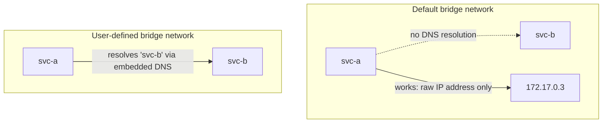
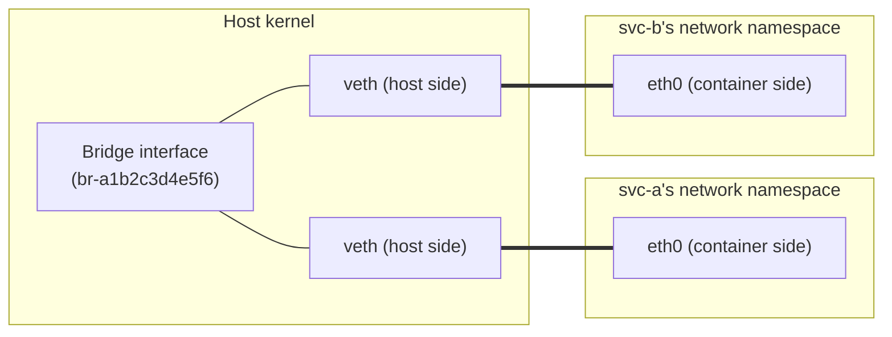
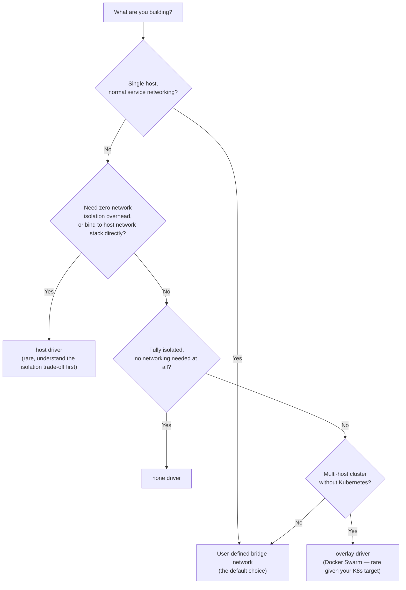

# Docker Network Drivers

Phase 1 Chapter 2 established that each container gets its own network namespace — its own loopback interface, its own routing table, its own view of "what's listening on what port." This chapter is about what Docker builds *on top of* that namespace isolation to actually let containers talk to each other and the outside world: **network drivers**. Choosing the right driver, and understanding what each one actually does at the namespace level, is the foundation for everything in the rest of this phase.

---

## The Built-In Drivers, and What Each One Actually Is

```bash
docker network ls
# NETWORK ID     NAME      DRIVER    SCOPE
# a1b2c3d4e5f6   bridge    bridge    local
# 6f5e4d3c2b1a   host      host      local
# 9c8b7a6d5e4f   none      null      local
```

Every Docker installation ships with these three by default, plus you can create additional user-defined bridge networks (the one you'll use constantly in practice) and, for multi-host setups, an `overlay` driver.

| Driver | What it does | Typical use |
|---|---|---|
| `bridge` (default) | Creates a private internal network; containers get their own IP on a virtual switch | The default for almost everything you'll run locally or on a single host |
| `host` | Container shares the host's network namespace entirely — no isolation | Rare; used when you need zero networking overhead or need to bind to a host-level port range directly |
| `none` | No networking at all — not even loopback to the outside | Fully isolated batch jobs with no network requirement |
| `overlay` | Connects containers across *multiple Docker hosts* as if on one network | Docker Swarm multi-host clusters (not used in this repository, since your target is Kubernetes — Kubernetes has its own overlay networking model, covered in Phase 10) |
| `macvlan` | Gives a container its own MAC address, appearing as a physical device on the LAN | Legacy network appliances, niche — rarely relevant for typical backend services |

For everything in this repository, you'll be using **user-defined bridge networks** almost exclusively — they're the correct default for anything running Spring Boot services locally or in Compose, and understanding them deeply pays off across the rest of this phase.

---

## The Default `bridge` Network vs. User-Defined Bridge Networks

This distinction trips people up constantly, and it's worth being precise about it immediately: **Docker's default `bridge` network and a bridge network *you* create are the same driver, but behave meaningfully differently.**

```bash
# Using the default bridge network (no --network flag = implicit default):
docker run -d --name svc-a myorg/order-service:1.4.2
docker run -d --name svc-b myorg/inventory-service:2.1.0

# On the DEFAULT bridge network, svc-a CANNOT resolve "svc-b" by name.
docker exec svc-a curl http://svc-b:8080/api/health
# curl: (6) Could not resolve host: svc-b
```

```bash
# Create a user-defined bridge network instead:
docker network create backend-net

docker run -d --name svc-a --network backend-net myorg/order-service:1.4.2
docker run -d --name svc-b --network backend-net myorg/inventory-service:2.1.0

# On a USER-DEFINED bridge network, automatic DNS-based service
# discovery by container name works out of the box:
docker exec svc-a curl http://svc-b:8080/api/health
# {"status":"UP"}
```

The default `bridge` network deliberately does **not** run Docker's embedded DNS server for container-name resolution — a legacy behavior kept for backward compatibility. User-defined bridge networks do, automatically, with zero extra configuration. This single fact is the reason Compose (Phase 6), which always creates a user-defined network for your project, "just works" for service-to-service communication by name, while two containers started with plain `docker run` and no `--network` flag famously cannot find each other by name — a genuinely common early-Docker confusion. We go deep on the DNS mechanism itself in Chapter 3.



**Practical rule going forward: always create (or let Compose create) a user-defined bridge network. Never rely on the default `bridge` network for anything beyond a single standalone container.**

---

## What "Bridge" Actually Means at the Kernel Level

A Docker bridge network is backed by a real Linux kernel construct: a **virtual ethernet bridge** (`docker0` for the default network, a separate bridge interface per user-defined network), functioning like a virtual switch. Each container connects to this bridge via a **veth pair** — two virtual network interfaces, permanently linked, with one end placed inside the container's network namespace and the other attached to the bridge on the host side.

```bash
# See the bridge interfaces Docker has created on the host:
ip link show type bridge
# docker0: <BROADCAST,MULTICAST,UP,LOWER_UP> ...
# br-a1b2c3d4e5f6: <BROADCAST,MULTICAST,UP,LOWER_UP> ...   <- your user-defined network

# See a specific container's end of its veth pair:
docker exec svc-a ip link show
# eth0@if17: <BROADCAST,MULTICAST,UP,LOWER_UP> ...   <- the container-side end
```



This is the direct mechanical answer to "how do two containers on the same bridge actually exchange packets": each container's `eth0` is one half of a veth pair whose other half is plugged into a shared virtual bridge on the host — the same way two physical machines plugged into the same physical switch can reach each other. We go deeper into the actual packet path (including iptables/nftables rules that handle NAT for external traffic) in the next chapter.

---

## Choosing a Driver: A Practical Decision



For everything you'll build in this repository — including the Phase 4 project and the Phase 6 Compose stack — **user-defined bridge networking is the answer** almost every time. The `host` driver trades away the exact isolation guarantees Phase 1 spent a full chapter establishing as valuable, and should be a deliberate, justified exception, not a default.

---

## Common Misconceptions This Chapter Should Correct

- **"All bridge networks behave the same way."** The default `bridge` network and a user-defined bridge network use the same underlying driver but differ meaningfully in DNS behavior — a distinction that causes real confusion if missed.
- **"`docker0` is the only bridge Docker ever creates."** `docker0` is specifically the *default* network's bridge — each user-defined bridge network gets its own separate bridge interface (`br-xxxxxxxx`), fully isolated from other bridge networks unless explicitly connected.
- **"`host` networking is just a faster, simpler bridge."** It's not bridge networking at all — it removes network namespace isolation entirely, meaning the container shares the host's actual network stack, ports and all. This has real security and port-collision implications, not just a performance trade-off.
- **"Containers on different Docker networks can always reach each other by default."** They cannot, by design — this isolation is often exactly what you want (separating a public-facing network from an internal database-only network), and we exploit it deliberately in the Phase 4 project and again in Phase 6.

---

## What's Next

We've established *which* driver to use and the high-level veth/bridge mechanism. The next chapter goes further into the actual bridge networking internals — the specific iptables/nftables rules that make NAT and port publishing work, and exactly how a packet gets from outside the host into a specific container.

**Next:** [`02-bridge-networking-deep-dive.md`](./02-bridge-networking-deep-dive.md)