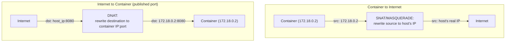
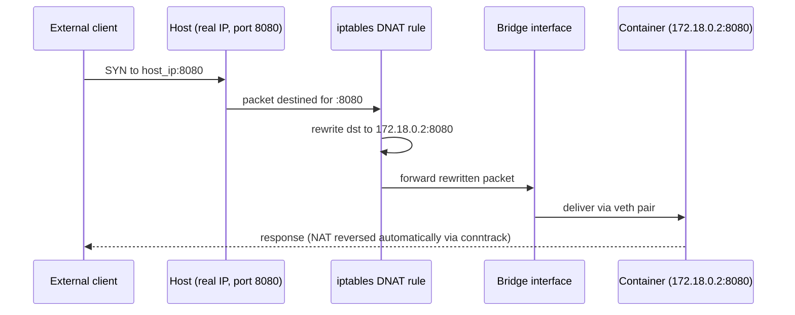

# Bridge Networking Deep Dive

Chapter 1 established that a Docker bridge network is a real Linux kernel bridge interface, with each container connected via a veth pair. This chapter goes one level deeper: the actual `iptables`/`nftables` rules Docker installs to make NAT and port publishing work, and the exact packet path for both container-to-container and container-to-internet traffic. If you've ever wondered exactly what `-p 8080:8080` does mechanically, or why a container can reach the internet but the internet can't reach the container without that flag, this chapter is the answer.

---

## Two Directions of Traffic, Two Different Mechanisms

There are three distinct traffic patterns on a bridge network, each handled by a different mechanism:

1. **Container → Container (same bridge network)**: direct bridge-level switching, no NAT involved
2. **Container → Internet (outbound)**: source NAT (masquerading), so return traffic can find its way back
3. **Internet/Host → Container (inbound, via published ports)**: destination NAT, routing an incoming connection to the right container



---

## Outbound: Why Containers Can Reach the Internet by Default

A container's IP address (e.g., `172.18.0.2`) is only valid within the bridge network — it's not routable on the wider internet. For a container to make an outbound HTTP call (say, your Spring Boot service calling an external payment API), the host must **rewrite the source IP** of outgoing packets to its own real, routable IP address before they leave the host. This is **masquerading**, a form of source NAT, and Docker sets it up automatically for every bridge network.

```bash
# See the actual iptables rule Docker installed for this (on a typical
# Linux Docker host using iptables; nftables-based hosts show equivalent
# rules through nft rather than iptables directly):
sudo iptables -t nat -L POSTROUTING -n
# Chain POSTROUTING (policy ACCEPT)
# target      prot  source           destination
# MASQUERADE  all   172.18.0.0/16    0.0.0.0/0
```

That single rule is the entire mechanism: any packet leaving the `172.18.0.0/16` subnet (your bridge network's IP range) gets its source address rewritten to the host's own outward-facing IP. The return traffic comes back addressed to the host, and the kernel's connection tracking (`conntrack`) — which remembers this rewrite happened — routes the reply back to the correct container automatically.

---

## Inbound: What `-p 8080:8080` Actually Installs

Publishing a port is the mechanism that makes the reverse direction work — letting something *outside* the bridge network (the host itself, or the internet, depending on what IP you bind to) reach a specific container.

```bash
docker run -d --name demo-service -p 8080:8080 demo-service:1.0
```

This single flag causes Docker to install a **destination NAT (DNAT)** rule:

```bash
sudo iptables -t nat -L DOCKER -n
# Chain DOCKER (2 references)
# target     prot  destination         ...
# DNAT       tcp   0.0.0.0/0   tcp dpt:8080 to:172.18.0.2:8080
```

Any TCP packet arriving at the host on port 8080, from anywhere (`0.0.0.0/0`), gets its destination address rewritten to the container's actual internal IP and port (`172.18.0.2:8080`) before the kernel routes it onward — into the bridge, across the container's veth pair, into its network namespace.



This is the concrete, mechanical answer to "why do I need `-p` at all if the container has its own IP" — because that IP isn't reachable from outside the bridge without an explicit rule telling the kernel to forward traffic to it. Without `-p`, the container is fully isolated from anything outside its bridge network by default — which, per Phase 1's isolation goals, is the deliberately safe default, not an oversight.

---

## Container-to-Container on the Same Bridge: No NAT Needed

Traffic between two containers on the *same* user-defined bridge network doesn't need any of the NAT machinery above — it's switched directly at the bridge, the same way two devices on the same physical network switch talk directly without going through a router.

```bash
docker network create backend-net
docker run -d --name svc-a --network backend-net myorg/order-service:1.4.2
docker run -d --name svc-b --network backend-net myorg/inventory-service:2.1.0

# svc-a reaches svc-b directly over the bridge — no NAT, no port
# publishing required at all, because both are already on the same
# Layer 2 segment (the bridge):
docker exec svc-a curl http://svc-b:8080/api/health
```

**This is a genuinely important practical point for the Compose stacks you'll build starting in Phase 6:** internal service-to-service traffic (your API calling your database, or another internal service) should never need `-p`/`ports:` published at all — publishing is only for exposing something to *outside* the bridge network (your laptop, the internet). Publishing internal-only services unnecessarily widens your actual attack surface for no operational benefit — a security-relevant habit worth building now, well before Phase 8 covers hardening explicitly.

---

## Verifying the Whole Picture on Your Own Host

```bash
# 1. Confirm the bridge network's subnet:
docker network inspect backend-net --format '{{json .IPAM.Config}}'
# [{"Subnet":"172.19.0.0/16","Gateway":"172.19.0.1"}]

# 2. Confirm each container's actual IP on that bridge:
docker inspect svc-a --format '{{.NetworkSettings.Networks.backend-net.IPAddress}}'
# 172.19.0.2

# 3. Confirm the DNAT rule exists for any published port:
sudo iptables -t nat -L DOCKER -n --line-numbers

# 4. Confirm the MASQUERADE rule for outbound traffic:
sudo iptables -t nat -L POSTROUTING -n
```

Being able to walk this chain yourself — network subnet, container IP, NAT rule — is a genuinely valuable debugging skill for the "container can't reach X" class of problems covered fully in Phase 7; more often than not, the fix is visible directly in this exact chain, not in application code.

---

## Common Misconceptions This Chapter Should Correct

- **"A container's internal IP address is directly reachable from my laptop or the internet."** It is not, by default — only through an explicit published port's DNAT rule, or by being on the same bridge network as the thing trying to reach it.
- **"Publishing a port and exposing a port (`EXPOSE` in a Dockerfile) do the same thing."** `EXPOSE` is documentation/metadata only — it does not open any port or install any NAT rule by itself. Only `-p`/`--publish` at `docker run` time (or `ports:` in Compose) actually creates the DNAT rule. We make this distinction fully explicit in the next chapter.
- **"NAT is needed for container-to-container traffic on the same network."** No — same-bridge traffic is switched directly, with no NAT involved at all; NAT only enters the picture for traffic crossing the bridge's boundary (outbound to the internet, or inbound via a published port).
- **"iptables rules for Docker are something you're expected to hand-edit."** You almost never should — Docker manages its own chains (`DOCKER`, `DOCKER-ISOLATION-STAGE-*`, etc.) and expects to own them; manually editing these is a common source of Docker networking breaking in confusing, hard-to-diagnose ways after a host reboot or Docker restart.

---

## What's Next

We now understand the packet-level mechanics of getting traffic in and out of a bridge network. What we haven't covered is how a container finds *another specific container by name* in the first place — the DNS mechanism briefly mentioned in Chapter 1. That's next, and it's the foundation for everything about service discovery you'll rely on in Compose (Phase 6) and, conceptually, in Kubernetes (Phase 10).

**Next:** [`03-dns-and-service-discovery.md`](./03-dns-and-service-discovery.md)