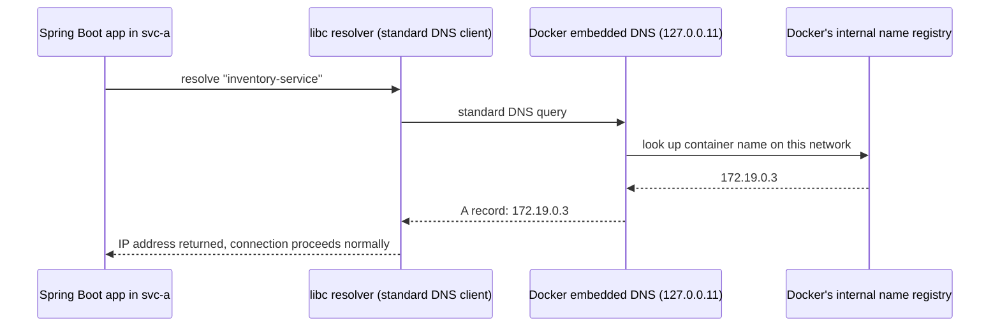

# DNS and Service Discovery

Chapter 1 mentioned, without fully explaining, that user-defined bridge networks give you automatic DNS resolution by container name. This chapter explains that mechanism precisely: where the DNS server actually runs, how names get registered, what happens with multiple replicas of the same service name, and the practical implications for how you should structure service-to-service calls in a Spring Boot microservices setup.

---

## Docker's Embedded DNS Server

Every user-defined bridge network runs an embedded DNS resolver, provided by the Docker daemon itself, at a well-known internal address:

```bash
docker network create backend-net
docker run -d --name svc-a --network backend-net myorg/order-service:1.4.2

# Inside any container on a user-defined network, /etc/resolv.conf
# points at Docker's internal DNS server, not your host's real DNS:
docker exec svc-a cat /etc/resolv.conf
# nameserver 127.0.0.11
# options ndots:0
```

`127.0.0.11` is Docker's embedded DNS resolver, running inside the container's own network namespace (technically implemented via a small proxy process associated with that container, forwarding to the daemon's DNS logic) — every container on a user-defined bridge network gets this same resolver configured automatically. This is *why* container-name resolution works transparently with zero application-level configuration: your Spring Boot app's `RestTemplate` or `WebClient` calling `http://inventory-service:8080` triggers a completely standard DNS lookup that your Java HTTP client already knows how to do — Docker intercepts and answers it correctly, and your application code has no idea anything Docker-specific is happening.



---

## What Gets Registered, and When

Docker registers a DNS entry for a container the moment it joins a network, using:

1. **The container's name** (`--name svc-a`)
2. **Any network aliases** explicitly assigned (`--network-alias`)
3. **The container's hostname**, if explicitly set

```bash
# Explicit network alias — useful when you want a service reachable
# under a name different from its container name (common when a
# Compose service name differs from what other services expect to call):
docker run -d --name order-svc-v2 \
  --network backend-net \
  --network-alias order-service \
  myorg/order-service:2.0.0
```

Now, other containers on `backend-net` can reach this container via `http://order-service:8080` even though its actual container name is `order-svc-v2` — a pattern that becomes directly relevant during blue-green or canary-style deployments, where you want callers to keep addressing a stable logical name while the underlying container identity changes.

---

## Multiple Containers, Same Name/Alias: Round-Robin at the DNS Level

If more than one running container shares the same name (this specifically happens with network aliases, since actual container *names* must be unique per Docker host) Docker's embedded DNS returns **multiple A records**, and most DNS clients (including the JVM's default resolver) will round-robin across them:

```bash
docker network create backend-net
docker run -d --network backend-net --network-alias inventory-service --name inv-1 myorg/inventory-service:2.1.0
docker run -d --network backend-net --network-alias inventory-service --name inv-2 myorg/inventory-service:2.1.0

docker run --rm --network backend-net alpine nslookup inventory-service
# Name:      inventory-service
# Address 1: 172.19.0.3 inv-1.backend-net
# Address 2: 172.19.0.4 inv-2.backend-net
```

This is a genuinely simple, workable load-balancing mechanism for local development and small Compose stacks (we use it directly in the Phase 4 project below), but it's worth being precise about its limits: **this is DNS-level round-robin with no health awareness** — if `inv-2` is unhealthy but still running, DNS will still hand out its address roughly half the time. There's no equivalent here to a real load balancer's active health checking. For anything beyond local development or a small Compose stack, this is exactly the gap Kubernetes Services (with readiness-probe-aware endpoint lists) are built to close — a connection we make explicit in Phase 10.

---

## A JVM-Specific Trap: DNS Caching

The JVM, by default, **caches successful DNS lookups indefinitely** within a running process (`networkaddress.cache.ttl`, defaulting to `-1`, meaning "forever," unless a `SecurityManager` is installed, in which case the default differs). This matters directly for the round-robin behavior above, and even more so for any scenario where a service's underlying IP changes while your application is still running (a container restart, a rolling redeploy):

```java
// A Spring Boot app that resolved "inventory-service" once at startup,
// with default JVM DNS caching, will keep using that ORIGINAL IP
// indefinitely — even after the container behind that name is replaced.
```

```properties
# Explicitly bound DNS cache TTL — a genuinely important setting for
# any containerized Java service that talks to other containers by
# name, especially ones that might be replaced/rescheduled over time:
networkaddress.cache.ttl=30
```

This can be set via a `java.security` override, or programmatically at startup via `java.security.Security.setProperty("networkaddress.cache.ttl", "30")`. Without an explicit, bounded TTL, a long-running Spring Boot service can silently keep sending traffic to a stale, no-longer-existing container IP after a redeploy — a subtle, easy-to-miss production issue that has nothing to do with Docker's DNS server (which is answering correctly, every time it's actually queried) and everything to do with the JVM simply not asking again.

---

## Practical Application: Structuring Service Calls

Given everything above, the practical pattern for Spring Boot services calling each other within a Compose stack (Phase 6) or standalone bridge network is straightforward and requires no special libraries:

```java
@Service
public class InventoryClient {

    private final RestClient restClient;

    public InventoryClient(RestClient.Builder builder) {
        // "inventory-service" resolves via Docker's embedded DNS —
        // no service discovery library, no Eureka, no Consul needed
        // for this networking layer; Docker itself is the registry.
        this.restClient = builder.baseUrl("http://inventory-service:8080").build();
    }

    public InventoryStatus checkStock(String sku) {
        return restClient.get()
            .uri("/api/inventory/{sku}", sku)
            .retrieve()
            .body(InventoryStatus.class);
    }
}
```

No hardcoded IP addresses, no separate service registry to run and maintain for local development or Compose-based environments — the container name (or network alias) *is* the service discovery mechanism, which is exactly the simplicity that makes Compose-based local development (Phase 6) so effective for microservices development compared to running each service bare on your laptop with manually-tracked ports.

---

## Common Misconceptions This Chapter Should Correct

- **"Container name resolution requires some kind of service mesh or discovery library."** For same-host, Compose-style setups, it requires nothing beyond a user-defined bridge network — it's a built-in Docker daemon feature, not a separate product.
- **"DNS round-robin across multiple containers with the same alias is equivalent to a real load balancer."** It's not health-aware, has no connection draining, and no weighting — a fine mechanism for simple local development scenarios, insufficient as a production load-balancing strategy.
- **"The JVM always re-resolves DNS names for every request."** By default it does not — successful lookups are cached, by default indefinitely, which interacts badly with container replacement unless you explicitly bound the cache TTL.
- **"`/etc/hosts` inside the container is how name resolution works here."** Docker does add certain static entries to `/etc/hosts` (like the container's own hostname), but cross-container name resolution on a bridge network goes through the embedded DNS server at `127.0.0.11`, not through static `/etc/hosts` entries.

---

## What's Next

We've covered how containers find each other by name. The next chapter goes back to the boundary between "inside the bridge network" and "outside it" — the precise, commonly-confused distinction between a Dockerfile's `EXPOSE` instruction (documentation) and actually publishing a port at runtime (a real, functioning NAT rule, per Chapter 2).

**Next:** [`04-exposing-vs-publishing-ports.md`](./04-exposing-vs-publishing-ports.md)