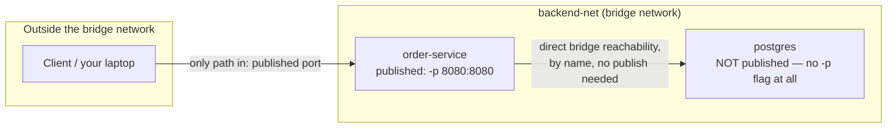

# Exposing vs. Publishing Ports

This is a small chapter about a distinction that causes an outsized amount of confusion: `EXPOSE` in a Dockerfile versus `-p`/`--publish` at `docker run` time (or `ports:` in Compose). They sound similar, they're often mentioned in the same breath in tutorials, and they do genuinely different things — one is inert documentation, the other installs the DNAT rule from Chapter 2 that actually lets traffic in.

---

## `EXPOSE`: Documentation, Not a Firewall Rule

```dockerfile
FROM eclipse-temurin:21-jre
COPY target/demo-0.0.1-SNAPSHOT.jar /app/app.jar
EXPOSE 8080
ENTRYPOINT ["java", "-jar", "/app/app.jar"]
```

`EXPOSE 8080` does exactly one functional thing: it's recorded as metadata in the image, retrievable via `docker inspect`, and it changes the default behavior of `docker run -P` (capital P — publish *all* exposed ports to random host ports, covered below). It does **not**:

- Open port 8080 on the host
- Install any iptables/NAT rule
- Prevent the container from listening on other, non-`EXPOSE`d ports
- Provide any actual network isolation or restriction whatsoever

```bash
docker build -t demo-service:1.0 .
docker run -d --name demo-no-publish demo-service:1.0

# The container is fully running and listening on 8080 *internally* —
# but nothing outside its own network namespace can reach it, because
# EXPOSE alone installed no DNAT rule:
curl http://localhost:8080/api/hello
# curl: (7) Failed to connect to localhost port 8080: Connection refused

# Yet another container on the same bridge network CAN reach it directly,
# because bridge-internal traffic (Chapter 2) never needed EXPOSE at all —
# it needed only to be on the same network:
docker network create test-net
docker network connect test-net demo-no-publish
docker run --rm --network test-net alpine wget -qO- http://demo-no-publish:8080/api/hello
# {"message":"Hello from inside a container", ...}
```

That last example is worth sitting with: **`EXPOSE` had zero bearing on whether the second container could reach the first.** Container-to-container reachability on the same bridge network (Chapter 2's direct switching) works regardless of whether a port was `EXPOSE`d — `EXPOSE` is purely informational metadata about the image, not an access control mechanism.

---

## Publishing: The Thing That Actually Opens a Path from Outside

```bash
docker run -d --name demo-published -p 8080:8080 demo-service:1.0

curl http://localhost:8080/api/hello
# {"message":"Hello from inside a container", ...}
```

`-p 8080:8080` (host port : container port) is what actually creates the DNAT rule from Chapter 2, making the container's port 8080 reachable from outside the bridge network — from your host machine, and from anywhere that can reach your host machine's network interface.

### The Full Publish Syntax

```bash
# host_port:container_port — the common form:
docker run -p 8080:8080 demo-service:1.0

# Bind only to a specific host interface (e.g., only localhost,
# not all interfaces — a genuinely important production/security
# consideration, covered further in Phase 8):
docker run -p 127.0.0.1:8080:8080 demo-service:1.0

# Different host port than container port — useful when running
# multiple instances or avoiding a host port collision:
docker run -p 9090:8080 demo-service:1.0

# Publish ALL ports the image's Dockerfile declared with EXPOSE,
# each to a random available host port:
docker run -P demo-service:1.0
docker port demo-published
# 8080/tcp -> 0.0.0.0:32768
```

That last form (`-P`, capital) is the one place `EXPOSE` actually has a functional effect: it tells Docker *which* ports to auto-publish (to random host ports) when you use `-P` instead of manually specifying each mapping with lowercase `-p`.

---

## Why Internal Services Should Never Be Published

Following directly from Chapter 2's point: a database or internal-only service in a multi-container stack (the Postgres behind your Spring Boot API, for instance) should generally have **no published port at all** — only the API-facing service needs one. Other containers on the same bridge network reach the database directly, by name (Chapter 3), with zero need for a host-level port mapping.



Publishing the database's port unnecessarily (a very common early-Docker habit, often done "just in case" or out of unfamiliarity with bridge-internal reachability) directly widens the actual attack surface — anyone who can reach your host's network can now attempt to connect straight to the database, bypassing the application entirely. We return to this specific point again, with concrete hardening steps, in Phase 8.

---

## Verifying Published Ports on a Running Container

```bash
docker port demo-published
# 8080/tcp -> 0.0.0.0:8080

docker inspect demo-published --format '{{json .NetworkSettings.Ports}}'
# {"8080/tcp":[{"HostIp":"0.0.0.0","HostPort":"8080"}]}

# Confirm the corresponding DNAT rule exists (from Chapter 2):
sudo iptables -t nat -L DOCKER -n | grep 8080
```

---

## Common Misconceptions This Chapter Should Correct

- **"`EXPOSE` opens a port."** It records metadata only — it neither opens a port on the host nor restricts anything about the container's actual network behavior.
- **"Without `EXPOSE`, other containers on the same network can't reach this one."** They can — bridge-internal reachability (Chapter 2) has no dependency on `EXPOSE` whatsoever; only reachability from *outside* the bridge network depends on actual port publishing.
- **"You must `EXPOSE` a port before you can publish it with `-p`."** You don't — `-p host:container` works regardless of whether the Dockerfile declared `EXPOSE` for that port; `EXPOSE` only matters for the `-P` (auto-publish-all) shortcut specifically.
- **"Every service in a multi-container stack needs its port published for the stack to work."** Only services that need to be reachable from *outside* the bridge network need publishing — internal-only services should deliberately have none, both for correctness clarity and for reduced attack surface.

---

## What's Next

We've now covered driver choice, the packet-level bridge/NAT mechanics, name-based discovery, and the expose/publish distinction. The final concept chapter of this phase pulls these together into concrete communication patterns for a real multi-service backend — synchronous request/response between services, and the network topology choices that come with splitting a system into public-facing and internal-only segments.

**Next:** [`05-inter-container-communication-patterns.md`](./05-inter-container-communication-patterns.md)