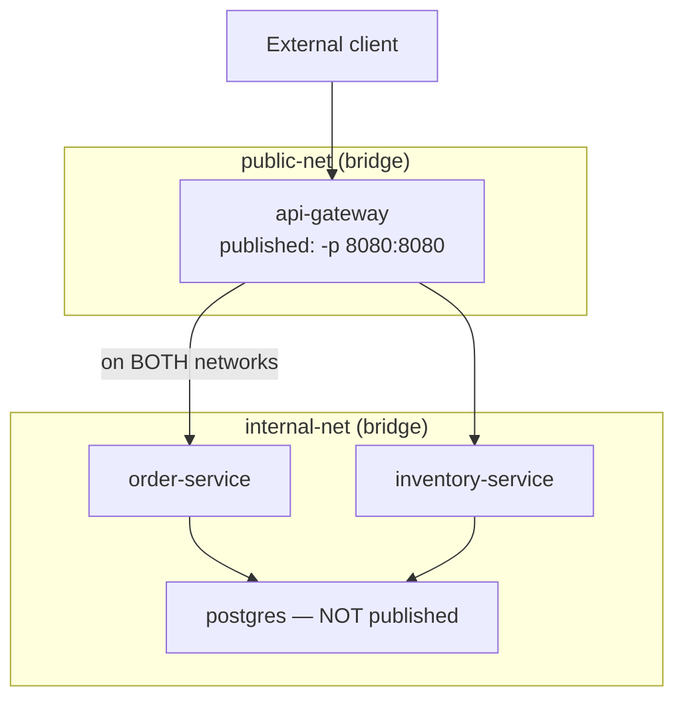
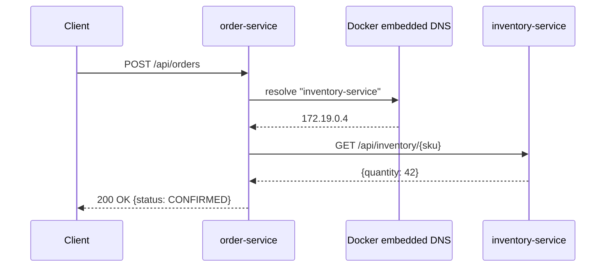
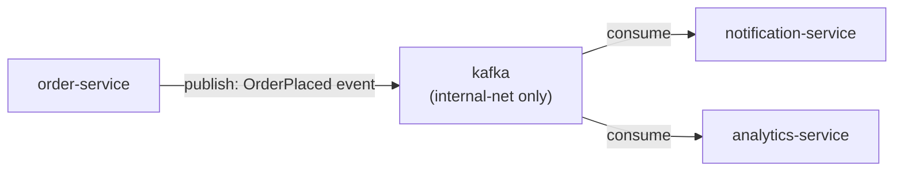

# Inter-Container Communication Patterns

This chapter is the synthesis of Phase 4 so far: given driver choice (Chapter 1), bridge/NAT mechanics (Chapter 2), DNS-based discovery (Chapter 3), and the expose/publish distinction (Chapter 4), how should you actually structure the network topology of a multi-service backend? This is about deliberate architecture, not just "which flag do I pass" — the choices here directly shape your service's security posture and are exactly what the Phase 4 project will implement concretely.

---

## Pattern 1: The Segmented Network (Public-Facing vs. Internal-Only)

The most common, and generally correct, pattern for a backend with a database: **two logical network segments**, with only the API-facing service bridging both.



A container can belong to **more than one Docker network simultaneously** — this is exactly how `api-gateway` bridges the two segments above: it's attached to `public-net` (where its published port is reachable from outside) *and* `internal-net` (where it can reach `order-service`, `inventory-service`, and indirectly whatever they depend on), while `order-service`, `inventory-service`, and `postgres` are only ever on `internal-net`, unreachable from outside no matter what.

```bash
docker network create public-net
docker network create internal-net

docker run -d --name api-gateway --network public-net -p 8080:8080 myorg/api-gateway:1.0
docker network connect internal-net api-gateway

docker run -d --name order-service --network internal-net myorg/order-service:1.4.2
docker run -d --name postgres --network internal-net -e POSTGRES_PASSWORD=secret postgres:16
```

This is the pattern Compose (Phase 6) makes trivial to declare and Kubernetes (Phase 10) enforces more rigorously via NetworkPolicies — but the underlying idea, **the network topology should mirror your trust boundary**, is identical across all three.

---

## Pattern 2: Direct Service-to-Service Calls (Synchronous)

The most common pattern for backend microservices talking to each other: plain HTTP (or gRPC) calls addressed by container/service name, relying on the DNS mechanism from Chapter 3.

```java
@Service
public class OrderService {

    private final RestClient inventoryClient;

    public OrderService(RestClient.Builder builder) {
        this.inventoryClient = builder.baseUrl("http://inventory-service:8080").build();
    }

    public OrderResult placeOrder(OrderRequest request) {
        InventoryStatus stock = inventoryClient.get()
            .uri("/api/inventory/{sku}", request.sku())
            .retrieve()
            .body(InventoryStatus.class);

        if (stock == null || stock.quantity() < request.quantity()) {
            throw new InsufficientStockException(request.sku());
        }
        // ... proceed with order creation
        return new OrderResult(request.sku(), "CONFIRMED");
    }
}
```



The engineering consideration this pattern surfaces immediately: `inventory-service` being temporarily unreachable (restarting, overloaded, network blip) directly becomes `order-service`'s problem, synchronously, on the request path. This is exactly the trade-off that motivates the next pattern for anything where tight coupling between services is undesirable.

**Practical resilience additions** (worth applying even in a Compose-based dev environment, since the failure modes are the same ones you'll see in production): explicit connect/read timeouts on the `RestClient`, and ideally a circuit breaker (Resilience4j is the common Spring Boot choice) so a slow or down `inventory-service` degrades `order-service` predictably rather than exhausting its own thread pool waiting on hung connections.

```java
@Bean
public RestClient.Builder restClientBuilder() {
    ClientHttpRequestFactorySettings settings = ClientHttpRequestFactorySettings.DEFAULTS
        .withConnectTimeout(Duration.ofSeconds(2))
        .withReadTimeout(Duration.ofSeconds(5));
    return RestClient.builder()
        .requestFactory(ClientHttpRequestFactories.get(settings));
}
```

---

## Pattern 3: Asynchronous, Broker-Mediated Communication

For genuinely decoupled communication — `order-service` needs to notify `notification-service` that an order was placed, but shouldn't block on (or fail because of) `notification-service` being temporarily down — a message broker container (Kafka, RabbitMQ) sits on the same internal network, and services publish/consume rather than calling each other directly.



Networking-wise, this is exactly Pattern 1's segmented internal network again — the broker is just another internal-only container, reachable by name, never published outside the bridge network. The architectural benefit is purely at the application level (decoupling, buffering, fan-out to multiple consumers) — the *networking* mechanism underneath is identical to any other internal service-to-service reachability already covered. We build a working version of this exact topology (Kafka included) in the Phase 6 Compose project.

---

## Choosing Between Patterns: A Practical Guide

| Situation | Pattern |
|---|---|
| Caller needs an immediate response to proceed | Direct synchronous call (Pattern 2), with timeouts and a circuit breaker |
| Caller doesn't need to wait, or multiple consumers care about the same event | Broker-mediated (Pattern 3) |
| A service should never be reachable from outside the cluster/host | Keep it exclusively on the internal network segment — no published port, ever |
| A service is the sole entry point for external traffic | Bridge both networks (Pattern 1), publish only this one |

---

## Common Misconceptions This Chapter Should Correct

- **"A container can only belong to one Docker network."** It can belong to several simultaneously — this is exactly the mechanism that makes the segmented public/internal topology (Pattern 1) possible with a single gateway container.
- **"Synchronous service-to-service calls are inherently the wrong pattern for microservices."** They're a completely normal, often correct pattern — the key engineering discipline is adding real timeouts and failure isolation (circuit breakers), not avoiding synchronous calls altogether.
- **"Using a message broker automatically solves reliability problems."** It changes *where* failure handling needs to live (consumer-side retry/dead-letter handling instead of caller-side timeout/circuit-breaking) — it doesn't remove the need for deliberate failure handling, just relocates it.
- **"Network segmentation is a Kubernetes-only concept."** The exact same idea — services grouped by trust boundary, with a single deliberate ingress point — is fully achievable with plain Docker networks, as shown in Pattern 1; Kubernetes NetworkPolicies (Phase 10) make it more rigorously enforced, not conceptually different.

---

## What's Next

Time to build all of this for real: a working multi-service backend on a segmented network topology, verifying reachability rules directly, and exercising both the synchronous call pattern and the DNS round-robin behavior from Chapter 3 under an actual running Postgres and two Spring Boot services.

**Next:** [`06-real-world-networking-lab.md`](./06-real-world-networking-lab.md)