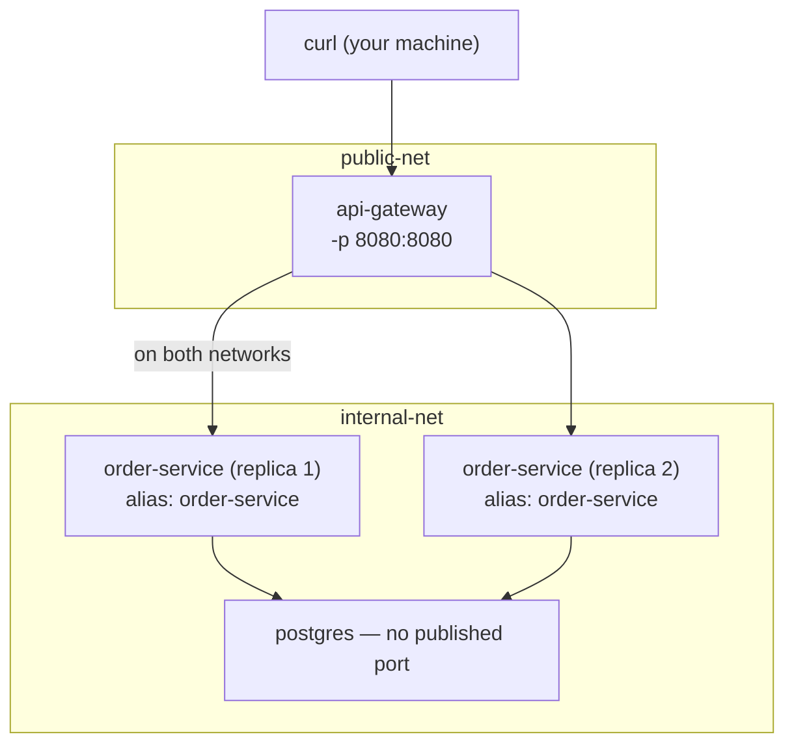

# Project: Real-World Networking Lab

This project builds the segmented-network topology from Chapter 5, Pattern 1, for real: an `api-gateway` service that's the only published container, an `order-service` reachable only internally, and a `postgres` database reachable only from `order-service` — then we verify, using the actual tools from this phase, that the isolation is real and not just a diagram.

We also deliberately reproduce and observe the DNS round-robin behavior from Chapter 3 by running two replicas of `order-service` behind one network alias.

---

## Objective

- Stand up a two-network topology: `public-net` and `internal-net`
- Run `api-gateway` (published), `order-service` x2 (internal only, sharing one network alias), and `postgres` (internal only)
- Verify, using `docker exec`, `curl`, and `iptables`, that the isolation boundaries actually hold
- Observe DNS round-robin across the two `order-service` replicas directly
- Debug a deliberately broken configuration (a container missing from the correct network) using the diagnostic techniques from this phase

---

## Architecture



---

## Folder Structure

```text
networking-lab/
├── gateway/
│   ├── pom.xml
│   ├── src/main/java/com/example/gateway/
│   │   ├── GatewayApplication.java
│   │   └── ProxyController.java
│   └── Dockerfile
├── order-service/
│   ├── pom.xml
│   ├── src/main/java/com/example/order/
│   │   ├── OrderApplication.java
│   │   └── OrderController.java
│   └── Dockerfile
└── run-lab.sh
```

---

## Source Code

**`gateway/src/main/java/com/example/gateway/ProxyController.java`**

```java
package com.example.gateway;

import org.springframework.web.bind.annotation.GetMapping;
import org.springframework.web.bind.annotation.RestController;
import org.springframework.web.client.RestClient;

import java.util.Map;

@RestController
public class ProxyController {

    // "order-service" resolves via Docker's embedded DNS (Chapter 3) —
    // and since TWO containers will share this alias, we'll see
    // round-robin behavior directly across repeated calls.
    private final RestClient client = RestClient.builder()
        .baseUrl("http://order-service:8081")
        .build();

    @GetMapping("/api/orders/ping")
    public Map<String, Object> pingOrderService() {
        return client.get()
            .uri("/api/internal/whoami")
            .retrieve()
            .body(Map.class);
    }
}
```

**`order-service/src/main/java/com/example/order/OrderController.java`**

```java
package com.example.order;

import org.springframework.beans.factory.annotation.Value;
import org.springframework.web.bind.annotation.GetMapping;
import org.springframework.web.bind.annotation.RestController;

import java.net.InetAddress;
import java.util.Map;

@RestController
public class OrderController {

    @Value("${HOSTNAME:unknown}")
    private String hostname;

    @GetMapping("/api/internal/whoami")
    public Map<String, Object> whoami() throws Exception {
        return Map.of(
            "respondingContainerHostname", hostname,
            "resolvedInternalIp", InetAddress.getLocalHost().getHostAddress()
        );
    }
}
```

`HOSTNAME` here reads the container's own hostname (Docker sets this to the container ID by default unless overridden) — exactly what lets us prove, from the response body itself, *which* of the two `order-service` replicas actually answered a given request.

**Dockerfiles** for both services follow the same simple single-stage pattern as the Phase 1 project (a full multi-stage, production-grade version is covered in Phase 2 — this project's focus is networking, not image optimization):

```dockerfile
FROM eclipse-temurin:21-jdk
WORKDIR /app
COPY . .
RUN ./mvnw clean package -DskipTests
EXPOSE 8080
ENTRYPOINT ["java", "-jar", "target/app.jar"]
```

(`gateway`'s Dockerfile listens on 8080; `order-service`'s `application.properties` sets `server.port=8081` to keep the two clearly distinct in this lab.)

---

## Build and Run Commands

```bash
# Build both images
docker build -t networking-lab/gateway:1.0 ./gateway
docker build -t networking-lab/order-service:1.0 ./order-service

# Create the two-network topology
docker network create public-net
docker network create internal-net

# Postgres: internal-net only, no published port at all
docker run -d --name postgres --network internal-net \
  -e POSTGRES_PASSWORD=secret -e POSTGRES_DB=orders \
  postgres:16

# order-service: TWO replicas, both on internal-net,
# both sharing the same network alias
docker run -d --name order-1 --network internal-net \
  --network-alias order-service \
  networking-lab/order-service:1.0

docker run -d --name order-2 --network internal-net \
  --network-alias order-service \
  networking-lab/order-service:1.0

# api-gateway: starts on public-net (for its published port),
# then explicitly joins internal-net too (Chapter 5, Pattern 1)
docker run -d --name api-gateway --network public-net -p 8080:8080 \
  networking-lab/gateway:1.0
docker network connect internal-net api-gateway
```

---

## Expected Output

```bash
curl http://localhost:8080/api/orders/ping
# {"respondingContainerHostname":"a1b2c3d4e5f6","resolvedInternalIp":"172.19.0.3"}

curl http://localhost:8080/api/orders/ping
# {"respondingContainerHostname":"f6e5d4c3b2a1","resolvedInternalIp":"172.19.0.4"}
```

Two different hostnames across repeated calls — direct, observed confirmation of DNS round-robin (Chapter 3) across the two `order-service` replicas, from a real running system rather than a described mechanism.

---

## Debugging Walkthrough: Verifying the Isolation Boundary Is Real

### 1. Confirm `postgres` is genuinely unreachable from outside

```bash
# From your host machine, this should fail — postgres was never
# published on any network:
docker port postgres
# (no output — no ports published at all)

psql -h localhost -p 5432 -U postgres
# psql: error: connection to server at "localhost" (::1), port 5432 failed
```

### 2. Confirm `postgres` IS reachable from `order-service` (same internal network)

```bash
docker exec order-1 sh -c "apt-get update -qq && apt-get install -y -qq postgresql-client 2>/dev/null; pg_isready -h postgres -p 5432"
# postgres:5432 - accepting connections
```

### 3. Confirm `postgres` is NOT reachable from `api-gateway`'s public-net identity, only via its internal-net membership

This is a subtler, genuinely instructive check: because `api-gateway` is on *both* networks, it's a good test case for confirming that network membership — not container identity — is what governs reachability.

```bash
# Temporarily disconnect api-gateway from internal-net and re-test:
docker network disconnect internal-net api-gateway

docker exec api-gateway sh -c "apt-get update -qq && apt-get install -y -qq postgresql-client 2>/dev/null; pg_isready -h postgres -p 5432"
# (fails to resolve "postgres" at all — no longer on that network,
#  so Docker's embedded DNS for internal-net no longer applies to this container)

# Reconnect it to restore the working topology:
docker network connect internal-net api-gateway
```

This directly demonstrates that reachability is a property of **network membership at any given moment**, re-evaluated live — not something fixed at container creation time.

### 4. Confirm the DNAT rule exists only for the one published port

```bash
sudo iptables -t nat -L DOCKER -n
# Only ONE DNAT rule should reference port 8080 (api-gateway) —
# no rule at all should exist referencing postgres's 5432 or
# order-service's 8081, confirming they were genuinely never published.
```

---

## Optimization / Architecture Discussion

- **Why two networks instead of one with careful firewall rules?** Docker's own network segmentation is simpler to reason about and audit than manually crafted iptables rules layered on top of a single flat network — `docker network inspect` gives you an immediate, accurate picture of "what can reach what," which is exactly the auditability property you want for a trust boundary.
- **Why `--network-alias` instead of a real load balancer for the two `order-service` replicas?** For local development and this lab, DNS round-robin is sufficient and requires zero extra infrastructure. For anything production-grade, this is precisely the gap that Compose's own scaling (`docker compose up --scale`, Phase 6) still shares this same limitation with — and the reason Kubernetes Services with real endpoint health-awareness (Phase 10) exist as the actual production answer.

## Production Considerations

- This lab's `postgres` container has no volume attached — restarting it loses all data. That's deliberately out of scope here (Phase 5 covers volumes fully) so this project stays focused purely on networking.
- In a real deployment, `api-gateway`'s published port should very likely be bound to a specific interface or sit behind a reverse proxy/load balancer rather than being directly internet-facing — a concern we build on in Phase 8 and Phase 9.

---

## Common Mistakes

- **Forgetting `--network-alias` on the second `order-service` replica** — without it, the two containers are reachable only by their distinct container names (`order-1`, `order-2`), and the gateway's hardcoded `http://order-service:8081` call will fail to resolve at all, since no container or alias named exactly `order-service` exists.
- **Publishing `postgres`'s port "just to check it's working" during setup, then forgetting to remove the flag** — this is exactly the accidental attack-surface widening called out in Chapter 4 and Chapter 5; always verify reachability from *inside* the correct internal container instead.

---

## Cleanup

```bash
docker rm -f api-gateway order-1 order-2 postgres
docker network rm public-net internal-net
docker rmi networking-lab/gateway:1.0 networking-lab/order-service:1.0
```

---

## What's Next

Phase 4 is complete: drivers, bridge/NAT mechanics, DNS-based discovery, the expose/publish distinction, and communication patterns — all verified hands-on against a real segmented topology with observed round-robin behavior. Phase 5 moves to storage: what actually happens to data written inside a container, and how volumes, bind mounts, and tmpfs each solve a different persistence problem.

**Next:** [`../phase-5-storage-and-state/01-container-filesystem-and-copy-on-write.md`](../phase-5-storage-and-state/01-container-filesystem-and-copy-on-write.md)