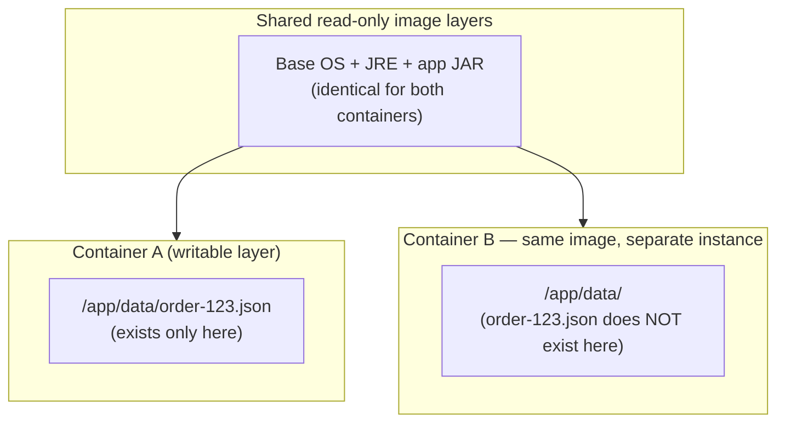
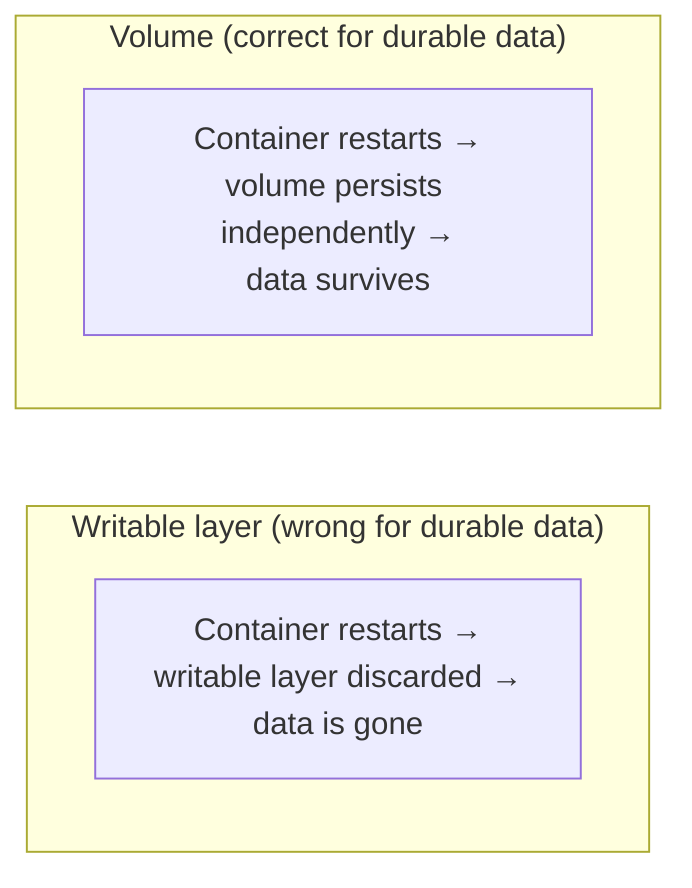

# Container Filesystem and Copy-on-Write, Revisited for Storage Decisions

Phase 1 Chapter 4 covered OverlayFS and copy-on-write mechanically — how layers stack, how copy-up works, why build caching and image sharing are possible. This chapter revisits that same mechanism from a different angle: **what it means for data your application actually writes at runtime**, and why that mechanism, however elegant for images, is the wrong tool for anything you need to survive a container's lifecycle or share across containers. This chapter is short and deliberately narrow — it exists to set up precisely why Chapter 2's three storage mechanisms (volumes, bind mounts, tmpfs) all exist as *alternatives* to writing through the union filesystem at all.

---

## Where Application Writes Actually Go, By Default

Without any volume or bind mount configured, every file your application writes goes into the container's writable layer — the `upperdir` from Phase 1 Chapter 4's OverlayFS mount.

```bash
docker run -d --name demo-service demo-service:1.0

# Application writes a file with no volume configured:
docker exec demo-service sh -c "echo 'order data' > /app/data/order-123.json"

# This lives entirely in the writable layer:
docker diff demo-service
# A /app/data
# A /app/data/order-123.json
```

Three consequences follow directly from this, all of which matter for real applications:

1. **It's ephemeral.** `docker rm demo-service` discards the writable layer entirely — `order-123.json` is gone permanently, with no recovery path.
2. **It's not shareable.** A second container from the same image (say, a horizontally-scaled replica) has its *own separate* writable layer — it cannot see `order-123.json` at all, even though both containers came from the identical image.
3. **First writes to pre-existing lower-layer files incur copy-up cost.** As covered in Phase 1, if your application modifies a file that shipped as part of the image (a config file baked into a layer, say), OverlayFS must first copy that entire file into the writable layer before applying the change — a real (if usually small) latency and I/O cost on that specific write.



---

## Why This Is the Wrong Default for Real Application Data

None of the three consequences above are Docker bugs — they're the *correct, intended* behavior of a system built around Phase 1's core premise: images are immutable, reproducible artifacts, and containers are disposable instances of them. A container's writable layer is deliberately treated as throwaway scratch space, precisely because that's what lets you kill and recreate a container from the same image at any time with full confidence you'll get identical behavior (Phase 1 Chapter 1's reproducibility goal).

The problem is that real applications have data that must **not** be throwaway: a database's actual rows, uploaded files a user expects to still exist tomorrow, a cache you want to survive a routine container restart during a rolling deploy. None of that data should live in a writable layer, precisely because the writable layer's disposability is a *feature* you rely on elsewhere (being able to `docker rm` and recreate a container from a fresh image without hesitation).



This is the exact gap the next chapter's three mechanisms — volumes, bind mounts, and tmpfs — each fill, in different ways, for different needs. All three share one property in common that's worth stating plainly now: **each of them bypasses the union filesystem entirely.** They're mounted directly into the container's mount namespace (Phase 1 Chapter 2) as separate filesystem mounts, sitting alongside the OverlayFS-merged view rather than being part of it — which is precisely why data written to them survives independently of the container's writable layer's lifecycle, and why writes to them don't incur any copy-up cost at all.

---

## Verifying This Directly

```bash
# Confirm a fresh container from the SAME image doesn't see data
# written into a different container's writable layer:
docker run -d --name demo-2 demo-service:1.0
docker exec demo-2 ls /app/data
# ls: /app/data: No such file or directory
# (demo-2 has its own separate writable layer — never saw demo's write)

# Confirm the data genuinely vanishes on removal:
docker rm -f demo-service
# order-123.json is now permanently gone — no volume, no backup, no recovery.
```

---

## Common Misconceptions This Chapter Should Correct

- **"Docker containers just don't support persistent data, period."** They do — via volumes, bind mounts, and tmpfs (next chapter) — but *not* via the default writable layer, which is deliberately ephemeral by design.
- **"Data in the writable layer is 'less persistent' but still recoverable somehow after `docker rm`."** It is not recoverable at all once the container is removed — the writable layer's underlying storage is deleted along with the container.
- **"Two containers from the same image share a writable layer."** They do not — each container gets its own independent writable layer, even when built from the identical image, which is exactly why in-container writes can't be used as a mechanism for sharing state between replicas.
- **"Copy-up cost is a reason to avoid Docker for I/O-heavy applications generally."** It only applies to *first writes to files that pre-exist in a lower image layer* — application data written to genuinely new paths (or better, to a volume, which bypasses this mechanism entirely) never incurs it.

---

## What's Next

Now that it's clear *why* the writable layer is the wrong place for durable data, the next chapter covers the three actual mechanisms Docker provides instead — volumes, bind mounts, and tmpfs — what each one is actually for, and the concrete trade-offs between them.

**Next:** [`02-volumes-vs-bind-mounts-vs-tmpfs.md`](./02-volumes-vs-bind-mounts-vs-tmpfs.md)