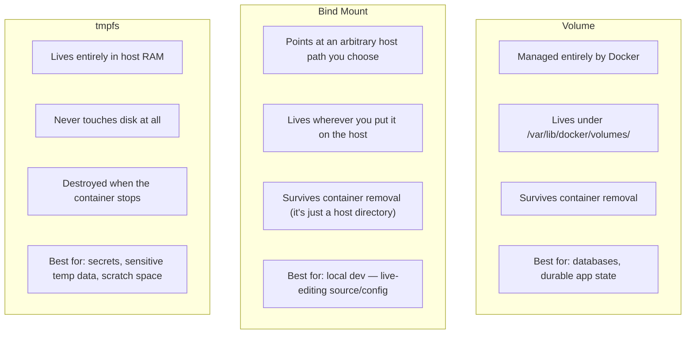
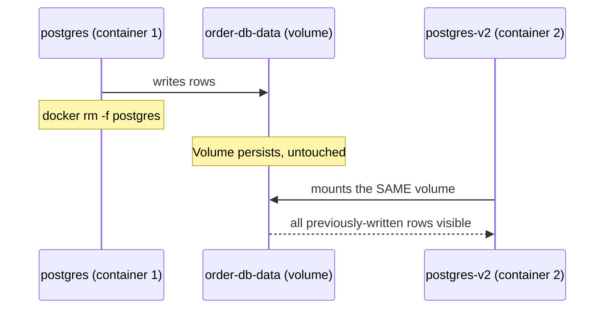
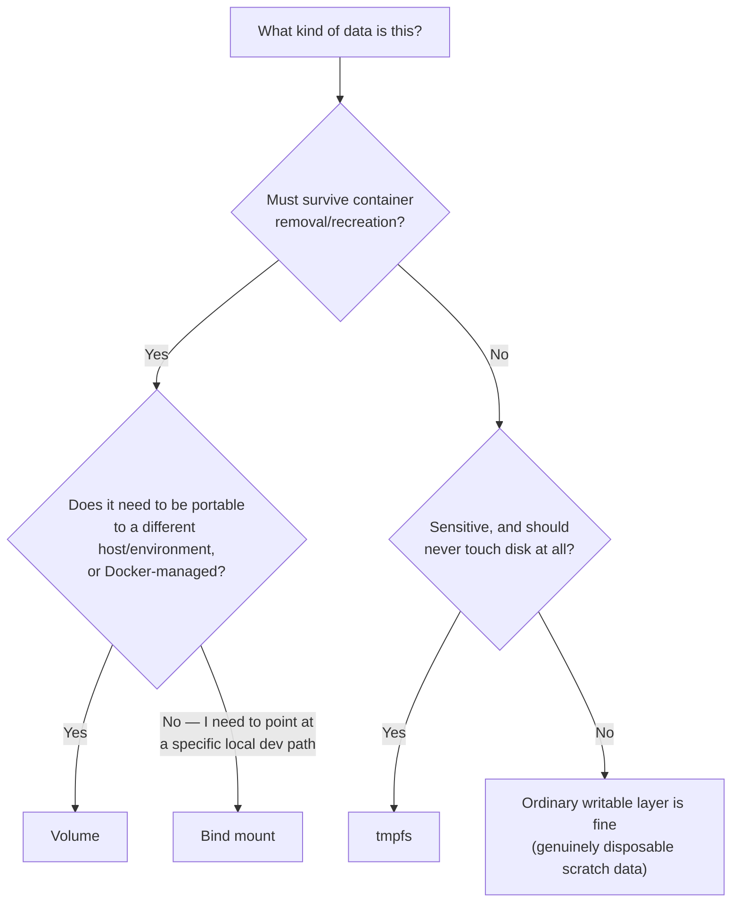

# Volumes vs. Bind Mounts vs. tmpfs

Chapter 1 established that all three of Docker's persistence mechanisms bypass the union filesystem entirely, mounting directly into the container's mount namespace. This chapter is about choosing correctly between them — they solve genuinely different problems, and picking the wrong one is a common source of both "why did my data disappear" and "why is my local dev environment out of sync with what's actually in the container" confusion.

---

## The Three Mechanisms, at a Glance



| | Volume | Bind Mount | tmpfs |
|---|---|---|---|
| Managed by | Docker | You (arbitrary host path) | Docker (in-memory) |
| Survives `docker rm` | Yes | Yes (it's just a host directory) | No — gone even before container removal, on stop |
| Backed by disk | Yes | Yes | No — RAM only |
| Portable across hosts | Yes (with volume drivers) | No (tied to a specific host path) | N/A |
| Typical use | Database data, durable app state | Local development, config injection | Secrets, sensitive scratch data |

---

## Volumes: The Right Default for Durable Application Data

A **volume** is a storage unit that Docker itself creates and manages, independent of any specific container's lifecycle.

```bash
# Create a named volume explicitly:
docker volume create order-db-data

# Mount it into a container:
docker run -d --name postgres \
  -v order-db-data:/var/lib/postgresql/data \
  -e POSTGRES_PASSWORD=secret \
  postgres:16

# Inspect where Docker is actually storing this on the host:
docker volume inspect order-db-data --format '{{.Mountpoint}}'
# /var/lib/docker/volumes/order-db-data/_data
```

The critical property: **the volume's lifecycle is entirely independent of any container's lifecycle.** You can `docker rm -f postgres` and the volume `order-db-data` still exists, with all its data intact, ready to be mounted into a brand-new `postgres` container:

```bash
docker rm -f postgres

# Data is still there — mount the same volume into a fresh container:
docker run -d --name postgres-v2 \
  -v order-db-data:/var/lib/postgresql/data \
  -e POSTGRES_PASSWORD=secret \
  postgres:16

# The database starts up with all previously-written rows intact.
```



This is the correct mechanism for anything that must genuinely outlive a specific container instance — database storage being the canonical example, which we build hands-on in this phase's project.

---

## Bind Mounts: The Right Tool for Local Development

A **bind mount** maps an arbitrary path on your host filesystem directly into the container — no Docker-managed abstraction in between, just a direct mount of a directory you chose.

```bash
# Live-mount your local source/config directory into a running container:
docker run -d --name demo-service \
  -v "$(pwd)/config:/app/config" \
  demo-service:1.0
```

Edits to files in `./config` on your host are visible **immediately** inside the running container, with zero rebuild — this is exactly why bind mounts are the standard choice for local development workflows (fully explored in Phase 6, where Compose makes this pattern trivial to declare for an entire multi-service stack), letting you iterate on config or even application code without repeated `docker build` cycles.

```bash
# Verify the live-edit behavior directly:
echo "custom.setting=true" >> ./config/application-override.properties
docker exec demo-service cat /app/config/application-override.properties
# custom.setting=true
# (No rebuild, no restart needed to see this change reflected inside the container)
```

**The trade-off**: bind mounts are tied to a specific, literal host path — `$(pwd)/config` only makes sense on the machine where that path exists. This makes bind mounts a poor fit for production deployments across a fleet of machines (where "the same host path" often has no meaning at all), and exactly why they're a local-development pattern, not a production storage pattern.

---

## tmpfs: In-Memory, Non-Persistent, and Never Written to Disk

A `tmpfs` mount lives entirely in the host's RAM (via the kernel's `tmpfs` filesystem) and is never backed by disk at all — not even transiently.

```bash
docker run -d --name demo-service \
  --tmpfs /app/secrets-scratch:size=64m,mode=1770 \
  demo-service:1.0
```

Two properties make this uniquely useful for a specific class of data:

1. **It vanishes the instant the container stops** — not just on `docker rm`, but on a plain stop/restart too, since it's tied to the container's runtime, not even to its writable layer's on-disk persistence.
2. **It is never written to a physical disk**, which matters specifically for sensitive data you don't want lingering in disk blocks that could be recovered later (decrypted credentials held only transiently in memory, a short-lived token written to a file path because some legacy tool insists on reading from a filesystem path rather than an environment variable).

```bash
# Confirm it's genuinely RAM-backed and container-scoped:
docker exec demo-service mount | grep secrets-scratch
# tmpfs on /app/secrets-scratch type tmpfs (rw,size=65536k,mode=1770)

docker exec demo-service sh -c "echo 'transient-token' > /app/secrets-scratch/token.txt"
docker restart demo-service
docker exec demo-service cat /app/secrets-scratch/token.txt
# cat: /app/secrets-scratch/token.txt: No such file or directory
# (gone — even a restart, not just removal, wipes tmpfs content)
```

We return to `tmpfs` specifically in the context of secrets handling in Phase 8, where this exact "never touches disk" property becomes a genuine security control, not just a storage curiosity.

---

## Choosing Correctly: A Decision Guide



---

## Common Misconceptions This Chapter Should Correct

- **"Bind mounts and volumes are basically the same thing with different syntax."** They differ fundamentally in *management* — a volume's storage location is Docker's own concern (portable, abstracted); a bind mount's path is yours to manage and is tied to that specific host, which makes them suited to different use cases (production durability vs. local development convenience) rather than being interchangeable.
- **"tmpfs data is 'more temporary' but still recoverable somewhere."** It's genuinely never written to disk at all — there is no recovery path, by design, once the container's tmpfs mount is torn down.
- **"You should bind-mount your production database's data directory the same way you bind-mount your local dev config."** Production durable storage should use volumes (or a cloud-managed storage backend, covered in Phase 5's later chapters) — bind mounts' host-path dependency makes them a poor fit for anything that needs to move between hosts or environments reliably.
- **"A named volume and an anonymous volume (`-v /app/data` with no name) are equivalent."** An anonymous volume still persists past `docker rm` by default, but with an auto-generated, hard-to-track name — always prefer named volumes for anything you intend to reference again deliberately (as in the postgres example above), to avoid orphaned, unlabeled volumes accumulating on your host over time.

---

## What's Next

We now know the three mechanisms and when to reach for each. The next chapter goes into the practical patterns built on top of volumes specifically — backup and restore strategies, and how to reason about data ownership when multiple containers might need access to overlapping storage.

**Next:** [`03-data-persistence-patterns.md`](./03-data-persistence-patterns.md)