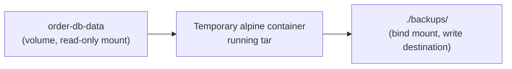
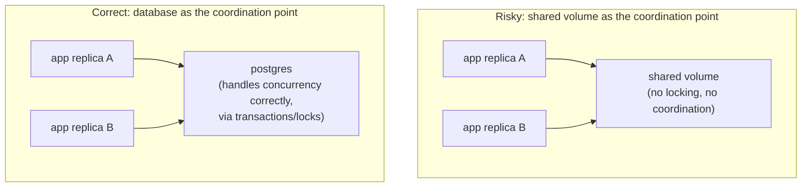

# Data Persistence Patterns

Chapter 2 established volumes as the right mechanism for durable data. This chapter covers the practical patterns built on top of that mechanism: how to back up and restore a volume, how to reason about ownership when more than one container might touch the same data, and how volume drivers extend this model beyond a single host — the concerns that separate "I know how to mount a volume" from "I know how to operate a stateful containerized service responsibly."

---

## Backing Up a Volume

A volume's data lives at a real path on the host (`/var/lib/docker/volumes/<name>/_data`), but you should never assume direct host-level access to that path in production — it's an internal Docker implementation detail, and paths/permissions can vary across Docker installations and storage drivers. The reliable, portable way to back up a volume is via a **temporary container that mounts the volume and writes an archive**, using another mechanism from Chapter 2 (a bind mount) purely as the backup's destination.

```bash
docker run --rm \
  -v order-db-data:/source:ro \
  -v "$(pwd)/backups:/backup" \
  alpine \
  tar czf /backup/order-db-backup-$(date +%Y%m%d).tar.gz -C /source .
```

Walking through this: a throwaway `alpine` container mounts the volume you want to back up (read-only — `:ro` — as a deliberate safety measure, since a backup process has no legitimate reason to write to the source), plus a bind mount pointing at a local `./backups` directory on your host, and runs `tar` to archive the volume's contents into that bind-mounted destination. The container then exits and is discarded (`--rm`) — it was only ever a vehicle for the `tar` operation, not a persistent thing itself.



## Restoring a Volume

The reverse operation follows the identical pattern:

```bash
docker volume create order-db-data-restored

docker run --rm \
  -v order-db-data-restored:/target \
  -v "$(pwd)/backups:/backup:ro" \
  alpine \
  tar xzf /backup/order-db-backup-20260114.tar.gz -C /target
```

```bash
# Verify the restore, then mount it into a real postgres container:
docker run -d --name postgres-restored \
  -v order-db-data-restored:/var/lib/postgresql/data \
  -e POSTGRES_PASSWORD=secret \
  postgres:16

docker exec postgres-restored psql -U postgres -c "\dt"
# Should show your restored tables.
```

**Practical rule worth internalizing**: for a live database, a plain filesystem-level `tar` backup like this (taken while the database is running and actively writing) risks capturing an inconsistent snapshot — a proper backup strategy for a running database should use the database's own consistent backup tooling (`pg_dump`/`pg_basebackup` for Postgres) rather than archiving the raw data directory while it's live. The `tar`-based approach above is genuinely correct and sufficient when the source container is stopped first, or for non-database volumes holding simpler application state.

---

## Ownership: What Happens When Multiple Containers Share a Volume

A single volume can be mounted into more than one container simultaneously — but Docker provides **no locking or coordination** for concurrent writers. If two containers write to the same volume path at the same time with no application-level coordination, you get exactly the same race conditions and corruption risk you'd get from two ordinary OS processes writing to the same file without coordination — because, mechanically, that's precisely what's happening.

```bash
# Both containers see the SAME underlying volume — Docker enforces
# no coordination between them whatsoever:
docker run -d --name writer-a -v shared-data:/data alpine sh -c "while true; do echo a >> /data/log.txt; sleep 1; done"
docker run -d --name writer-b -v shared-data:/data alpine sh -c "while true; do echo b >> /data/log.txt; sleep 1; done"
```

This works fine for the trivial append-only case above (POSIX guarantees atomic small appends), but breaks down the moment either container does anything more complex than a simple append — a read-modify-write cycle on the same file from two containers is a race condition, full stop, with no Docker-level safety net protecting you from it.

**Practical pattern**: for genuinely shared durable state accessed by multiple service instances, the *database itself* should be the single source of truth and the coordination point (this is precisely why the Phase 4 networking lab had multiple `order-service` replicas but only *one* `postgres` — the database, not a shared filesystem volume, is what safely serializes concurrent writes). Sharing a raw volume directly between multiple *application* containers for anything beyond read-only shared assets (static files, a shared read-only configuration set) is usually a sign the architecture should have a proper data service (a database, an object store) in that role instead.



---

## Read-Only Mounts: A Simple, Underused Safety Net

Any volume or bind mount can be marked read-only from a specific container's perspective, even if other containers mount the same volume read-write:

```bash
# The reporting service only ever needs to READ shared reference data —
# mounting it read-only means a bug in that service literally cannot
# corrupt the underlying data, by kernel-enforced mount option, not
# just by convention or code review:
docker run -d --name reporting-service \
  -v reference-data:/app/reference:ro \
  myorg/reporting-service:1.0
```

This is a genuinely cheap, high-value habit: any container that has no legitimate reason to write to a given mount should have that mount marked `:ro` — it converts "we trust this code not to write here" into "the kernel will refuse the write regardless of what the code does," a categorically stronger guarantee, and one worth defaulting to deliberately rather than only reaching for after an incident.

---

## Volume Drivers: Extending Beyond a Single Host

Everything covered so far uses Docker's default `local` volume driver, which stores data on the specific Docker host it's created on — meaning a volume created on Host A is not automatically available if a container gets scheduled onto Host B. For multi-host setups, **volume drivers** (plugins implementing network-attached or distributed storage backends — NFS, cloud block storage like EBS, or distributed systems like GlusterFS) let a volume's data live independently of any single host:

```bash
# Example: an NFS-backed volume — the actual storage lives on a
# separate NFS server, not on this specific Docker host's local disk:
docker volume create --driver local \
  --opt type=nfs \
  --opt o=addr=192.168.1.100,rw \
  --opt device=:/exported/path \
  nfs-backed-volume
```

This repository's target orchestrator is Kubernetes, which has its own, more fully-developed abstraction for exactly this problem (PersistentVolumes and PersistentVolumeClaims, decoupling "what storage does my pod need" from "which specific node is it scheduled on") — we cover that translation explicitly in Phase 10. The important conceptual takeaway here is narrower: **the default `local` volume driver ties data to a specific host**, and any design that assumes a container can be freely rescheduled onto a different host while keeping its data needs a storage layer that doesn't have that limitation.

---

## Common Misconceptions This Chapter Should Correct

- **"Copying files directly out of `/var/lib/docker/volumes/` on the host is a reliable backup method."** It works in a pinch on a single, known Docker installation, but it's not portable across storage drivers or Docker versions, and doesn't handle databases needing an application-consistent snapshot — prefer the containerized `tar` (or database-native tool) approach.
- **"Docker prevents two containers from corrupting shared volume data."** It provides zero coordination guarantees beyond what the underlying POSIX filesystem itself guarantees (atomic small writes) — anything more complex is the application's responsibility entirely.
- **"A volume is automatically available on any host in a cluster."** Only with a non-default volume driver backed by genuinely shared/networked storage — the default `local` driver ties data to the single host it was created on.
- **"Read-only mounts are only useful for security-sensitive scenarios."** They're broadly useful any time a container has no legitimate write need for a given mount — a cheap correctness and safety improvement, not a niche security-only feature.

---

## What's Next

With backup/restore, ownership, and multi-host considerations covered conceptually, the next chapter gets concrete and specific: running real database containers (Postgres specifically) in practice — initialization, credentials, health checks, and the exact volume configuration a production-realistic database container needs.

**Next:** [`04-database-containers-in-practice.md`](./04-database-containers-in-practice.md)