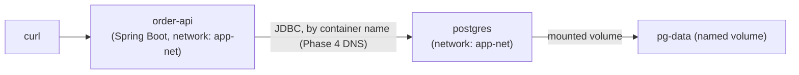

# Project: Spring Boot with Persistent Postgres Storage

This project builds a real Spring Boot service backed by a real Postgres container, wired together entirely with plain `docker run` and `docker network`/`docker volume` commands (Compose arrives in Phase 6 — this project deliberately uses the primitives directly so you understand exactly what Compose will later automate for you). The core thing we're proving, hands-on: **application data survives the application container being destroyed and recreated, because it lives in a volume, not in either container's writable layer.**

---

## Objective

- Run a Spring Boot order-management API backed by Postgres
- Use a named volume for the database's actual data directory
- Seed the schema via an init script (Chapter 4's pattern)
- Write real data through the API, then deliberately destroy and recreate the *application* container and confirm the data is untouched
- Then deliberately destroy and recreate the *database* container itself (keeping the volume) and confirm the data still survives that too
- Correctly back up and restore the volume using Chapter 3's pattern

---

## Architecture



---

## Folder Structure

```text
persistent-postgres-project/
├── order-api/
│   ├── pom.xml
│   ├── src/main/java/com/example/orderapi/
│   │   ├── OrderApiApplication.java
│   │   ├── Order.java
│   │   ├── OrderRepository.java
│   │   └── OrderController.java
│   ├── src/main/resources/application.properties
│   └── Dockerfile
├── init-scripts/
│   └── 01-schema.sql
└── run-project.sh
```

---

## Source Code

**`init-scripts/01-schema.sql`**

```sql
CREATE TABLE orders (
    id SERIAL PRIMARY KEY,
    sku VARCHAR(64) NOT NULL,
    quantity INT NOT NULL,
    created_at TIMESTAMPTZ DEFAULT now()
);
```

**`order-api/src/main/java/com/example/orderapi/Order.java`**

```java
package com.example.orderapi;

import jakarta.persistence.*;
import java.time.OffsetDateTime;

@Entity
@Table(name = "orders")
public class Order {
    @Id
    @GeneratedValue(strategy = GenerationType.IDENTITY)
    private Long id;

    private String sku;
    private Integer quantity;
    private OffsetDateTime createdAt;

    // Getters and setters omitted for brevity
    public Long getId() { return id; }
    public String getSku() { return sku; }
    public void setSku(String sku) { this.sku = sku; }
    public Integer getQuantity() { return quantity; }
    public void setQuantity(Integer quantity) { this.quantity = quantity; }
    public OffsetDateTime getCreatedAt() { return createdAt; }
}
```

**`order-api/src/main/java/com/example/orderapi/OrderRepository.java`**

```java
package com.example.orderapi;

import org.springframework.data.jpa.repository.JpaRepository;

public interface OrderRepository extends JpaRepository<Order, Long> {}
```

**`order-api/src/main/java/com/example/orderapi/OrderController.java`**

```java
package com.example.orderapi;

import org.springframework.web.bind.annotation.*;

import java.util.List;
import java.util.Map;

@RestController
@RequestMapping("/api/orders")
public class OrderController {

    private final OrderRepository repository;

    public OrderController(OrderRepository repository) {
        this.repository = repository;
    }

    @PostMapping
    public Order create(@RequestBody Map<String, Object> body) {
        Order order = new Order();
        order.setSku((String) body.get("sku"));
        order.setQuantity((Integer) body.get("quantity"));
        return repository.save(order);
    }

    @GetMapping
    public List<Order> all() {
        return repository.findAll();
    }
}
```

**`order-api/src/main/resources/application.properties`**

```properties
server.port=8080
spring.datasource.url=jdbc:postgresql://postgres:5432/orders
spring.datasource.username=postgres
spring.datasource.password=secret
spring.jpa.hibernate.ddl-auto=validate
management.endpoints.web.exposure.include=health
```

**`order-api/Dockerfile`**

```dockerfile
FROM eclipse-temurin:21-jdk
WORKDIR /app
COPY . .
RUN ./mvnw clean package -DskipTests
EXPOSE 8080
ENTRYPOINT ["java", "-jar", "target/order-api-0.0.1-SNAPSHOT.jar"]
```

(Requires `spring-boot-starter-data-jpa` and `postgresql` (JDBC driver) dependencies in `pom.xml`, alongside `spring-boot-starter-web` and `spring-boot-starter-actuator` as in earlier projects.)

---

## Build and Run Commands

```bash
docker build -t persistent-project/order-api:1.0 ./order-api

docker network create app-net
docker volume create pg-data

docker run -d --name postgres \
  --network app-net \
  --health-cmd="pg_isready -U postgres" \
  --health-interval=5s --health-timeout=3s --health-retries=5 \
  -v pg-data:/var/lib/postgresql/data \
  -v "$(pwd)/init-scripts:/docker-entrypoint-initdb.d:ro" \
  -e POSTGRES_PASSWORD=secret \
  -e POSTGRES_DB=orders \
  postgres:16

# Wait until healthy before starting the app (Chapter 4's health check pattern):
until [ "$(docker inspect postgres --format '{{.State.Health.Status}}')" = "healthy" ]; do
  echo "waiting for postgres..."
  sleep 2
done

docker run -d --name order-api \
  --network app-net \
  -p 8080:8080 \
  persistent-project/order-api:1.0
```

---

## Expected Output

```bash
curl -X POST http://localhost:8080/api/orders \
  -H "Content-Type: application/json" \
  -d '{"sku":"WIDGET-001","quantity":10}'
# {"id":1,"sku":"WIDGET-001","quantity":10,"createdAt":"2026-01-14T10:40:00Z"}

curl http://localhost:8080/api/orders
# [{"id":1,"sku":"WIDGET-001","quantity":10,"createdAt":"2026-01-14T10:40:00Z"}]
```

---

## Debugging Walkthrough: Proving Persistence, Two Different Ways

### Test 1: Destroy and recreate the *application* container

```bash
docker rm -f order-api

# Rebuild from scratch and run a brand new application container —
# the OLD one is completely gone:
docker run -d --name order-api \
  --network app-net \
  -p 8080:8080 \
  persistent-project/order-api:1.0

curl http://localhost:8080/api/orders
# [{"id":1,"sku":"WIDGET-001","quantity":10,"createdAt":"2026-01-14T10:40:00Z"}]
# Still there — because the data was never IN the application
# container's writable layer to begin with; it lives entirely in
# postgres's volume, which order-api never touched directly.
```

### Test 2: Destroy and recreate the *database* container itself, keeping the volume

This is the more convincing test — it proves the data lives in the **volume**, not merely "the postgres container happened to survive":

```bash
docker rm -f postgres

# Recreate postgres from scratch, mounting the SAME volume:
docker run -d --name postgres \
  --network app-net \
  --health-cmd="pg_isready -U postgres" \
  --health-interval=5s --health-timeout=3s --health-retries=5 \
  -v pg-data:/var/lib/postgresql/data \
  -e POSTGRES_PASSWORD=secret \
  -e POSTGRES_DB=orders \
  postgres:16

until [ "$(docker inspect postgres --format '{{.State.Health.Status}}')" = "healthy" ]; do sleep 2; done

curl http://localhost:8080/api/orders
# [{"id":1,"sku":"WIDGET-001","quantity":10,"createdAt":"2026-01-14T10:40:00Z"}]
# STILL there — the postgres CONTAINER was fully destroyed and rebuilt
# from the base image, and the data survived anyway, because it lived
# in pg-data (the volume) the entire time, exactly as Chapter 2 predicted.
```

Notice we did **not** re-mount the init scripts directory on this recreation — and the schema was still present, because (per Chapter 4) init scripts only ever run against an *empty* data directory, and `pg-data` was anything but empty at this point.

### Test 3: Back Up and Restore the Volume (Chapter 3's Pattern, Applied Here)

```bash
mkdir -p ./backups
docker run --rm \
  -v pg-data:/source:ro \
  -v "$(pwd)/backups:/backup" \
  alpine \
  tar czf /backup/pg-data-backup.tar.gz -C /source .

# Simulate total data loss:
docker rm -f postgres
docker volume rm pg-data
docker volume create pg-data

# Restore from the backup:
docker run --rm \
  -v pg-data:/target \
  -v "$(pwd)/backups:/backup:ro" \
  alpine \
  tar xzf /backup/pg-data-backup.tar.gz -C /target

# Recreate postgres against the restored volume:
docker run -d --name postgres --network app-net \
  -v pg-data:/var/lib/postgresql/data \
  -e POSTGRES_PASSWORD=secret -e POSTGRES_DB=orders \
  postgres:16

# Confirm via the API once healthy:
curl http://localhost:8080/api/orders
# [{"id":1,"sku":"WIDGET-001", ...}]   <- restored successfully
```

---

## Optimization / Architecture Discussion

- **Why did `order-api` never need its own volume?** It's stateless by design — all durable state lives in Postgres. This is deliberate and worth calling out: a genuinely stateless application container is exactly what makes Test 1 above trivial and safe — you should be able to destroy and recreate any stateless service container at any time with zero data-loss risk, which is precisely the reproducibility property Phase 1 established as a core Docker goal.
- **Why `ddl-auto=validate` and a separate init script, rather than letting Hibernate create the schema?** As discussed in Chapter 4, this keeps the schema's source of truth explicit and reviewable, rather than implicitly derived from whatever the entity classes currently look like.

## Production Considerations

- A real production setup would very likely use a managed database service (RDS, Cloud SQL) rather than a self-hosted containerized Postgres for the actual production data tier — this project's containerized Postgres is representative of local development and testing environments, where this exact pattern is both correct and valuable.
- The `tar`-based backup approach here is adequate because we stopped write traffic conceptually during the backup (a demonstration script); a live production database backup should use `pg_dump`/`pg_basebackup` for an application-consistent snapshot, as flagged in Chapter 3.

---

## Cleanup

```bash
docker rm -f order-api postgres
docker network rm app-net
docker volume rm pg-data
docker rmi persistent-project/order-api:1.0
```

---

## What's Next

Phase 5 is complete: you've gone from understanding why the writable layer is wrong for durable data, through the three persistence mechanisms, through backup/restore and ownership patterns, through realistic database container operation, to a hands-on project that proved — twice, in two different ways — that a named volume genuinely decouples data from any specific container's lifecycle. Phase 6 takes everything from Phases 1–5 and wraps it into Docker Compose — declaring this exact kind of multi-container, networked, volume-backed stack in a single file instead of a sequence of manual commands.

**Next:** [`../phase-6-docker-compose/01-compose-fundamentals-and-mental-model.md`](../phase-6-docker-compose/01-compose-fundamentals-and-mental-model.md)