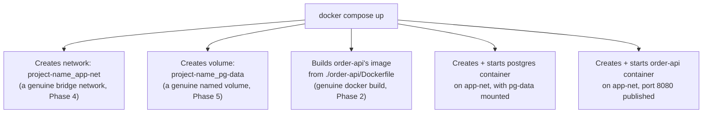
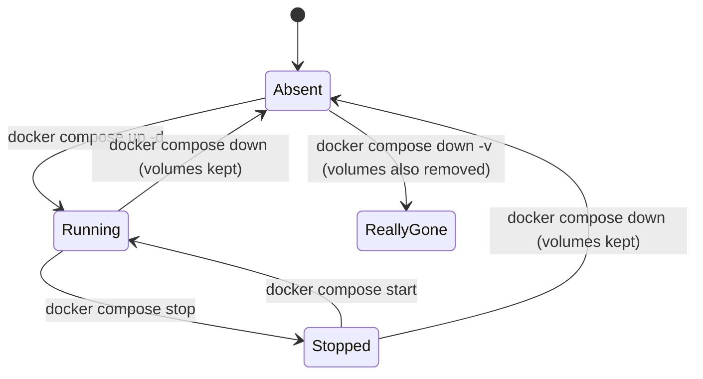

# Compose Fundamentals and Mental Model

Every project so far has manually wired together networks, volumes, and containers with sequences of `docker run`, `docker network create`, `docker volume create` commands. That's been deliberate — you needed to understand exactly what those primitives do before automating them. **Docker Compose does not introduce any new underlying technology.** It's a declarative YAML format that describes the same networks, volumes, and containers you've been creating by hand, and a tool that reads that file and issues the equivalent Docker API calls for you. This chapter is about building the correct mental model for what Compose actually does — a translation layer, not a new kind of container technology.

---

## The Core Insight: Compose Is a Convergence Engine

Give Compose a `compose.yaml` file describing your desired state (these services, these networks, these volumes), and `docker compose up` **converges the current state toward that description** — creating what's missing, leaving unchanged what already matches, and (with certain commands) removing what's no longer declared.

```yaml
# compose.yaml
services:
  order-api:
    build: ./order-api
    ports:
      - "8080:8080"
    networks:
      - app-net
    depends_on:
      - postgres

  postgres:
    image: postgres:16
    environment:
      POSTGRES_PASSWORD: secret
      POSTGRES_DB: orders
    volumes:
      - pg-data:/var/lib/postgresql/data
    networks:
      - app-net

networks:
  app-net:

volumes:
  pg-data:
```

```bash
docker compose up -d
```

This single command does exactly what you did by hand across the entire Phase 5 project:



Every arrow in that diagram is something you already know how to do manually. Compose's entire value proposition is: **declare the end state once, in version-controllable YAML, instead of remembering and re-typing a long sequence of imperative commands** — and get the *same* underlying network, volume, and container primitives every time, with no drift between runs.

---

## Verifying This Directly

```bash
docker compose up -d

# Confirm it's a genuine bridge network, same as Phase 4:
docker network ls | grep app-net
# myproject_app-net   bridge   local

# Confirm it's a genuine named volume, same as Phase 5:
docker volume ls | grep pg-data
# myproject_pg-data

# Confirm the containers are ordinary containers, inspectable
# with every tool from Phases 1-5:
docker ps
docker inspect myproject-postgres-1 --format '{{json .NetworkSettings.Networks}}'
```

Notice the naming convention: Compose prefixes resource names with the **project name** (by default, the directory name containing your `compose.yaml`) to avoid collisions if you run multiple Compose projects on the same host — `myproject_app-net`, `myproject_pg-data`, `myproject-postgres-1`. This is Compose-level bookkeeping, not a new networking or storage concept.

---

## `up`, `down`, `stop`, `start`: Mapping to What You Already Know

| Compose command | What it actually does (in terms you already know) |
|---|---|
| `docker compose up -d` | Creates networks/volumes if missing, builds images if needed, creates and starts containers |
| `docker compose stop` | Equivalent to `docker stop` on every service container — containers and their writable layers persist |
| `docker compose start` | Equivalent to `docker start` on existing (stopped) service containers |
| `docker compose down` | Stops AND removes containers and networks — but **volumes are kept by default** (a deliberate, important safety default) |
| `docker compose down -v` | Same as above, but **also removes volumes** — this is the command that would delete your Phase 5-style persistent data |



**The `-v` flag on `down` is worth burning into memory** — it's the single most common way people accidentally delete a local development database's data, precisely because it's easy to type `docker compose down -v` out of habit (or because a tutorial included it) without registering that `-v` crosses the line from "tear down the stack" to "also destroy the data," a distinction that matters directly because of everything Phase 5 established about volumes being deliberately independent of container lifecycle.

---

## Why User-Defined Networking "Just Works" in Compose

Recall from Phase 4 Chapter 1: the *default* Docker bridge network doesn't run embedded DNS for container names, but *user-defined* bridge networks do. Compose **always** creates a user-defined network for your project (even if you don't declare one explicitly) — which is exactly why `order-api` can reach `postgres` by that literal service name with zero extra configuration:

```yaml
services:
  order-api:
    build: ./order-api
    environment:
      # "postgres" resolves via Compose's auto-created user-defined
      # network's embedded DNS — literally the Phase 4, Chapter 3
      # mechanism, with the SERVICE NAME acting as the container name.
      SPRING_DATASOURCE_URL: jdbc:postgresql://postgres:5432/orders
  postgres:
    image: postgres:16
```

Even without an explicit `networks:` section at all, Compose creates one default network per project and attaches every service to it — this is a deliberate design choice (not an implicit accident) precisely so that "define two services, they can reach each other by name" is the out-of-the-box Compose experience, building directly on the DNS mechanism from Phase 4.

---

## `compose.yaml` vs. `docker-compose.yml`: A Naming Note

You'll see both `compose.yaml` (the current, Compose Specification-standard name) and the older `docker-compose.yml` in the wild — both are read by the same `docker compose` CLI (the modern, integrated-into-Docker-CLI plugin, not the older standalone `docker-compose` Python tool it replaced). Either filename works; `compose.yaml` is the forward-looking convention this repository uses.

---

## Common Misconceptions This Chapter Should Correct

- **"Compose is a different, higher-level technology than plain Docker."** It's a YAML-driven convenience layer over the exact same networks, volumes, and containers you've been creating manually in every prior phase — there is no new container runtime concept introduced here.
- **"`docker compose down` deletes my data."** By default it does not — volumes persist unless you explicitly add `-v`. This distinction is genuinely important and easy to get wrong.
- **"You must declare a `networks:` section for services to reach each other."** Compose creates a default project-scoped network automatically if none is declared — an explicit `networks:` section is for when you want more control (multiple networks, specific driver options), not a prerequisite for basic reachability.
- **"Compose only works for local development, never anything production-adjacent."** Compose itself is commonly used for local development and CI test environments specifically (and this repository treats it that way — production orchestration is Kubernetes' job, Phase 10) — but the underlying mental model (declarative desired state, converged by a tool) is the same one Kubernetes itself is built around, just at a different scale and with a different scheduler.

---

## What's Next

Now that the mental model is solid, the next chapter addresses a problem this chapter's example glossed over: `depends_on: [postgres]` only guarantees postgres's *container* started — not that its database is actually ready to accept connections (exactly the "container running vs. service ready" distinction from Phase 5, Chapter 4). We fix that properly with Compose health check conditions.

**Next:** [`02-service-dependencies-and-healthchecks.md`](./02-service-dependencies-and-healthchecks.md)