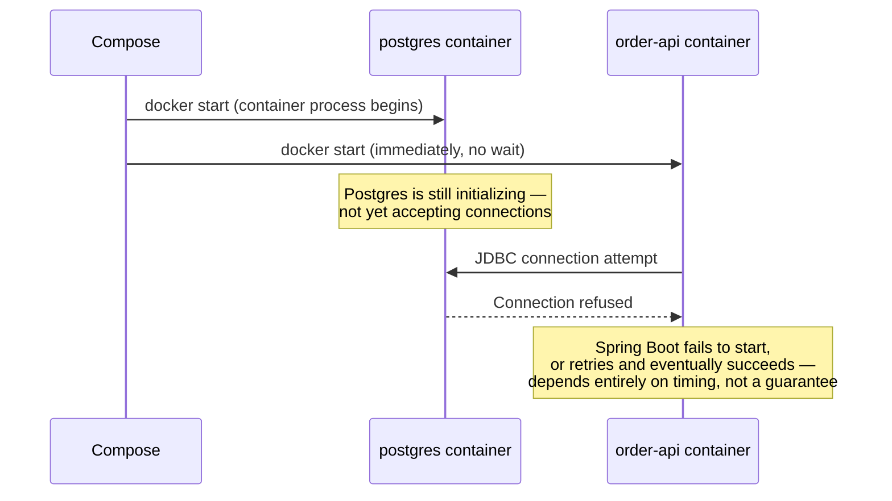
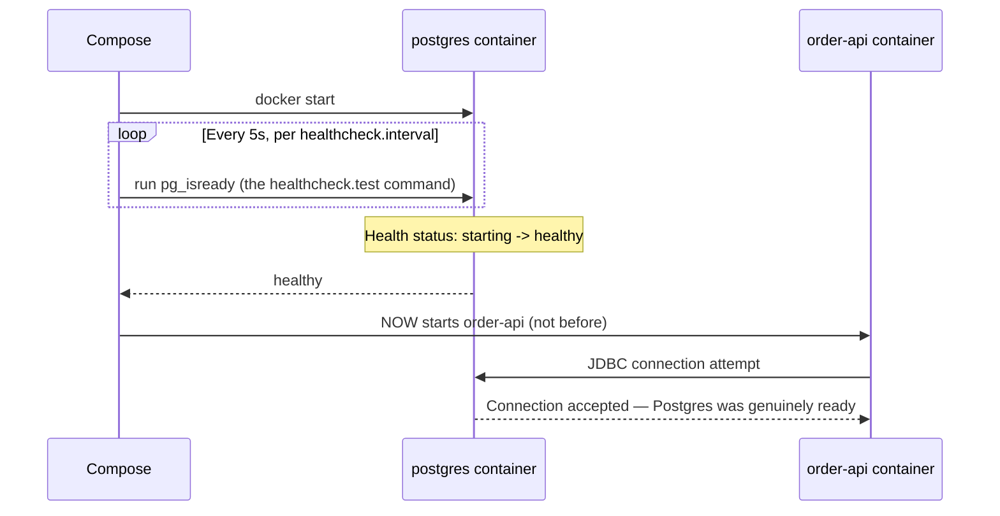
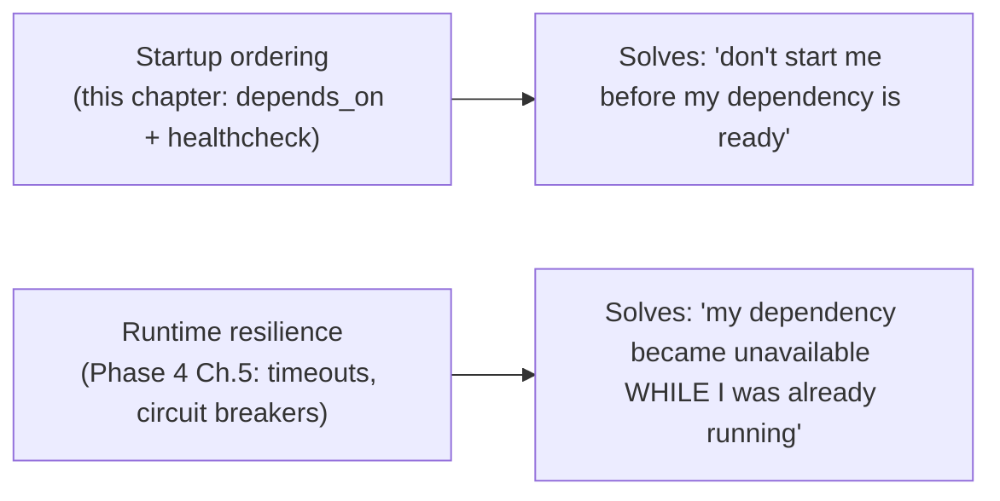

# Service Dependencies and Healthchecks

Chapter 1's example used a bare `depends_on: [postgres]` on `order-api`. This chapter explains precisely what that guarantees (less than most people assume), why it causes real, intermittent startup failures, and how to fix it correctly using the same health check concept introduced in Phase 5 Chapter 4 — now wired directly into Compose's own startup ordering logic.

---

## What Bare `depends_on` Actually Guarantees

```yaml
services:
  order-api:
    build: ./order-api
    depends_on:
      - postgres     # <- bare form: ordering only
  postgres:
    image: postgres:16
```

Bare `depends_on` (just a list of service names) guarantees exactly one thing: **Compose starts `postgres`'s container before starting `order-api`'s container.** It says nothing about whether Postgres has finished initializing, whether it's accepting connections, or whether its data directory recovery (if restarting from an existing volume) has completed.



This is exactly the "container running vs. service ready" gap from Phase 5 Chapter 4, now showing up as a genuinely observed intermittent failure: on a fast machine, or with a database that initializes quickly, this race might not manifest for weeks of development — then it appears the moment someone runs the stack on a slower machine, or after a Postgres version upgrade adds a few seconds to startup, and it looks like a flaky, unreproducible bug rather than what it actually is: a deterministic race condition that simply hadn't lost the race yet.

---

## The Fix: `condition: service_healthy`

Compose supports a richer form of `depends_on` that ties startup ordering to an actual health check — the *same* Docker health check mechanism from Phase 5 Chapter 4, now declared in the Compose file and actively gating when dependent services start.

```yaml
services:
  order-api:
    build: ./order-api
    depends_on:
      postgres:
        condition: service_healthy   # <- waits for HEALTHY, not just STARTED

  postgres:
    image: postgres:16
    environment:
      POSTGRES_PASSWORD: secret
      POSTGRES_DB: orders
    healthcheck:
      test: ["CMD-SHELL", "pg_isready -U postgres"]
      interval: 5s
      timeout: 3s
      retries: 5
    volumes:
      - pg-data:/var/lib/postgresql/data

volumes:
  pg-data:
```



With this in place, `order-api`'s container is **not started at all** until `postgres`'s health check reports `healthy` — turning a probabilistic race condition into a deterministic, correctly-ordered startup sequence, with zero reliance on retry logic or arbitrary `sleep` commands papering over the gap.

---

## Verifying the Ordering Directly

```bash
docker compose up -d

docker compose ps
# NAME                  STATUS
# myproject-postgres-1  Up 12 seconds (healthy)
# myproject-order-api-1 Up 3 seconds

# Confirm order-api's container creation timestamp is genuinely
# AFTER postgres reached healthy, not just after postgres started:
docker inspect myproject-postgres-1 --format '{{.State.StartedAt}}'
docker inspect myproject-order-api-1 --format '{{.Created}}'
```

---

## Health Checks for Your Own Application Services, Not Just Third-Party Images

The same mechanism applies to `order-api` itself — useful both for Compose's own dependency ordering (if a third service depends on `order-api` being genuinely ready, not just started) and, more importantly, as the same signal Kubernetes readiness/liveness probes will build on in Phase 10.

```yaml
services:
  order-api:
    build: ./order-api
    healthcheck:
      test: ["CMD", "curl", "-f", "http://localhost:8080/actuator/health"]
      interval: 10s
      timeout: 3s
      retries: 3
      start_period: 15s   # grace period before failures count against retries —
                           # important for a JVM app with real startup time
```

`start_period` deserves specific attention for anything JVM-based: Spring Boot applications have genuinely non-trivial startup time (context initialization, connection pool warmup) — without a `start_period` grace window, a health check that starts probing immediately can register several failures before the application has had a fair chance to finish starting, potentially triggering premature "unhealthy" status or restart behavior in whatever's consuming that signal.

```dockerfile
# The actuator endpoint referenced above requires spring-boot-starter-actuator
# (already included since the Phase 1 project) and, since this Dockerfile's
# base image may not include curl by default, verify it's present or use
# wget/an equivalent already available in your chosen base image:
FROM eclipse-temurin:21-jre
RUN apt-get update && apt-get install -y --no-install-recommends curl \
    && rm -rf /var/lib/apt/lists/*
```

---

## `depends_on` Does Not Handle Runtime Failures, Only Startup Ordering

A final, important scope limitation: **`condition: service_healthy` only governs startup ordering.** If `postgres` becomes unhealthy *after* `order-api` has already started successfully (a later crash, a disk issue), Compose does not automatically stop or restart `order-api` in response — that's a runtime resilience concern (the circuit breaker and timeout patterns from Phase 4 Chapter 5), entirely separate from the startup-ordering problem this chapter solves.



Both are necessary; neither substitutes for the other.

---

## Common Misconceptions This Chapter Should Correct

- **"`depends_on` means Compose waits for the dependency to be fully ready."** Only with the explicit `condition: service_healthy` form — bare `depends_on` guarantees container start order only, nothing about readiness.
- **"A healthcheck without `start_period` is just as good, only slightly less precise."** For anything with meaningful startup time (a JVM application being the clearest example in this repository), omitting `start_period` risks the health check machinery registering false failures during a completely normal startup window.
- **"Health checks solve ongoing runtime resilience, not just startup ordering."** They inform Compose's *startup* sequencing and Docker's own `Health` status field — they do not automatically restart or reroute traffic away from a service that becomes unhealthy mid-run; that requires either Docker's own restart policies (briefly) or, properly, an orchestrator like Kubernetes (Phase 10).
- **"You only need health checks on third-party images like databases."** Your own application services benefit just as much — both for Compose-level ordering if other services depend on them, and as direct groundwork for Phase 10's readiness/liveness probes, which are conceptually and mechanically closely related.

---

## What's Next

We've solved *when* services start relative to each other. The next chapter addresses *what configuration* they start with — environment variables, `.env` files, and how to handle secrets (database passwords, API keys) without committing them to version control or baking them into images.

**Next:** [`03-environment-config-and-secrets.md`](./03-environment-config-and-secrets.md)