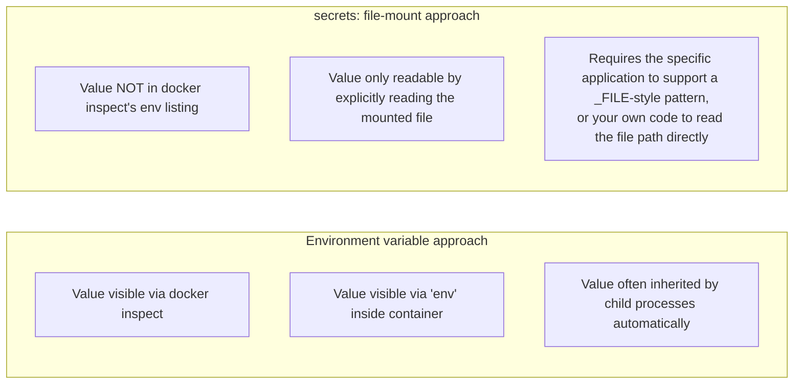

# Environment Configuration and Secrets

Every project so far has passed configuration via `-e` flags or hardcoded `environment:` values directly in the Compose file — fine for a `secret` password in a learning repository, genuinely wrong for anything real. This chapter covers `.env` files, variable interpolation, and Compose's `secrets:` mechanism, with an honest assessment of what each one actually protects against (less than people often assume) and what still requires a real secrets manager in production.

---

## `.env` Files and Variable Interpolation

Compose automatically reads a file named `.env` in the same directory as your `compose.yaml`, and substitutes `${VARIABLE}` references anywhere in the file:

```bash
# .env  (this file should be in .gitignore — never committed)
POSTGRES_PASSWORD=a-real-generated-password
POSTGRES_DB=orders
SPRING_PROFILES_ACTIVE=docker
```

```yaml
# compose.yaml — references variables, contains no actual secret values
services:
  postgres:
    image: postgres:16
    environment:
      POSTGRES_PASSWORD: ${POSTGRES_PASSWORD}
      POSTGRES_DB: ${POSTGRES_DB}

  order-api:
    build: ./order-api
    environment:
      SPRING_PROFILES_ACTIVE: ${SPRING_PROFILES_ACTIVE}
      SPRING_DATASOURCE_PASSWORD: ${POSTGRES_PASSWORD}
```

```bash
docker compose config
# Shows the fully resolved configuration with variables substituted in —
# genuinely useful for verifying what Compose will actually apply,
# especially when debugging a config that "looks right" but isn't working:
```

This separates the **committed, shareable structure** (`compose.yaml`) from the **uncommitted, environment-specific values** (`.env`) — a genuinely important separation of concerns that has nothing to do with Docker specifically (the same principle applies to any twelve-factor-style application configuration) but that Compose makes convenient to apply consistently.

---

## Why `environment:` Values Are Not Actually Secret, Mechanically

It's worth being precise and honest here: **environment variables passed to a container are visible to anything that can inspect that container**, regardless of whether the value came from a `.env` file, a hardcoded string, or anywhere else.

```bash
# Anyone with docker exec/inspect access to this host can see the
# "secret" password directly, trivially — .env just kept it out of
# version control, it did NOT make it secret at the runtime level:
docker inspect myproject-postgres-1 --format '{{json .Config.Env}}'
# ["POSTGRES_PASSWORD=a-real-generated-password", ...]

docker exec myproject-postgres-1 env | grep POSTGRES_PASSWORD
# POSTGRES_PASSWORD=a-real-generated-password
```

`.env` files solve **"don't commit secrets to git"** — a real and important problem — but they do **not** solve **"prevent anyone with container access from reading this value"**, which is a different, harder problem. Understanding this distinction precisely is important, because reaching for `.env` and believing the secrets-handling problem is now "solved" is a common, incomplete conclusion.

---

## Compose's `secrets:` Mechanism: A Real, If Partial, Improvement

Compose's dedicated `secrets:` top-level key mounts secret values as **files inside the container's filesystem**, rather than as environment variables — a meaningfully different exposure profile, because file-based secrets don't show up in `docker inspect`'s environment listing, in most crash-dump/core-dump tooling that captures process environment, or in child-process environment inheritance the way env vars do by default.

```yaml
services:
  postgres:
    image: postgres:16
    environment:
      # Note: POSTGRES_PASSWORD_FILE, not POSTGRES_PASSWORD directly —
      # the official Postgres image specifically supports reading
      # credentials FROM a file path, precisely for this reason:
      POSTGRES_PASSWORD_FILE: /run/secrets/pg_password
      POSTGRES_DB: orders
    secrets:
      - pg_password

secrets:
  pg_password:
    file: ./secrets/pg_password.txt   # a file OUTSIDE version control,
                                        # containing just the password value
```

```bash
docker exec myproject-postgres-1 cat /run/secrets/pg_password
# a-real-generated-password

# But notice it does NOT appear in the environment listing:
docker exec myproject-postgres-1 env | grep -i password
# (no output — POSTGRES_PASSWORD_FILE is set, but the actual
#  password value itself is not present as an env var at all)
```



**This is a genuinely worthwhile improvement, but not a complete secrets-management solution** — anyone with `docker exec` access to the container can still `cat` the file directly; this mechanism narrows *which specific tools and code paths* casually expose the secret, it doesn't make the secret inaccessible to someone with legitimate container access. This is the honest, correct framing: **`secrets:` reduces accidental exposure surface, it does not provide access control, rotation, or auditing** — those require an actual secrets manager (Vault, AWS Secrets Manager, cloud KMS-backed solutions), which is out of Compose's scope entirely and a topic we return to properly in Phase 8, once you have the full container security threat model in view.

---

## Applying This to Your Own Spring Boot Application

For an application that doesn't have built-in `_FILE`-suffix support the way the official Postgres image does, read the secret file directly in your Spring configuration:

```java
@Configuration
public class SecretConfig {

    @Value("${db.password.file:/run/secrets/pg_password}")
    private String passwordFilePath;

    @Bean
    public String databasePassword() throws IOException {
        return Files.readString(Path.of(passwordFilePath)).trim();
    }
}
```

Or, more idiomatically for Spring, use `spring.config.import` with the file path directly via Spring's own config-file-import mechanism, or a `PropertySource` that reads the mounted secret file at startup — the specific implementation detail matters less than the underlying pattern: **read the secret from the mounted file path at runtime, never bake it into the image or pass it as a value the process environment broadly exposes.**

---

## Common Misconceptions This Chapter Should Correct

- **"Putting a password in `.env` instead of directly in `compose.yaml` makes it secure."** It keeps it out of version control — a genuinely important improvement — but the running container still exposes the value through ordinary environment-inspection tooling exactly the same as before.
- **"Compose's `secrets:` mechanism is equivalent to a real secrets manager (Vault, cloud KMS)."** It reduces accidental exposure (not visible via `docker inspect`'s env listing, not inherited by child processes automatically) but provides no access control, rotation, or audit trail — genuinely useful, genuinely incomplete.
- **"`.env` files are safe to commit if the values are 'just for local development.'** Development credentials often get reused, copy-pasted into other environments, or simply represent a bad habit that follows the team into production — `.env` should be gitignored unconditionally, with a `.env.example` (containing variable names but no real values) committed instead as documentation of what's needed.
- **"Environment variables are the only way to pass configuration into a container, so there's no alternative to accepting this exposure."** File-mounted secrets (via Compose's `secrets:`, or the equivalent bind-mount pattern manually) are a real, available alternative wherever the exposure profile matters — the choice is deliberate, not forced.

---

## What's Next

The next chapter covers a related but distinct configuration concern: running different variants of your stack (a lightweight dev subset vs. the full stack with observability tooling, or environment-specific overrides for local vs. CI) using Compose profiles and override files — without maintaining several duplicated, drifting Compose files.

**Next:** [`04-compose-profiles-and-overrides.md`](./04-compose-profiles-and-overrides.md)