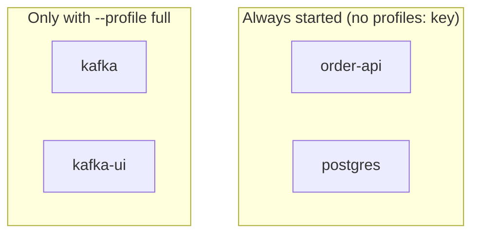
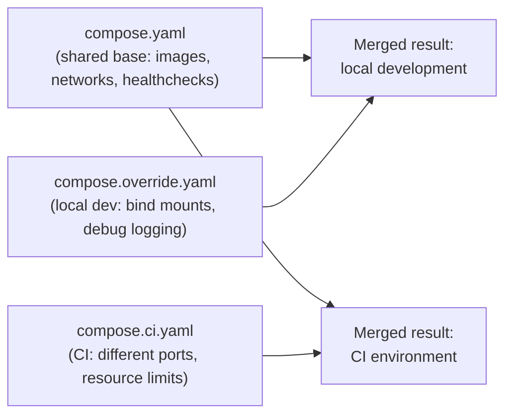

# Compose Profiles and Overrides

Real projects rarely need exactly one fixed set of services running all the time — you might want just the API and database for a quick backend session, or the full stack including Kafka and a metrics dashboard when testing integration flows end to end. This chapter covers Compose's two mechanisms for handling that variation cleanly: **profiles** (opt-in service groups within one file) and **override files** (layering environment-specific changes on top of a shared base) — without resorting to maintaining several separately-drifting copies of your Compose configuration.

---

## Profiles: Opt-In Services Within a Single File

```yaml
services:
  order-api:
    build: ./order-api
    depends_on:
      postgres:
        condition: service_healthy

  postgres:
    image: postgres:16
    healthcheck:
      test: ["CMD-SHELL", "pg_isready -U postgres"]

  kafka:
    image: apache/kafka:3.7.0
    profiles: ["full"]      # <- only starts when the "full" profile is active

  kafka-ui:
    image: provectuslabs/kafka-ui:latest
    profiles: ["full", "observability"]  # <- starts under EITHER profile
    depends_on:
      - kafka
```

```bash
# Default: only services with NO profiles listed are started
# (order-api, postgres) — kafka and kafka-ui are skipped entirely:
docker compose up -d

# Explicitly activate the "full" profile: now kafka and kafka-ui
# start too, alongside the always-on services:
docker compose --profile full up -d
```



This is genuinely different from maintaining a second, separate Compose file with a subset of services — profiles keep the **entire system's definition in one place**, avoiding the drift risk of two files that are supposed to stay in sync but silently diverge over time (someone updates the image tag in one file, forgets the other — a very real, very common source of "works in my Compose file but not in yours" bugs on a team).

---

## Override Files: Layering Environment-Specific Differences

Compose automatically merges `compose.yaml` with `compose.override.yaml` if present in the same directory — letting you keep a single **base** definition and layer **environment-specific** differences (a bind mount for live-editing source code in local dev, different resource limits, a different image tag) without duplicating the entire file.

```yaml
# compose.yaml — the shared, environment-agnostic base definition
services:
  order-api:
    build: ./order-api
    environment:
      SPRING_PROFILES_ACTIVE: docker
```

```yaml
# compose.override.yaml — automatically merged in local development,
# NOT deployed anywhere else (this file typically stays out of what
# gets shipped to CI/staging, or is deliberately local-only)
services:
  order-api:
    volumes:
      # Bind-mount source for live reload during local development —
      # exactly the Phase 5 Chapter 2 bind-mount pattern, applied here:
      - ./order-api/src:/app/src
    environment:
      SPRING_PROFILES_ACTIVE: local-dev
      LOGGING_LEVEL_ROOT: DEBUG
```

```bash
# Compose automatically merges compose.yaml + compose.override.yaml
# if the override file is present in the same directory — no flag needed:
docker compose up -d
docker compose config
# Shows the FULLY MERGED result — genuinely useful for confirming
# exactly what got combined, especially with several layered files.
```

For explicit, named alternative environments (rather than the automatic `compose.override.yaml` convention), specify files explicitly with `-f`:

```bash
# compose.yaml (base) + compose.ci.yaml (CI-specific overrides,
# e.g., different port bindings to avoid collisions on a shared CI runner):
docker compose -f compose.yaml -f compose.ci.yaml up -d
```



---

## Merge Semantics: What "Layering" Actually Means

Compose's merge behavior for overrides is worth understanding precisely, because it differs by field type:

- **Scalar values** (a single image tag, an environment variable's value) are **replaced** by the later file.
- **Lists** (like `volumes:` or `ports:`) are, by default, **appended to**, not replaced — an override file's `volumes:` entries add to the base file's list rather than overwriting it entirely (this can occasionally surprise people expecting a full override, not an addition).
- **Maps** (like `environment:` when written as a key-value map rather than a list) are **merged key by key** — an override can add or replace individual keys without needing to restate the entire map.

```bash
# Verify exactly how a specific merge resolved, rather than assuming:
docker compose -f compose.yaml -f compose.override.yaml config
```

**Practical habit worth building now**: whenever an override file's behavior seems surprising, `docker compose config` (with the exact same `-f` flags you intended to use for `up`) shows you the fully resolved result — this is the single most useful debugging command for anything override-related, and far more reliable than reading two files side by side and mentally merging them yourself.

---

## Combining Profiles and Overrides

These two mechanisms compose cleanly together — profiles for "which services run," overrides for "how they're configured in this specific environment":

```bash
# Full stack, with local-development overrides applied on top:
docker compose --profile full up -d
# (compose.override.yaml is still auto-merged in addition to this)
```

---

## Common Misconceptions This Chapter Should Correct

- **"Maintaining separate Compose files per environment is the standard, expected approach."** It's a valid but higher-maintenance approach compared to a single base file with profiles and/or override files layered on top — the latter reduces the specific risk of environment definitions silently drifting apart from each other over time.
- **"`compose.override.yaml` needs to be explicitly specified with `-f`."** It's auto-merged by Compose's own convention if present in the same directory as `compose.yaml` — no flag required, which is exactly why it's the right choice specifically for the "always want this locally, never in other environments" case.
- **"Override files always fully replace the base file's value for a given key."** Only for scalar values — lists are appended to and maps are merged key-by-key by default, which can produce a different result than a naive "later file wins entirely" mental model would predict.
- **"Profiles and override files solve the same problem."** They solve different, complementary problems — profiles control *which services run at all*, overrides control *how an already-running service is configured*. A real project typically uses both together.

---

## What's Next

Every mechanism from this phase — networking that "just works," health-check-gated startup ordering, `.env`/secrets handling, and profiles/overrides — comes together in this phase's project: a complete, realistic multi-service backend (API, database, cache, message broker, reverse proxy) defined entirely in Compose, with a working local-dev override and a full-stack profile.

**Next:** [`05-orchestrating-a-multi-service-stack-with-compose.md`](./05-orchestrating-a-multi-service-stack-with-compose.md)