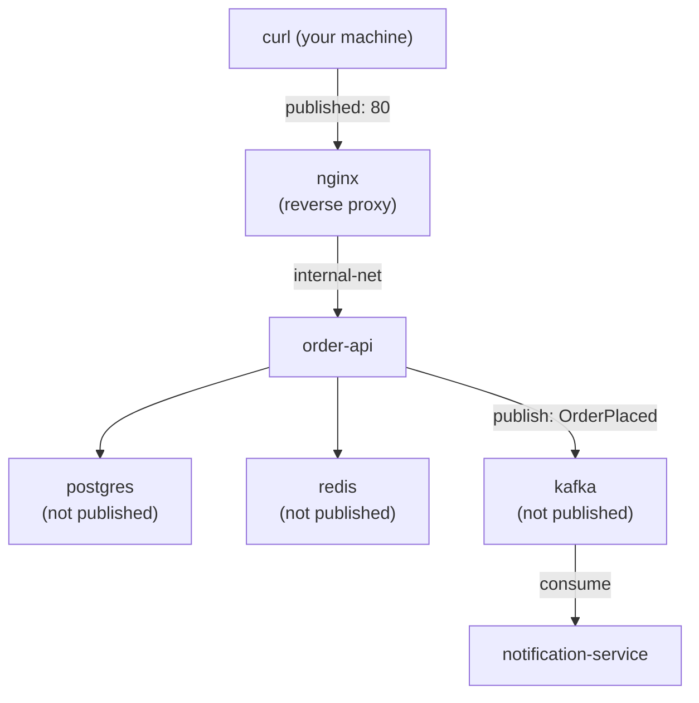

# Project: Orchestrating a Multi-Service Stack with Compose

This project brings together every concept from Phase 6, and indirectly from Phases 1–5, into one realistic multi-service backend: an `order-api` (Spring Boot) behind an `nginx` reverse proxy, backed by `postgres` for durable data and `redis` for caching, publishing events to `kafka` for a separate `notification-service` to consume — all defined in a single `compose.yaml`, with health-check-gated startup, a local-dev override, and a `full` profile for the observability tooling.

---

## Objective

- Define a five-service stack (nginx, order-api, postgres, redis, kafka + notification-service) entirely in Compose
- Use health-check-gated `depends_on` throughout (Phase 6 Chapter 2)
- Keep internal-only services unpublished, mirroring the segmented topology from Phase 4's networking lab
- Provide a `compose.override.yaml` for local development (bind-mounted source, debug logging)
- Verify the full request path end to end: client → nginx → order-api → postgres/redis, plus the async order-api → kafka → notification-service path

---

## Architecture



Only `nginx` is published to the host — every other service is reachable exclusively via the internal Compose network, directly mirroring the trust-boundary principle from Phase 4 Chapter 5.

---

## Folder Structure

```text
multi-service-stack/
├── compose.yaml
├── compose.override.yaml
├── .env.example
├── nginx/
│   └── nginx.conf
├── order-api/
│   ├── Dockerfile
│   ├── pom.xml
│   └── src/main/java/com/example/orderapi/...
└── notification-service/
    ├── Dockerfile
    ├── pom.xml
    └── src/main/java/com/example/notification/...
```

---

## Source Code (Key Files)

**`nginx/nginx.conf`**

```nginx
events {}

http {
    upstream order_api {
        server order-api:8080;
    }

    server {
        listen 80;

        location / {
            proxy_pass http://order_api;
            proxy_set_header Host $host;
            proxy_set_header X-Real-IP $remote_addr;
        }
    }
}
```

`order-api` here resolves via Compose's automatic user-defined network DNS (Phase 6 Chapter 1, Phase 4 Chapter 3) — nginx has zero awareness that it's talking to a container versus any other host.

**`order-api`'s Kafka producer** (new relative to the Phase 5 project):

```java
package com.example.orderapi;

import org.springframework.kafka.core.KafkaTemplate;
import org.springframework.web.bind.annotation.*;

import java.util.Map;

@RestController
@RequestMapping("/api/orders")
public class OrderController {

    private final OrderRepository repository;
    private final KafkaTemplate<String, String> kafkaTemplate;

    public OrderController(OrderRepository repository, KafkaTemplate<String, String> kafkaTemplate) {
        this.repository = repository;
        this.kafkaTemplate = kafkaTemplate;
    }

    @PostMapping
    public Order create(@RequestBody Map<String, Object> body) {
        Order order = new Order();
        order.setSku((String) body.get("sku"));
        order.setQuantity((Integer) body.get("quantity"));
        Order saved = repository.save(order);

        // Publish asynchronously — order-api does not block on,
        // or fail because of, notification-service being unavailable
        // (Phase 4 Chapter 5, Pattern 3):
        kafkaTemplate.send("order-events", saved.getId().toString(),
            "OrderPlaced:" + saved.getSku());

        return saved;
    }
}
```

**`notification-service`'s consumer:**

```java
package com.example.notification;

import org.springframework.kafka.annotation.KafkaListener;
import org.springframework.stereotype.Component;

@Component
public class OrderEventListener {

    @KafkaListener(topics = "order-events", groupId = "notification-service")
    public void onOrderEvent(String message) {
        System.out.println("Notification service received: " + message);
        // In a real service: send an email, push notification, etc.
    }
}
```

---

## `compose.yaml`

```yaml
services:
  nginx:
    image: nginx:1.27-alpine
    ports:
      - "80:80"
    volumes:
      - ./nginx/nginx.conf:/etc/nginx/nginx.conf:ro
    depends_on:
      order-api:
        condition: service_healthy

  order-api:
    build: ./order-api
    environment:
      SPRING_DATASOURCE_URL: jdbc:postgresql://postgres:5432/${POSTGRES_DB}
      SPRING_DATASOURCE_PASSWORD: ${POSTGRES_PASSWORD}
      SPRING_REDIS_HOST: redis
      SPRING_KAFKA_BOOTSTRAP_SERVERS: kafka:9092
    healthcheck:
      test: ["CMD", "wget", "-qO-", "http://localhost:8080/actuator/health"]
      interval: 10s
      timeout: 3s
      retries: 3
      start_period: 20s
    depends_on:
      postgres:
        condition: service_healthy
      redis:
        condition: service_healthy
      kafka:
        condition: service_healthy

  notification-service:
    build: ./notification-service
    depends_on:
      kafka:
        condition: service_healthy

  postgres:
    image: postgres:16
    environment:
      POSTGRES_PASSWORD: ${POSTGRES_PASSWORD}
      POSTGRES_DB: ${POSTGRES_DB}
    volumes:
      - pg-data:/var/lib/postgresql/data
    healthcheck:
      test: ["CMD-SHELL", "pg_isready -U postgres"]
      interval: 5s
      timeout: 3s
      retries: 5

  redis:
    image: redis:7-alpine
    healthcheck:
      test: ["CMD", "redis-cli", "ping"]
      interval: 5s
      timeout: 3s
      retries: 5

  kafka:
    image: apache/kafka:3.7.0
    environment:
      KAFKA_NODE_ID: 1
      KAFKA_PROCESS_ROLES: broker,controller
      KAFKA_LISTENERS: PLAINTEXT://:9092,CONTROLLER://:9093
      KAFKA_ADVERTISED_LISTENERS: PLAINTEXT://kafka:9092
      KAFKA_CONTROLLER_QUORUM_VOTERS: 1@kafka:9093
      KAFKA_CONTROLLER_LISTENER_NAMES: CONTROLLER
    healthcheck:
      test: ["CMD-SHELL", "kafka-broker-api-versions.sh --bootstrap-server localhost:9092"]
      interval: 10s
      timeout: 5s
      retries: 6
    profiles: ["full", "default"]

  kafka-ui:
    image: provectuslabs/kafka-ui:latest
    ports:
      - "8090:8080"
    environment:
      KAFKA_CLUSTERS_0_NAME: local
      KAFKA_CLUSTERS_0_BOOTSTRAPSERVERS: kafka:9092
    profiles: ["observability"]

volumes:
  pg-data:
```

## `compose.override.yaml` (local development)

```yaml
services:
  order-api:
    volumes:
      - ./order-api/src:/app/src
    environment:
      LOGGING_LEVEL_ROOT: DEBUG
  notification-service:
    environment:
      LOGGING_LEVEL_ROOT: DEBUG
```

## `.env.example` (committed; real `.env` is gitignored, per Phase 6 Chapter 3)

```bash
POSTGRES_PASSWORD=changeme
POSTGRES_DB=orders
```

---

## Build and Run Commands

```bash
cp .env.example .env
# edit .env with a real generated password before anything beyond local dev

docker compose up -d --build

# Watch the health-check-gated startup sequence directly:
watch docker compose ps
```

## Expected Output

```bash
curl -X POST http://localhost/api/orders \
  -H "Content-Type: application/json" \
  -d '{"sku":"WIDGET-001","quantity":5}'
# {"id":1,"sku":"WIDGET-001","quantity":5,"createdAt":"..."}

docker compose logs notification-service --tail 5
# notification-service-1 | Notification service received: OrderPlaced:WIDGET-001
```

Requests flowed `nginx → order-api → postgres` synchronously (visible in the immediate response), and `order-api → kafka → notification-service` asynchronously (visible moments later in the logs) — both patterns from Phase 4 Chapter 5, now running together in one real stack.

---

## Debugging Walkthrough

### Confirm internal-only services are genuinely unreachable from the host

```bash
docker compose port postgres 5432
# (no output — postgres has no ports: mapping at all, exactly as intended)

psql -h localhost -p 5432 -U postgres
# connection refused — confirms the Phase 4 segmentation principle
# holds true inside a Compose-managed stack exactly as it did with
# plain docker run commands in the networking lab.
```

### Confirm health-check-gated ordering actually held

```bash
docker compose ps
# order-api should show "Up X seconds (healthy)" — and its Created
# timestamp should be AFTER postgres, redis, and kafka all reached
# healthy, not merely after they started (Chapter 2's core point).
```

### Run just the lightweight subset, without Kafka/notification-service

```bash
docker compose down
docker compose --profile "" up -d order-api postgres redis nginx
# (Explicitly listing services bypasses profile-gated ones not needed
#  for a quick API+DB+cache session — kafka and kafka-ui stay stopped.)
```

### Bring up the observability tooling too

```bash
docker compose --profile full --profile observability up -d
curl http://localhost:8090   # kafka-ui, now reachable
```

---

## Optimization / Architecture Discussion

- **Why does `order-api` depend on `kafka`'s health, even though the Kafka publish is "fire and forget" at the application level?** Because a Kafka client library typically needs the broker reachable to even initialize its producer correctly on startup — this is a Compose-level startup-ordering concern (Chapter 2), separate from the application-level resilience question of what happens if Kafka becomes unavailable *after* `order-api` is already running (which the async, non-blocking publish call is specifically designed to tolerate).
- **Why is `notification-service` not itself given a health check gating anything else?** Nothing in this stack depends on `notification-service` being ready — it's a pure consumer at the end of the chain, so no other service needs to wait on it.

## Production Considerations

- This exact Compose file is representative of local development and CI integration testing — Phase 9 and Phase 10 build the production path from here: the same container images, built once, promoted through a CI pipeline, and ultimately translated into Kubernetes manifests rather than run via Compose in production.
- The single-broker Kafka configuration here is appropriate for local development only — a production Kafka deployment needs a properly sized, replicated cluster, well outside Compose's intended scope.

---

## Cleanup

```bash
docker compose down          # keeps pg-data volume
docker compose down -v       # ALSO removes pg-data — be deliberate about this (Chapter 1)
```

---

## What's Next

Phase 6 is complete: Compose's mental model, health-check-gated dependencies, secrets/config handling, profiles/overrides, and a full working multi-service stack combining synchronous and asynchronous communication patterns, all with the internal/external network segmentation established back in Phase 4. Phase 7 moves to debugging — what to do, systematically, when any piece of a stack like this one breaks.

**Next:** [`../phase-7-debugging-and-observability/01-inspecting-running-containers.md`](../phase-7-debugging-and-observability/01-inspecting-running-containers.md)