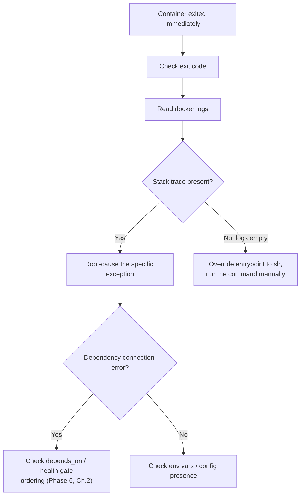

# Debugging a Container That Won't Start

A container that exits immediately after `docker run` is one of the most common early frustrations, and it has a small, well-defined set of root causes. This chapter is a systematic checklist, ordered from fastest-to-check to more involved, building directly on tools from Chapter 1 and concepts from Phases 1–3.

---

## Step 1: Check the Exit Code First

```bash
docker run -d --name broken-service demo-service:1.0
docker ps -a --filter name=broken-service
# CONTAINER ID   STATUS
# a1b2c3d4e5f6   Exited (1) 2 seconds ago
```

The exit code itself narrows the search space immediately:

| Exit code | Likely cause |
|---|---|
| `0` | Clean exit — the process ran and finished normally (unusual for a long-running service; check if this was actually intended) |
| `1` | Generic application error — check logs next |
| `126` | Command found but not executable (permissions issue on the entrypoint binary) |
| `127` | Command not found (typo in `ENTRYPOINT`/`CMD`, or a missing binary) |
| `137` | `SIGKILL` — either `docker stop`'s grace period expired (Phase 3, Chapter 2), or the OOM killer fired (Phase 3, Chapter 3) |
| `139` | Segmentation fault — rare for a JVM app; suspect a native library issue |

```bash
docker inspect broken-service --format '{{.State.ExitCode}} {{.State.OOMKilled}}'
```

## Step 2: Read the Logs

```bash
docker logs broken-service
```

For a Spring Boot application specifically, look for:
- A stack trace during context initialization (a misconfigured bean, a missing required property)
- `Caused by:` chains — Spring's actual root cause is usually several lines into a wrapped exception, not the topmost line
- `Address already in use` — port collision with something else on the same network namespace or, in host networking mode, the host itself

```bash
# If logs are empty entirely, the process may have died before
# logging even initialized — check exit code + a bare rerun:
docker run --rm demo-service:1.0
# Running WITHOUT -d shows output directly in your terminal, live,
# which can surface a crash that happened too fast for `docker logs`
# to be checked calmly afterward.
```

## Step 3: Verify the Entrypoint Itself Works

```bash
# Override the entrypoint to get a shell instead of running the app —
# confirms the IMAGE itself is sound, isolating the problem to
# configuration/environment rather than a broken build:
docker run --rm -it --entrypoint sh demo-service:1.0

# From inside, try running the actual command manually:
java -jar /app/app.jar
```

Running the command manually, interactively, surfaces errors immediately and lets you inspect the filesystem state at the moment of failure — confirm the JAR actually exists at the expected path, confirm file permissions, confirm any expected config files are present.

## Step 4: Check for Missing Environment Variables or Config

```bash
docker run --rm demo-service:1.0 env
# Compare against what the application actually requires —
# a required datasource URL or credential that's silently absent
# is a very common cause of a fast, early crash.
```

## Step 5: Check for a Networking-Related Startup Failure

A Spring Boot app that depends on a database at startup (rather than lazily) will crash immediately if that database isn't reachable — this is exactly the bare-`depends_on` race condition from Phase 6 Chapter 2, now showing up as a crash rather than an intermittent connection failure, if the timing is consistently unlucky.

```bash
docker exec broken-service curl -v http://postgres:5432
# or, if the container has already exited and can't be exec'd into,
# reproduce interactively:
docker run --rm --network app-net demo-service:1.0
```

## Step 6: Check Resource Limits

```bash
docker inspect broken-service --format '{{.State.OOMKilled}}'
# true -> this is a Phase 3, Chapter 3 cgroup memory problem,
#         not an application logic bug at all.
```

---

## A Concrete Worked Example

```bash
docker logs broken-service
# Error creating bean with name 'dataSource':
# Caused by: org.postgresql.util.PSQLException:
#   Connection to postgres:5432 refused

# Diagnosis: order-api started before postgres was ready to accept
# connections — exactly the race condition from Compose Chapter 2.
# Fix: add condition: service_healthy, not just bare depends_on.
```



---

## Common Misconceptions

- **"An empty `docker logs` output means nothing was wrong."** It can mean the process crashed before its logging framework initialized at all — rerunning without `-d` to see raw output, or overriding the entrypoint to a shell, surfaces this.
- **"Exit code 137 always means an OOM kill."** It means `SIGKILL` was received — check `OOMKilled` specifically to distinguish a genuine OOM kill from `docker stop`'s grace period simply expiring (Phase 3, Chapter 2).
- **"If it worked with `docker run --rm -it ... sh` then `java -jar ...`, the image is definitely fine and the problem must be elsewhere."** This confirms the image and entrypoint are sound, but doesn't rule out environment-specific issues (missing env vars, unreachable network dependencies) that only manifest under the real `docker run` configuration.

---

## What's Next

**Next:** [`03-attaching-a-remote-jvm-debugger.md`](./03-attaching-a-remote-jvm-debugger.md)