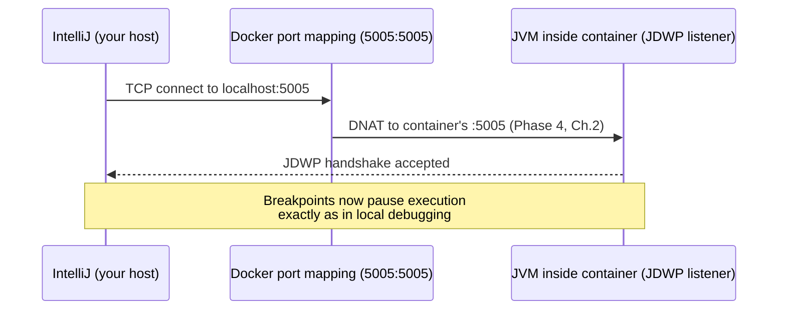

# Attaching a Remote JVM Debugger

Sometimes logs and `docker exec` aren't enough — you need to actually step through code with breakpoints, exactly as you would in your IDE locally. This chapter covers exposing the JVM's remote debugging port from inside a container, and connecting to it from IntelliJ or another IDE, including the specific case (distroless images, Phase 2 Chapter 4) where `docker exec` isn't an option at all.

---

## Enabling the JVM's Debug Agent

The JVM has a built-in remote debugging protocol (JDWP — Java Debug Wire Protocol), enabled via a JVM flag:

```dockerfile
ENTRYPOINT ["java", \
  "-agentlib:jdwp=transport=dt_socket,server=y,suspend=n,address=*:5005", \
  "-jar", "/app/app.jar"]
```

- `server=y` — the JVM listens for an incoming debugger connection (rather than initiating one itself)
- `suspend=n` — the application starts normally and immediately; use `suspend=y` only if you specifically need to pause execution until a debugger attaches (useful for catching startup-time issues, but inconvenient for routine debugging since the app won't serve any traffic until you connect)
- `address=*:5005` — listen on all interfaces, port 5005 (the container's internal port; still requires publishing to be reached from outside, per Phase 4 Chapter 4)

```bash
docker run -d --name debug-service -p 8080:8080 -p 5005:5005 demo-service:debug
```

Publishing port 5005 (Phase 4, Chapter 4's explicit publish mechanism) is what actually lets your IDE, running on your host, reach the JVM's debug listener inside the container.

---

## Connecting From IntelliJ IDEA

1. **Run → Edit Configurations → Add New Configuration → Remote JVM Debug**
2. Host: `localhost`, Port: `5005` (matching the published port above)
3. Set breakpoints in your source as normal
4. Click the debug-attach button



Once connected, hitting a breakpoint pauses the actual running JVM thread inside the container — request processing genuinely halts at that point, exactly like debugging a local process, because it *is* the actual JVM thread, just running inside a container's namespaces instead of directly on your host.

---

## A Genuinely Important Production Caution

**Never enable JDWP in a production image without deliberate access control.** JDWP has no built-in authentication — anyone who can reach the port can attach a debugger, which in practice means full read/write access to the running application's memory and the ability to arbitrarily redirect its execution. Treat this exactly like an unauthenticated remote code execution vector, because it functionally is one. Best practice: enable it only in an explicit debug image variant (Phase 2's `--target debug` pattern), never in the default production target, and never publish port 5005 to anything beyond a tightly controlled network — we return to this specific risk in Phase 8's attack-surface discussion.

```dockerfile
FROM runtime AS debug
ENTRYPOINT ["java", \
  "-agentlib:jdwp=transport=dt_socket,server=y,suspend=n,address=*:5005", \
  "-jar", "/app/app.jar"]
```

```bash
docker build --target runtime -t demo-service:prod .    # no JDWP at all
docker build --target debug -t demo-service:debug .     # JDWP enabled, explicitly
```

---

## Debugging Distroless Images (Phase 2, Chapter 4)

Since a distroless image has no shell for `docker exec`, remote JVM debugging is often your *primary* interactive debugging option for such images — this is precisely the trade-off flagged when choosing distroless: you're not giving up debugging capability entirely, but you are narrowing it to JDWP-based (or dedicated observability-tool-based) approaches rather than a quick `docker exec ... sh`.

```bash
# distroless images still support JDWP normally — the debug agent
# is a JVM flag, entirely independent of whether a shell exists:
docker run -d -p 5005:5005 demo-service:distroless-debug
```

---

## Common Misconceptions

- **"Remote debugging requires special container support beyond a normal published port."** It's an ordinary TCP port (JDWP), published exactly like any application port (Phase 4, Chapter 4) — no container-specific mechanism beyond that.
- **"JDWP is safe to leave enabled since it's 'just for debugging.'** It has no authentication whatsoever by default — leaving it enabled and reachable in any non-strictly-controlled environment is a genuine, serious security exposure.
- **"`suspend=y` is always the right choice for convenience."** It blocks the application from serving any traffic at all until a debugger connects — useful specifically for startup-time issues, actively inconvenient for routine mid-run debugging sessions.

---

## What's Next

**Next:** [`04-healthchecks-readiness-vs-liveness.md`](./04-healthchecks-readiness-vs-liveness.md)