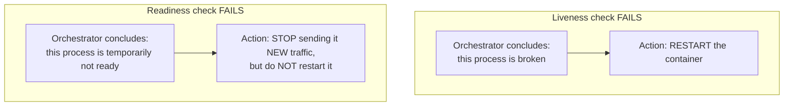
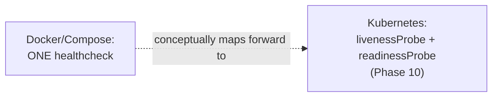

# Healthchecks: Readiness vs. Liveness

Phase 5 and Phase 6 both used Docker health checks to gate startup ordering. This chapter makes an important distinction those chapters glossed over, one that becomes critical once you reach Kubernetes (Phase 10): **readiness and liveness are two different questions, and answering them with the same check is a common, costly mistake.**

---

## Two Different Questions

- **Liveness: "Is this process fundamentally still working, or should it be restarted?"** A liveness failure should trigger a restart — the process is presumed unrecoverable in its current state (deadlocked, corrupted internal state).
- **Readiness: "Is this process currently able to handle new traffic?"** A readiness failure should route traffic *away* from this instance temporarily — the process is presumed fine, just not ready *right now* (still warming up, temporarily overloaded, its database connection pool momentarily exhausted).



Conflating these has a specific, real failure mode: if your single health check reflects *readiness* (e.g., "can I currently reach the database") but is wired up as a *liveness* signal, a temporary database blip causes the orchestrator to **restart your application container** — even though the application itself was perfectly healthy and would have recovered the moment the database came back. You've turned a transient dependency issue into an unnecessary, disruptive restart.

---

## Spring Boot Actuator's Built-In Distinction

Spring Boot Actuator, since 2.3, ships with exactly this distinction built in, via **health groups**:

```properties
management.endpoint.health.probes.enabled=true
management.health.livenessstate.enabled=true
management.health.readinessstate.enabled=true
```

```bash
curl http://localhost:8080/actuator/health/liveness
# {"status":"UP"}   <- "is the JVM process itself in a broken state?"

curl http://localhost:8080/actuator/health/readiness
# {"status":"UP"}   <- "am I currently able to serve traffic?"
```

Liveness reflects application-internal state (is the Spring context broken, is a critical background thread dead) — it should generally **not** include external dependency checks (a database being briefly unreachable is not evidence *this JVM* is broken). Readiness, conversely, is exactly the right place for dependency checks — genuinely reflecting "can I usefully serve a request right now."

```java
@Component
public class CustomReadinessIndicator implements HealthIndicator {

    private final DataSource dataSource;

    public CustomReadinessIndicator(DataSource dataSource) {
        this.dataSource = dataSource;
    }

    @Override
    public Health health() {
        try (Connection conn = dataSource.getConnection()) {
            return conn.isValid(2) ? Health.up().build() : Health.down().build();
        } catch (SQLException e) {
            return Health.down(e).build();
        }
    }
}
```

Registering this as a **readiness** contributor (not a liveness one) means a temporary database outage correctly stops new traffic from being routed to this instance, without triggering a needless container restart.

---

## Applying This With Docker's Single Health Check

Docker's own `HEALTHCHECK` (and Compose's `healthcheck:`) has only **one** health signal, not Kubernetes' separate readiness/liveness probes — an important scope limitation worth naming honestly:

```dockerfile
HEALTHCHECK --interval=10s --timeout=3s --start-period=20s --retries=3 \
  CMD curl -f http://localhost:8080/actuator/health/readiness || exit 1
```

For Docker/Compose specifically (used for startup-ordering gating, Phase 6 Chapter 2), pointing at the **readiness** endpoint is usually the more useful choice — it correctly delays dependent services from starting until this one can genuinely serve traffic. The full readiness/liveness split becomes actionable once you reach Kubernetes, where both probes exist as genuinely separate, independently configurable mechanisms — a direct extension of exactly this concept, covered explicitly in Phase 10.



---

## Common Misconceptions

- **"A single health check endpoint is sufficient for any container orchestration need."** It's sufficient for Docker/Compose's single-signal model, but conflating readiness and liveness concerns even within that one endpoint risks unnecessary restarts from transient, recoverable dependency issues.
- **"Liveness checks should verify the whole system is working, including dependencies."** They should verify the *process itself* isn't broken — a dependency being briefly unavailable is a readiness concern, not evidence this specific JVM needs restarting.
- **"Readiness and liveness are Kubernetes-specific concepts with no relevance to plain Docker."** The conceptual distinction is universal; Kubernetes just happens to provide two separate, dedicated mechanisms for it, whereas Docker/Compose has one, requiring you to choose which concern that single check should represent.

---

## What's Next

Time to bring every debugging technique from this phase together on a stack that's deliberately broken in several ways at once — practicing the systematic diagnostic process end to end, rather than one technique at a time.

**Next:** [`05-diagnosing-a-deliberately-broken-stack.md`](./05-diagnosing-a-deliberately-broken-stack.md)