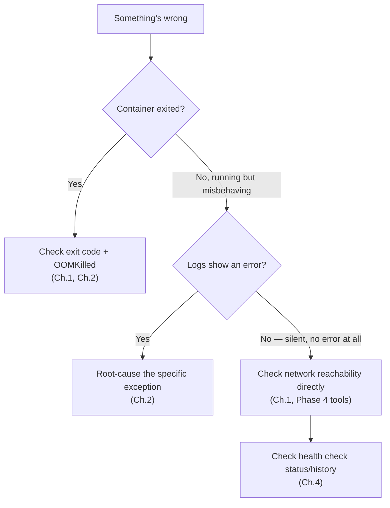

# Project: Diagnosing a Deliberately Broken Stack

This project takes the Phase 6 multi-service Compose stack and deliberately introduces four independent, realistic bugs — one at a time, or all together — and walks through diagnosing each using only the techniques from this phase. The goal is practicing the *systematic process*, not memorizing these specific fixes.

---

## Objective

- Reproduce four distinct, realistic failure modes in a Compose stack
- Diagnose each using `docker inspect`, `docker logs`, exit codes, and the systematic checklist from Chapter 2
- Fix each one and verify the fix using the same tools

---

## Setup

Start from the Phase 6 project's `compose.yaml`, then apply each of the four deliberate breakages below **one at a time**, restoring the original between each.

---

## Bug 1: Bare `depends_on`, No Health Gate

**Introduced break:**

```yaml
order-api:
  build: ./order-api
  depends_on:
    - postgres    # <- bare form, no condition
```

**Symptom:**

```bash
docker compose up -d
docker compose ps
# order-api-1   Exited (1)
```

**Diagnosis, using Chapter 2's checklist:**

```bash
docker logs myproject-order-api-1
# Caused by: org.postgresql.util.PSQLException: Connection to postgres:5432 refused
```

**Root cause:** exactly the race condition from Phase 6 Chapter 2 — `order-api` started before Postgres was accepting connections.

**Fix:**

```yaml
order-api:
  depends_on:
    postgres:
      condition: service_healthy
```

---

## Bug 2: Cgroup Memory Limit Too Tight

**Introduced break:**

```yaml
order-api:
  build: ./order-api
  deploy:
    resources:
      limits:
        memory: 150M
```

**Symptom:**

```bash
docker compose ps
# order-api-1   Exited (137)
```

**Diagnosis:**

```bash
docker inspect myproject-order-api-1 --format '{{.State.OOMKilled}}'
# true
```

This is exactly the Phase 3 Chapter 3 mechanism — confirmed via `OOMKilled`, not merely inferred from the exit code alone (which only tells you `SIGKILL`, not specifically *why*).

**Fix:** raise the limit and/or apply the deliberate `-XX:MaxRAMPercentage` tuning from the Phase 3 project, verified with `docker stats` afterward.

---

## Bug 3: Wrong Network — Service Genuinely Unreachable

**Introduced break:** `notification-service` accidentally omitted from the Compose file's implied default network association due to an explicit (and wrong) `networks:` override:

```yaml
notification-service:
  build: ./notification-service
  networks:
    - isolated-net   # <- a network kafka is NOT on

networks:
  isolated-net:
```

**Symptom:** no crash at all — `notification-service` starts and shows `Up`, but never logs receiving any order events.

**Diagnosis, using Phase 4's tools inside a Phase 6 stack:**

```bash
docker exec myproject-notification-service-1 sh -c \
  "apk add --no-cache bind-tools 2>/dev/null; nslookup kafka"
# nslookup: can't resolve 'kafka'
# -- confirms notification-service is NOT on the same bridge network as kafka,
#    exactly per Phase 4 Chapter 3's DNS mechanism: no shared network,
#    no name resolution, regardless of anything else being correctly configured.

docker network inspect myproject_isolated-net --format '{{json .Containers}}'
docker network inspect myproject_default --format '{{json .Containers}}'
# Confirms kafka is on "default", notification-service is on "isolated-net" — disjoint.
```

**Fix:** remove the incorrect `networks:` override, letting Compose's default network association apply as intended.

---

## Bug 4: Readiness/Liveness Conflation Causing Unwanted Restarts

**Introduced break:** the health check calls a readiness-style endpoint that includes a database check, but is wired as a naive restart-on-failure mechanism at the container level (simulated here via a health check with very aggressive retries feeding into an external restart script, since Docker itself doesn't auto-restart on unhealthy status by default — this specifically foreshadows the Kubernetes liveness-probe version of this exact mistake in Phase 10):

```yaml
order-api:
  healthcheck:
    test: ["CMD", "curl", "-f", "http://localhost:8080/actuator/health"]
    interval: 5s
    retries: 2
```

**Symptom:** a brief, deliberately injected Postgres restart (`docker restart myproject-postgres-1`) causes `order-api`'s health status to flip to `unhealthy` within 10 seconds — even though `order-api`'s own JVM was never actually broken.

**Diagnosis:**

```bash
docker inspect myproject-order-api-1 --format '{{json .State.Health}}' | python3 -m json.tool
# Shows failing checks correlated exactly with the postgres restart window —
# confirms this is a DEPENDENCY blip being misreported as this container's
# own liveness failure (Chapter 4's core distinction).
```

**Fix:** point the check at `/actuator/health/readiness` specifically (Chapter 4), and — if wiring an actual auto-restart mechanism — ensure it's driven by a genuine liveness signal, not a readiness one.

---

## Debugging Walkthrough Summary



---

## Production Considerations

- All four of these bugs are genuinely common in real systems — none are contrived beyond what a real team encounters. The value of this exercise is having *walked* the diagnostic path once, deliberately, so the next time a similar symptom appears in a real system, the checklist is already internalized rather than being invented under pressure.

---

## Cleanup

```bash
docker compose down -v
```

---

## What's Next

Phase 7 is complete: inspection tooling, the startup-failure checklist, remote JVM debugging, the readiness/liveness distinction, and a full diagnostic exercise across four realistic bugs. Phase 8 moves to security — what "container isolation" actually does and doesn't protect against, and how to harden everything built so far.

**Next:** [`../phase-8-security-and-hardening/01-container-isolation-is-not-a-vm.md`](../phase-8-security-and-hardening/01-container-isolation-is-not-a-vm.md)