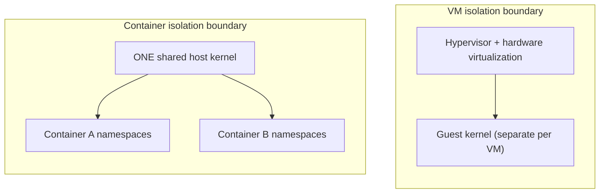

# Container Isolation Is Not a VM

Phase 1 Chapter 1 established the key mechanical fact this entire phase builds on: a container shares the host's kernel — there is no hypervisor, no separate guest kernel. This chapter makes the security consequences of that fact explicit and precise: what namespace/cgroup isolation actually protects against, and — just as important — what it does not.

---

## What Namespace Isolation Actually Provides

Namespaces (Phase 1, Chapter 2) provide genuine, kernel-enforced isolation of *what a process can see*: its own PID tree, its own network stack, its own mounted filesystem view. This is real isolation, not a convention — a process inside a container genuinely cannot see or directly signal processes outside its PID namespace, by kernel enforcement, not by application-level cooperation.

## What It Does Not Provide: Kernel Isolation

Every container on a host shares **one kernel**. A kernel vulnerability — a bug in namespace handling itself, a bug in a syscall any container can invoke — is a **potential cross-container, or container-to-host, escalation path**, in a way that has no equivalent in real hardware virtualization (where a guest kernel exploit is contained to that one guest's virtual hardware boundary, enforced by the hypervisor and, typically, actual CPU virtualization extensions).



A kernel-level exploit doesn't need to "break out of" anything conceptually distinct the way a VM escape does — it operates *within* the single kernel every container already shares. This is the single most important security mental model correction for anyone coming from a VM-centric background: **container isolation is a strong, real, kernel-enforced boundary for ordinary process behavior, but it is not the same category of isolation as separate hardware-virtualized kernels.**

---

## The Practical Consequence: Root in a Container Matters

Following directly from Phase 1 Chapter 2's user-namespace discussion: without user namespace remapping (the common default on many Docker installations), a process running as UID 0 (root) *inside* a container is the *same* UID 0 on the host's kernel — meaning any successful kernel-level escape from that process inherits genuine host root privileges, not some intermediate, contained privilege level.

```bash
# Verify whether user namespace remapping is active on your host:
docker info --format '{{.SecurityOptions}}'
# Look for "name=userns" — its absence means containers run with
# the host's real UID 0 as root by default.
```

This is exactly why the next chapter's core recommendation — **never run application containers as root** — is a genuinely load-bearing security control, not a stylistic best practice: it directly narrows what a successful escape (via a kernel bug, or via a container misconfiguration) can actually achieve, even in the worst case.

---

## Capabilities: A Partial, Real Mitigation

Linux **capabilities** split up what "root" traditionally meant into individually grantable/revokable privileges (binding to a low port, changing file ownership, loading kernel modules, and dozens more). Docker drops several dangerous capabilities by default (though not all), and you can explicitly drop more:

```bash
docker run --cap-drop=ALL --cap-add=NET_BIND_SERVICE demo-service:1.0
```

This runs the container with **no** capabilities except the one explicitly re-added (binding to a privileged port, if your application genuinely needs that) — a meaningfully smaller set of things even a fully-compromised root-equivalent process inside the container could do. We apply this concretely in Chapter 6's hardening project.

---

## Common Misconceptions

- **"Containers are basically as secure as VMs, just lighter-weight."** They provide strong isolation for ordinary process behavior, but not the same category of protection against kernel-level exploits — a genuinely different security posture, not merely a "smaller VM."
- **"Since Docker isolates namespaces, root inside a container is harmless."** Without user namespace remapping (the common default), root inside the container is the real host UID 0 — a kernel-level escape inherits genuine host root.
- **"Capabilities are an obscure, rarely-relevant detail."** Dropping unnecessary capabilities is one of the most direct, practical hardening steps available, precisely because it shrinks what even a compromised root process could do.

---

## What's Next

**Next:** [`02-running-as-non-root.md`](./02-running-as-non-root.md)