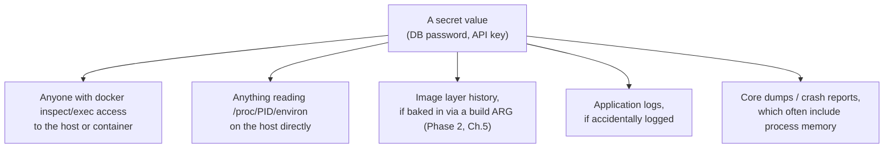
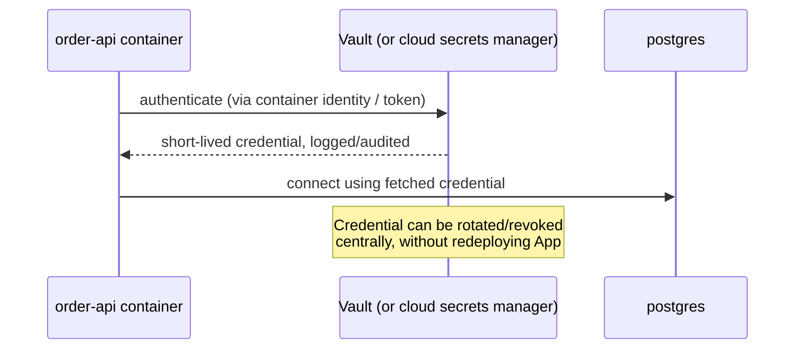

# Secrets Management in Containers

Phase 6 Chapter 3 covered Compose's `secrets:` mechanism honestly: it reduces accidental exposure, but doesn't provide access control, rotation, or auditing. This chapter completes that picture from a security-specific angle — the full threat model for container secrets, and where a genuine secrets manager becomes necessary rather than optional.

---

## The Threat Model: Who Can See What, and How



Every one of these is a genuinely realistic exposure path, and none of them is prevented merely by keeping the secret out of your Dockerfile or version control — that only closes the "someone reads your git history" path, which is real but far from the only one.

---

## Ranking the Mechanisms From This Repository, Honestly

| Mechanism | Protects against | Does not protect against |
|---|---|---|
| `.env` file (Phase 6, Ch.3) | Committing secrets to git | `docker inspect`/`exec` exposure, logs, core dumps |
| Compose `secrets:` file mount (Phase 6, Ch.3) | `docker inspect`'s env listing, child-process env inheritance | Anyone with `docker exec` access reading the file directly |
| `tmpfs` mount (Phase 5, Ch.2) | Secret ever touching physical disk | In-memory exposure to anyone with process/container access |
| A real secrets manager (Vault, cloud KMS) | Access control, rotation, audit trail, encryption at rest | Nothing — this is the appropriate tool for genuinely sensitive production secrets |

**Being honest about this table is the point of this chapter**: none of the Docker-native mechanisms alone provide access control or auditing — they only narrow *which specific tools and paths* casually expose a secret. For anything beyond local development or a genuinely low-stakes internal tool, a real secrets manager is not an upgrade, it's the correct baseline.

---

## A Practical Pattern: Fetching Secrets at Runtime, Never Baking Them In

```java
@Configuration
public class VaultSecretConfig {

    @Bean
    public DataSource dataSource(VaultTemplate vaultTemplate) {
        VaultResponse response = vaultTemplate.read("secret/data/order-service/db");
        String password = (String) response.getData().get("password");

        return DataSourceBuilder.create()
            .url("jdbc:postgresql://postgres:5432/orders")
            .username("order-service")
            .password(password)
            .build();
    }
}
```

The credential is fetched **at application startup, from an authenticated, audited source**, and never appears in the image, the Compose file, or any environment variable dump — a genuinely different exposure profile than anything covered so far, because the secret's lifecycle (issuance, rotation, revocation) is now managed by a system built specifically for that purpose, with an audit trail of who/what accessed which secret and when.



---

## Never Log Secrets — A Concrete Application-Level Control

A genuinely common, easy-to-miss leak: logging an entire configuration object or request body that happens to contain a credential.

```java
// WRONG — this could log the datasource password directly to stdout,
// which (per Phase 3, Chapter 5) goes straight into your log
// aggregation pipeline, potentially retained far longer than the
// secret's actual intended lifetime:
log.info("Configured datasource: {}", dataSourceProperties);

// RIGHT — log only what's needed for debugging, never the full object:
log.info("Configured datasource for host: {}", dataSourceProperties.getHost());
```

Structured logging frameworks can also be configured with explicit field-masking rules for known-sensitive field names (`password`, `token`, `secret`) as a defense-in-depth backstop against this exact class of accidental leak.

---

## Common Misconceptions

- **"If a secret isn't in my Dockerfile or git repo, it's properly secured."** That closes only one specific exposure path — runtime exposure via `docker inspect`/`exec`, logs, and core dumps are all separate, real risks that a `.env` file alone does nothing to address.
- **"Compose's `secrets:` mechanism is 'good enough' for production."** It's a genuine improvement over plain environment variables, but it provides no rotation, no access control beyond ordinary file permissions, and no audit trail — the honest comparison in the table above.
- **"Using a secrets manager is overkill for most services."** For anything handling real user data or production credentials, it's the appropriate baseline, not a premium option reserved for especially sensitive systems.

---

## What's Next

**Next:** [`05-container-escape-attack-surface.md`](./05-container-escape-attack-surface.md)