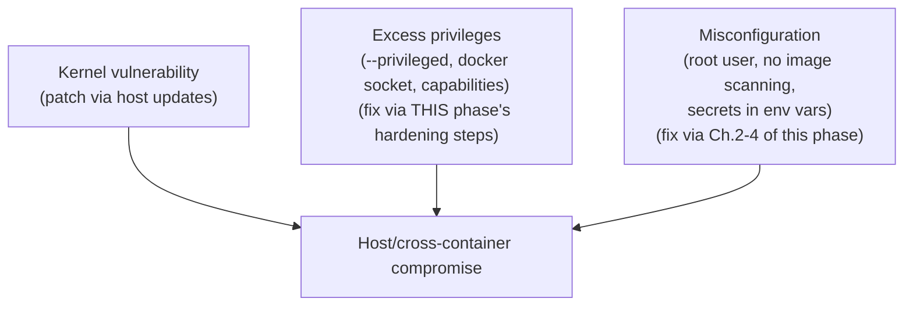

# Container Escape Attack Surface

Chapter 1 established that container isolation is not equivalent to VM isolation, mechanically, because every container shares the host's kernel. This chapter is about the specific, named categories of container escape — not to alarm, but to give you a concrete, accurate mental model of what actually constitutes the attack surface, so the hardening steps from this phase (non-root, capability dropping, read-only filesystems) map to specific things they're each defending against.

---

## Category 1: Kernel Vulnerabilities

The most direct escape category: a bug in the kernel's own namespace or cgroup implementation that lets a process inside a container perform an action that should be scoped to its namespace, but isn't due to the bug. These are patched via ordinary kernel updates — **keeping your Docker host's kernel current is a genuine, direct security control**, not merely general IT hygiene.

```bash
# Confirm your host's kernel version and check it against current
# security advisories for your specific distribution:
uname -r
```

## Category 2: Misconfigured Container Privileges

This is the category most within *your* direct control as the person writing Dockerfiles and `docker run`/Compose configuration — and the category the rest of this chapter and phase focuses on, because it's the one you can actually close through configuration discipline.

### `--privileged`: Effectively Disabling Isolation Entirely

```bash
# NEVER do this for an application container — --privileged grants
# nearly all capabilities, disables most kernel security restrictions,
# and gives the container direct access to host devices:
docker run --privileged demo-service:1.0
```

`--privileged` exists for genuinely narrow legitimate cases (certain low-level system tooling, nested container runtimes for CI) — it should never appear in a typical application service's configuration. If you find yourself reaching for it "to fix a permission error," that's a signal to find the specific, narrow capability actually needed (Chapter 1's `--cap-add`) rather than granting everything.

### Mounting the Docker Socket Into a Container

```bash
# A genuinely common but dangerous pattern — mounting the host's
# Docker socket gives the container the ability to control the
# ENTIRE Docker daemon, including creating new privileged containers:
docker run -v /var/run/docker.sock:/var/run/docker.sock demo-service:1.0
```

A process with access to the Docker socket can trivially create a new `--privileged` container mounting the host's root filesystem — effectively full host compromise, achieved entirely through the Docker API, no kernel exploit required at all. This pattern appears legitimately in specific CI/tooling contexts (a container that needs to build other containers) but should be treated as equivalent to giving that container full host root, and scoped/audited accordingly — never done for an ordinary application service.

### Excessive Capabilities

Covered in Chapter 1 — running with the default (or worse, undropped, `--privileged`-level) capability set means a compromised process retains capabilities (like `CAP_SYS_ADMIN`, historically involved in several real-world escape techniques) it almost certainly doesn't need for its actual job.

---

## Category 3: Shared Kernel Resource Exhaustion (A Milder, Adjacent Risk)

Not an "escape" in the strict sense, but a related, kernel-sharing consequence: one container exhausting a shared kernel resource (file descriptors, the PID table globally, not just within its own cgroup) can degrade or destabilize *other* containers on the same host — a direct consequence of the shared-kernel model from Chapter 1, distinct from cgroup-scoped limits (Phase 3, Chapter 3) which bound a container's *own* resource consumption but don't fully insulate against every possible shared-kernel-level interaction.

---

## Putting the Categories Together: A Defense-in-Depth View



None of Chapters 1–4's individual hardening steps close every category alone — this is precisely why "defense in depth" isn't a cliché here but a literal description of the correct approach: non-root execution, dropped capabilities, a read-only filesystem, image scanning, and disciplined secrets handling each close off a different specific path, and a genuinely hardened container applies all of them together, which is exactly what the next chapter's project does.

---

## Common Misconceptions

- **"Container escapes are purely theoretical, rarely-exploited edge cases."** Real, disclosed kernel and container-runtime CVEs enabling escapes have occurred repeatedly — treating the risk as purely hypothetical leads directly to skipping the practical, low-cost mitigations this phase covers.
- **"`--privileged` is just a stronger version of normal container permissions."** It's closer to "don't isolate this container at all" — a categorically different, much larger grant than any specific `--cap-add`.
- **"Mounting the Docker socket into a container is a convenience with a small, contained risk."** It's effectively equivalent to giving that container root access to the entire host, achievable via the ordinary Docker API with no kernel exploit needed.

---

## What's Next

Time to apply every hardening technique from this phase together, on the exact image built across Phase 2, and verify each mitigation actually holds.

**Next:** [`06-hardening-a-production-container.md`](./06-hardening-a-production-container.md)