# Production-Ready Dockerfile Checklist

This chapter is a consolidation, not new material: a single, concrete checklist pulling together every Dockerfile-level decision from Phases 1, 2, 3, and 8, so you have one place to verify a Dockerfile against before considering it production-ready.

---

## The Checklist

```mermaid
flowchart TB
    C1["1. Pinned base image tag<br/>(Phase 1, Ch.3 — never :latest)"]
    C2["2. Multi-stage build<br/>(Phase 2, Ch.3 — no build tools in final image)"]
    C3["3. JRE, not JDK, in final stage<br/>(Phase 2, Ch.4)"]
    C4["4. Dependency-first layer ordering<br/>(Phase 2, Ch.2 — cache-efficient)"]
    C5["5. .dockerignore excludes build artifacts, .git<br/>(Phase 2, Ch.2)"]
    C6["6. Exec-form ENTRYPOINT, with tini<br/>(Phase 2, Ch.1 / Phase 3, Ch.1 — correct PID 1)"]
    C7["7. Non-root USER<br/>(Phase 8, Ch.2)"]
    C8["8. HEALTHCHECK pointing at readiness<br/>(Phase 7, Ch.4)"]
    C9["9. No secrets baked into ARG/ENV<br/>(Phase 8, Ch.4)"]
    C10["10. Scanned, with no unresolved HIGH/CRITICAL CVEs<br/>(Phase 8, Ch.3)"]
```



## Walking the Checklist Against the Phase 8 Hardened Image

```dockerfile
# syntax=docker/dockerfile:1
FROM eclipse-temurin:21-jdk AS build          # [1] pinned tag ✓
WORKDIR /app
COPY pom.xml . 
COPY .mvn/ .mvn/
COPY mvnw .                                    # [4] dependency files first ✓
RUN --mount=type=cache,target=/root/.m2 \
    ./mvnw dependency:go-offline
COPY src ./src
RUN --mount=type=cache,target=/root/.m2 \
    ./mvnw clean package -DskipTests

FROM eclipse-temurin:21-jre                    # [2][3] multi-stage, JRE-only ✓
RUN apt-get update && apt-get install -y --no-install-recommends tini curl \
    && rm -rf /var/lib/apt/lists/* \
    && groupadd --gid 1001 appgroup \
    && useradd --uid 1001 --gid appgroup --shell /usr/sbin/nologin --no-create-home appuser

WORKDIR /app
COPY --from=build /app/target/demo-0.0.1-SNAPSHOT.jar /app/app.jar
RUN chown -R appuser:appgroup /app

USER appuser                                    # [7] non-root ✓
EXPOSE 8080
HEALTHCHECK --interval=10s --timeout=3s --start-period=20s --retries=3 \
  CMD curl -f http://localhost:8080/actuator/health/readiness || exit 1   # [8] readiness-based ✓

ENTRYPOINT ["tini", "--", "java", "-jar", "/app/app.jar"]  # [6] exec form + tini ✓
```

Item 9 (no baked-in secrets) and item 5 (`.dockerignore`) are external to the Dockerfile's visible content but equally checkable — verify `.dockerignore` exists and excludes `target/`, `.git`, and any local `.env` file, and confirm no `ARG` is used to pass anything that should instead be fetched at runtime (Phase 8, Chapter 4).

Item 10 (scanning) is a pipeline-level gate, not something the Dockerfile itself can guarantee — covered as an automated CI step in Chapter 5's project.

---

## A Quick Self-Audit Command Sequence

```bash
# [1] Confirm no floating tags anywhere in the Dockerfile:
grep -E "FROM .*:latest" Dockerfile && echo "FAIL: floating tag found"

# [6] Confirm exec-form ENTRYPOINT (JSON array syntax):
grep -E "^ENTRYPOINT \[" Dockerfile || echo "WARN: check ENTRYPOINT form"

# [7] Confirm a non-root USER instruction exists:
grep -E "^USER " Dockerfile || echo "FAIL: no USER instruction found"

# [8] Confirm a HEALTHCHECK exists:
grep -E "^HEALTHCHECK" Dockerfile || echo "WARN: no HEALTHCHECK defined"

# [10] Run the actual scan:
trivy image --exit-code 1 --severity HIGH,CRITICAL myorg/order-service:1.4.2
```

---

## Common Misconceptions

- **"A Dockerfile that builds successfully and runs is production-ready."** Building and running successfully says nothing about image size, security posture, signal handling correctness, or health-check accuracy — all genuinely separate, checkable concerns.
- **"This checklist is Spring-Boot-specific."** Every item generalizes to any language/runtime — the specific flags (JRE vs JDK, `pg_isready`-style health commands) are Java/Spring examples of universal principles (minimize runtime footprint, verify readiness correctly, run unprivileged).

---

## What's Next

**Next:** [`02-tagging-versioning-and-registries.md`](./02-tagging-versioning-and-registries.md)