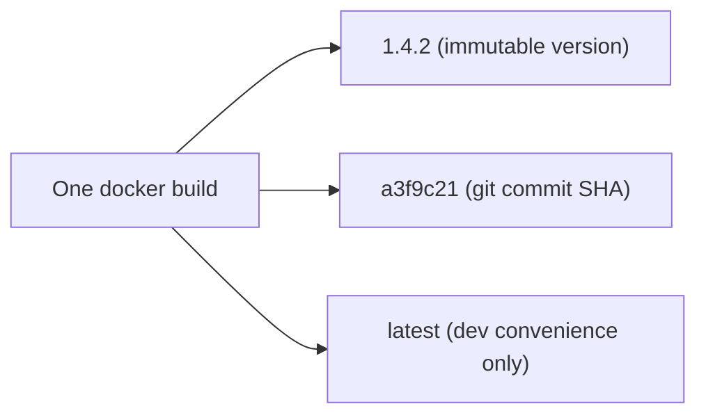
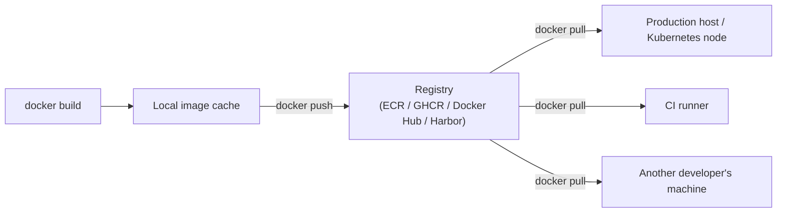

# Tagging, Versioning, and Registries

Phase 1 Chapter 3 established that `latest` provides no reproducibility guarantee. This chapter builds a complete, practical tagging strategy for a real CI/CD pipeline — what to tag, when, and how registries (Docker Hub, ECR, GHCR, a private registry) fit into the picture, including the authentication model you'll need in Chapter 5's actual pipeline.

---

## A Practical Multi-Tag Strategy

A single build should typically produce **several tags pointing at the identical image**, each serving a different purpose:

```bash
docker build -t myorg/order-service:1.4.2 \
             -t myorg/order-service:1.4 \
             -t myorg/order-service:1 \
             -t myorg/order-service:$(git rev-parse --short HEAD) \
             -t myorg/order-service:latest \
             .
```

| Tag | Purpose |
|---|---|
| `1.4.2` | Exact, immutable-in-practice version — what you deploy and reference explicitly |
| `1.4`, `1` | "Floating" convenience tags for consumers who want the latest patch/minor within a major version (common for base images you publish for others; less relevant for an internal deployable service) |
| `$(git rev-parse --short HEAD)` | Ties an image directly to the exact commit that produced it — invaluable for tracing "which image is running which code" during an incident |
| `latest` | Genuinely convenient for local development ("just give me something recent"), but — per Phase 1 — never referenced in a production deployment manifest |



---

## Semantic Versioning, Applied to Container Images

If your service follows semantic versioning (major.minor.patch), the tagging convention should reflect what changed:

- **Patch** (`1.4.2` → `1.4.3`): bug fixes, no API contract changes
- **Minor** (`1.4.x` → `1.5.0`): backward-compatible new functionality
- **Major** (`1.x.x` → `2.0.0`): breaking changes

This matters specifically for anything consuming your image as a dependency (another team's service, an internal shared library packaged as a container) — the same discipline you'd apply to a Maven artifact's version number applies identically here, for the identical reason: consumers need to reason about compatibility from the version number alone.

---

## Registries: Where Images Actually Live

A registry stores images and serves them via `docker push`/`docker pull` — Docker Hub, AWS ECR, Google Artifact Registry, GitHub Container Registry (GHCR), and self-hosted options (Harbor) are all functionally equivalent at the protocol level (the OCI Distribution Specification), differing mainly in access control, integration with your cloud provider, and pricing.

```bash
# Authenticate to a registry (mechanism varies by provider — this is
# the general shape, e.g. for GHCR):
echo $GITHUB_TOKEN | docker login ghcr.io -u your-username --password-stdin

# Tag for that specific registry (registries other than Docker Hub
# require the registry hostname as part of the tag):
docker tag myorg/order-service:1.4.2 ghcr.io/myorg/order-service:1.4.2

docker push ghcr.io/myorg/order-service:1.4.2
```



---

## Private Registries and Image Pull Authentication

For anything beyond a public open-source image, the registry needs to know the pulling party is authorized:

```bash
# On a deployment target (or Kubernetes node, Phase 10), credentials
# are typically supplied via a registry secret / pull credential,
# not an interactively-typed docker login:
docker login ghcr.io -u deploy-bot --password-stdin < registry-token.txt
```

Kubernetes has its own dedicated mechanism for this (`imagePullSecrets`), which we cover explicitly in Phase 10 — conceptually identical to this authentication step, just expressed as a Kubernetes resource rather than an interactive `docker login`.

---

## Common Misconceptions

- **"You should only ever push one tag per build."** Multiple tags pointing at the same image is standard practice — an immutable version tag for deployment reference, plus convenience/tracing tags, all pointing at identical bytes.
- **"All registries are interchangeable in terms of what they offer."** The push/pull protocol is standardized (OCI Distribution Spec), but access control models, vulnerability scanning integration, geographic replication, and cost structures differ meaningfully between providers — a real architectural decision, not an arbitrary choice.
- **"A commit-SHA tag replaces the need for a semantic version tag."** They serve different audiences — the SHA tag is for precise internal tracing; the semantic version tag is for anything (human or automated) reasoning about compatibility and intended release cadence.

---

## What's Next

**Next:** [`03-multi-arch-builds.md`](./03-multi-arch-builds.md)