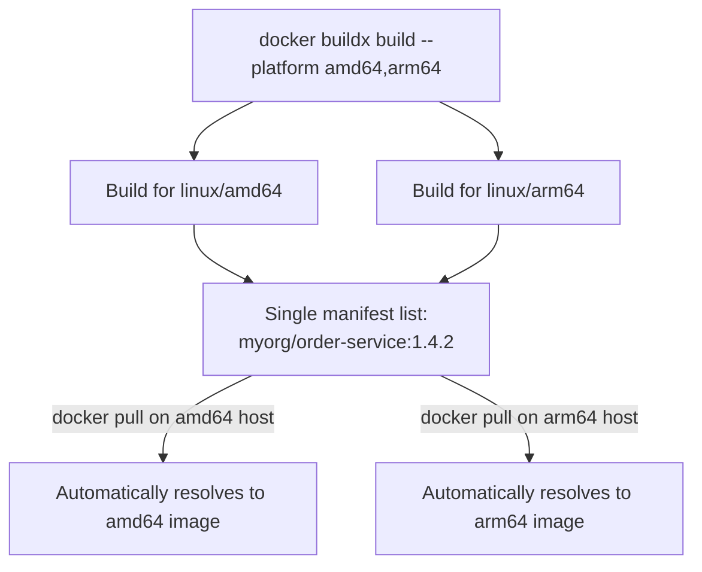

# Multi-Architecture Builds

Every image built so far has implicitly targeted one CPU architecture — almost certainly `amd64` (x86-64), the architecture of most CI runners and traditional cloud VMs. This chapter covers building images that work correctly on both `amd64` and `arm64` (increasingly common: Apple Silicon developer machines, AWS Graviton production instances) — and precisely why "it built and ran fine on my machine" doesn't guarantee it'll run on a differently-architected deployment target.

---

## Why This Matters Now, Specifically

A base image tag like `eclipse-temurin:21-jre` is not actually one single image — it's a **manifest list** pointing at multiple architecture-specific images, and Docker automatically pulls the one matching your host's architecture:

```bash
docker manifest inspect eclipse-temurin:21-jre
# Shows multiple platform entries: linux/amd64, linux/arm64, etc.
```

If your Dockerfile only uses multi-arch base images (as official images like `eclipse-temurin` and `postgres` do), your image is *architecture-portable by default* for everything up to your own build steps — the risk appears specifically when a build step does something architecture-specific (compiling native code, referencing an `amd64`-only tool) without you realizing it.

```bash
# Developing on Apple Silicon (arm64), pushing to a registry, then
# deploying to a traditional amd64 cloud VM — if the image was only
# ever built for arm64, this fails outright on the target:
docker run myorg/order-service:1.4.2
# exec format error   <- architecture mismatch, not an application bug
```

---

## Building for Multiple Architectures With `buildx`

```bash
# Set up a buildx builder capable of multi-platform builds
# (uses QEMU emulation under the hood for architectures that
# don't match your local build machine):
docker buildx create --use --name multiarch-builder

# Build and push BOTH architectures in one command, producing
# a single manifest list at the tag, exactly like official images:
docker buildx build \
  --platform linux/amd64,linux/arm64 \
  -t myorg/order-service:1.4.2 \
  --push \
  .
```



Consumers pulling `myorg/order-service:1.4.2` get the architecture-appropriate image automatically — exactly the same experience official multi-arch images already provide, now extended to your own images.

---

## A Pure JVM Application Is Usually Trivially Portable

For a Spring Boot service specifically, the JVM itself abstracts away architecture at the bytecode level — your compiled JAR runs identically on any architecture with a matching JVM available. The multi-arch concern here is almost entirely about the **base image and Dockerfile build steps**, not your Java code:

```bash
# Confirm your Dockerfile has no architecture-specific assumptions,
# e.g., no hardcoded amd64-only binary downloads:
grep -iE "amd64|x86_64" Dockerfile
```

If your Dockerfile is "clean" in this sense (only uses multi-arch base images, installs packages via the OS's own package manager rather than downloading architecture-specific binaries by hand), `docker buildx build --platform ...` above is usually sufficient with no further code changes.

---

## Verifying a Multi-Arch Image

```bash
docker buildx imagetools inspect myorg/order-service:1.4.2
# Shows the manifest list with both linux/amd64 and linux/arm64 entries,
# confirming the push genuinely produced both architectures.
```

---

## Common Misconceptions

- **"If it builds successfully on my machine, it'll run anywhere."** A successful build only confirms it works for *your build machine's architecture* — a genuinely separate concern from whether it'll run on a differently-architected deployment target.
- **"Multi-arch builds require maintaining separate Dockerfiles per architecture."** One Dockerfile, built via `buildx --platform` with multiple targets — no duplication needed for a typical JVM-based Dockerfile with no architecture-specific steps.
- **"This only matters for exotic embedded/IoT use cases."** ARM-based cloud instances (AWS Graviton) and Apple Silicon developer machines have made this a mainstream, everyday concern for ordinary backend services, not a niche one.

---

## What's Next

**Next:** [`04-image-promotion-strategies.md`](./04-image-promotion-strategies.md)