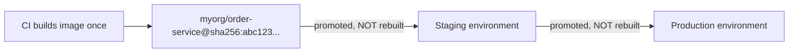
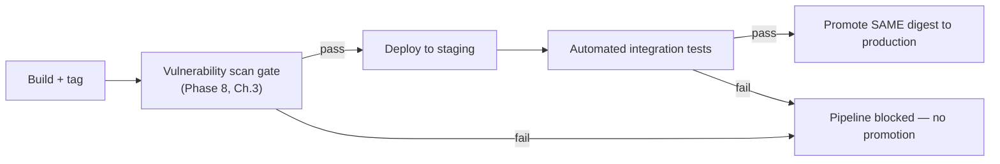

# Image Promotion Strategies

Every chapter so far in this phase has focused on producing a correct, well-tagged, multi-arch image. This chapter addresses a different, equally important question: how does an image move from "just built by CI" to "running in production," across intermediate environments, without rebuilding it at each stage — and why rebuilding at each stage is itself a reproducibility risk worth actively avoiding.

---

## The Core Principle: Build Once, Promote the Same Artifact



The alternative — rebuilding the image separately for staging and production, even from the identical source commit — reintroduces exactly the environment-drift risk Phase 1 Chapter 1 identified as the core problem Docker exists to solve: a base image update between the staging build and the production build, a dependency resolving to a different transitive version, a build-time flag difference — any of these could produce genuinely different bytes despite "the same source code," defeating the entire reproducibility guarantee.

**The correct pattern: build the image exactly once, per commit, then move that exact same digest through each environment via re-tagging or promotion metadata — never rebuild for a later stage.**

---

## A Concrete Promotion Flow

```bash
# CI, on merge to main: build once, tag with the commit SHA, push
docker build -t myorg/order-service:a3f9c21 .
docker push myorg/order-service:a3f9c21

# Get its immutable digest for precise reference:
DIGEST=$(docker inspect myorg/order-service:a3f9c21 --format '{{index .RepoDigests 0}}')
echo $DIGEST
# myorg/order-service@sha256:abc123...

# --- Deploy to staging, referencing the EXACT digest, not a tag: ---
kubectl set image deployment/order-service order-service=$DIGEST -n staging
# (Kubernetes specifics covered fully in Phase 10 — the principle
#  here applies regardless of the specific orchestrator.)

# --- After staging validation passes, promote the SAME digest to prod: ---
kubectl set image deployment/order-service order-service=$DIGEST -n production
```

Notice **no `docker build` happens between staging and production** — the identical, already-tested bytes are what actually runs in production, which is the strongest possible guarantee that "what we tested in staging is exactly what's running in prod," full stop, not "something built from similar-looking instructions."

---

## Tagging Convention for Promotion Tracking

A common, practical pattern: mutable environment tags that get **re-pointed** (not rebuilt) at promotion time, alongside the immutable digest as the actual source of truth:

```bash
# These are convenience pointers for humans/dashboards — the
# underlying deployment reference should still be the digest:
docker tag myorg/order-service@sha256:abc123... myorg/order-service:staging-current
docker push myorg/order-service:staging-current

# Later, promoting the SAME image to production:
docker tag myorg/order-service@sha256:abc123... myorg/order-service:production-current
docker push myorg/order-service:production-current
```

---

## Automated Gates Between Stages

A promotion pipeline typically gates each transition on specific checks passing — this is where Chapter 5's CI pipeline project and Phase 8's scanning gate compose together:



---

## Common Misconceptions

- **"Rebuilding for each environment is safer because it catches environment-specific issues earlier."** It reintroduces exactly the drift risk containers exist to eliminate — environment-specific *configuration* differences (Phase 6's `.env`/overrides) should vary between environments; the image's actual bytes should not.
- **"Tagging with an environment name (`staging-current`) is sufficient tracking on its own."** These mutable convenience tags are useful for humans, but the actual deployment reference and audit trail should be the immutable digest — tags alone don't prove staging and production ran identical bytes.
- **"Promotion is only relevant for teams with formal staging/production separation."** Even a two-stage (dev → prod) pipeline benefits from the same principle — build once, promote, never silently rebuild between the environment you tested and the one you deploy to.

---

## What's Next

Time to build a real CI pipeline that applies everything from this phase — and Phase 8's scanning gate — end to end: build, scan, tag, push, and promote.

**Next:** [`05-building-a-ci-pipeline-build-scan-push.md`](./05-building-a-ci-pipeline-build-scan-push.md)