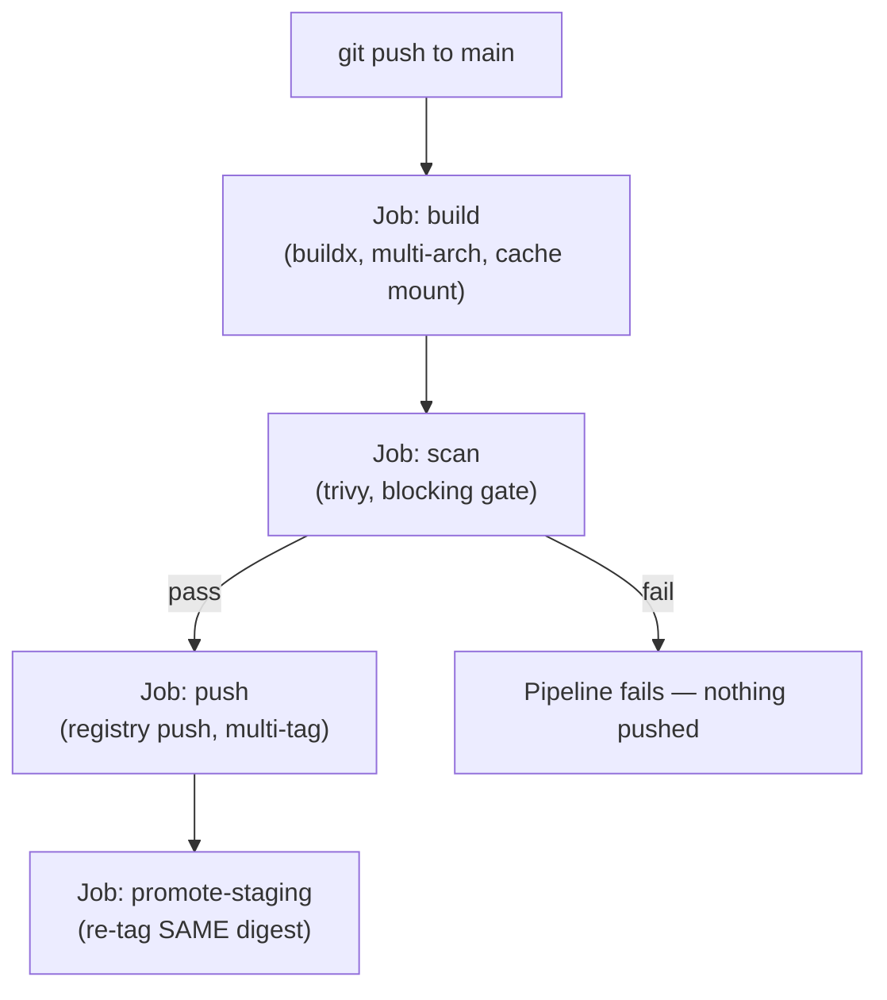

# Project: Building a CI Pipeline (Build, Scan, Push, Promote)

This project builds a complete, working GitHub Actions pipeline for the hardened image from Phase 8 — applying every concept from this phase: multi-tag strategy, multi-arch build, a scanning gate that blocks on HIGH/CRITICAL findings, digest-based promotion, and no rebuilding between stages.

---

## Objective

- Build the image once per commit, tagged with both the commit SHA and semantic version
- Scan the image and fail the pipeline on HIGH/CRITICAL vulnerabilities
- Push a multi-arch (`amd64` + `arm64`) manifest to a registry
- Promote the exact same digest through a staging gate before a production tag update
- Verify the whole pipeline end to end with a real commit

---

## Architecture



---

## Folder Structure

```text
ci-pipeline-project/
├── .github/
│   └── workflows/
│       └── build-scan-push.yml
├── order-api/
│   ├── Dockerfile          (the Phase 8 hardened Dockerfile)
│   ├── pom.xml
│   └── src/...
```

---

## The Workflow File

**`.github/workflows/build-scan-push.yml`**

```yaml
name: build-scan-push

on:
  push:
    branches: [main]

env:
  IMAGE_NAME: ghcr.io/myorg/order-service

jobs:
  build:
    runs-on: ubuntu-latest
    outputs:
      digest: ${{ steps.build.outputs.digest }}
    steps:
      - uses: actions/checkout@v4

      - name: Set up Docker Buildx
        uses: docker/setup-buildx-action@v3

      - name: Log in to registry
        uses: docker/login-action@v3
        with:
          registry: ghcr.io
          username: ${{ github.actor }}
          password: ${{ secrets.GITHUB_TOKEN }}

      - name: Build and push (multi-arch)
        id: build
        uses: docker/build-push-action@v5
        with:
          context: ./order-api
          platforms: linux/amd64,linux/arm64
          push: true
          tags: |
            ${{ env.IMAGE_NAME }}:${{ github.sha }}
          cache-from: type=gha
          cache-to: type=gha,mode=max

  scan:
    needs: build
    runs-on: ubuntu-latest
    steps:
      - name: Scan pushed image
        uses: aquasecurity/trivy-action@master
        with:
          image-ref: ${{ env.IMAGE_NAME }}@${{ needs.build.outputs.digest }}
          severity: HIGH,CRITICAL
          exit-code: 1     # fails the job — and the whole pipeline — on any finding

  tag-release:
    needs: [build, scan]
    runs-on: ubuntu-latest
    steps:
      - name: Log in to registry
        uses: docker/login-action@v3
        with:
          registry: ghcr.io
          username: ${{ github.actor }}
          password: ${{ secrets.GITHUB_TOKEN }}

      - name: Re-tag the SAME digest as staging-current
        run: |
          docker buildx imagetools create \
            --tag ${{ env.IMAGE_NAME }}:staging-current \
            ${{ env.IMAGE_NAME }}@${{ needs.build.outputs.digest }}
```

`docker buildx imagetools create` here is the exact mechanism from Chapter 4's promotion discussion — it re-points a tag at an existing digest **without triggering any new build**, precisely the "promote, don't rebuild" principle.

---

## Build and Run Commands (Local Verification Before Pushing)

```bash
# Verify locally before relying on CI, using the same tools the
# pipeline itself uses:
docker buildx build --platform linux/amd64,linux/arm64 \
  -t ghcr.io/myorg/order-service:local-test \
  ./order-api

trivy image --exit-code 1 --severity HIGH,CRITICAL \
  ghcr.io/myorg/order-service:local-test
```

---

## Expected Output

On a push to `main` with no HIGH/CRITICAL vulnerabilities:

```text
✓ build         (multi-arch image pushed, digest captured)
✓ scan          (0 HIGH/CRITICAL findings — gate passes)
✓ tag-release   (staging-current re-tagged to the same digest)
```

On a push introducing a vulnerable dependency:

```text
✓ build
✗ scan          (2 HIGH findings — job fails, pipeline halts)
- tag-release   (skipped — never runs, because scan failed)
```

---

## Debugging Walkthrough

### Confirm the pushed image is genuinely multi-arch

```bash
docker buildx imagetools inspect ghcr.io/myorg/order-service:$(git rev-parse HEAD)
# Should list both linux/amd64 and linux/arm64 platform entries.
```

### Confirm the scan gate genuinely blocks the pipeline

```bash
# Deliberately introduce an outdated, vulnerable base image tag
# temporarily, push, and confirm the "scan" job fails and
# "tag-release" is skipped entirely — not merely marked as a warning.
```

### Confirm promotion re-used the exact digest, not a rebuild

```bash
docker buildx imagetools inspect ghcr.io/myorg/order-service:staging-current
# The digest shown here should be BYTE-IDENTICAL to the digest
# produced by the original "build" job — confirming no rebuild
# happened during promotion (Chapter 4's core principle).
```

---

## Production Considerations

- A real pipeline would add a manual approval gate (GitHub Environments' required reviewers, or an equivalent) between staging promotion and production promotion — this project automates staging promotion for demonstration purposes, but production promotion typically warrants a deliberate human checkpoint.
- `cache-from`/`cache-to: type=gha` uses GitHub Actions' own cache backend for BuildKit's cache mounts (Phase 2, Chapter 5) across CI runs — without this, every CI run would re-download all Maven dependencies from scratch, since GitHub Actions runners don't persist a local Docker build cache between separate runs by default.

---

## Cleanup

This project's artifacts live in the CI/registry, not locally — no local cleanup beyond removing any local test images:

```bash
docker rmi ghcr.io/myorg/order-service:local-test
```

---

## What's Next

Phase 9 is complete: the full production Dockerfile checklist, tagging/registry strategy, multi-arch builds, promotion discipline, and a real, working CI pipeline enforcing all of it automatically. Phase 10 is the final conceptual phase: how everything built across this entire repository maps onto Kubernetes — what carries over unchanged, and what Kubernetes does differently.

**Next:** [`../phase-10-docker-to-kubernetes-bridge/01-what-kubernetes-takes-from-docker.md`](../phase-10-docker-to-kubernetes-bridge/01-what-kubernetes-takes-from-docker.md)